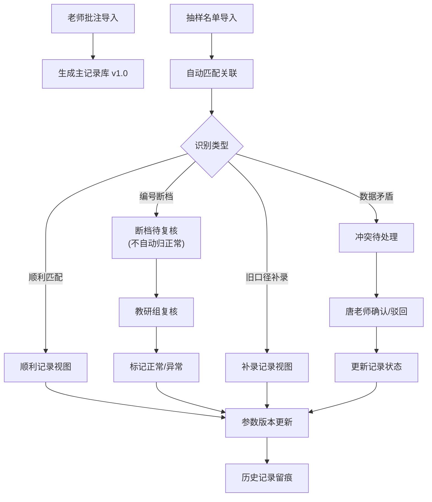

## 1. 产品概述

"稀疏矩阵账单压缩"是一个面向教育机构的账单证据整合与审核系统，解决老师批注（主流程）与抽样名单（现场说法）两边证据独立存放、难以追溯对照的问题。系统核心是将双边证据统一呈现，通过清晰的冲突标记和人工复核机制，确保每一条结论都有完整的证据链支撑。

- 核心目标：将分散在老师批注和抽样名单中的证据整合到同一结果视图，实现证据可追溯、冲突可复核、历史可比对
- 目标用户：竞赛教练唐老师（审核决策人）、教研组（复核断档记录）、行政老师（数据导入）
- 产品价值：避免"结论很满、证据断链"的业务风险，建立可审计的账单压缩审核流程

---

## 2. 核心功能

### 2.1 用户角色

| 角色 | 登录方式 | 核心权限 |
|------|----------|----------|
| 行政老师 | 工号登录 | 导入老师批注数据、导入抽样名单数据 |
| 竞赛教练唐老师 | 工号登录 | 查看整合结果、处理证据冲突、确认/驳回冲突记录、查看参数版本、查看历史记录 |
| 教研组 | 工号登录 | 复核编号断档记录、标记断档处理结果 |

### 2.2 功能模块

1. **数据导入页**：老师批注导入、抽样名单导入、导入结果预览
2. **整合结果页**：双边证据统一展示、三种处理结果分类视图、证据链追溯
3. **冲突处理页**：冲突证据并列展示、确认/驳回操作、处理意见填写
4. **断档复核页**：编号断档记录列表、教研组复核、标记处理状态
5. **参数版本页**：版本快照对比、参数变更历史、版本回滚查看
6. **历史记录页**：全操作轨迹、按记录追溯、处理时间线

### 2.3 页面详情

| 页面名称 | 模块名称 | 功能描述 |
|-----------|-------------|---------------------|
| 数据导入页 | 老师批注导入 | 上传 Excel/CSV，校验格式，预览数据，标记导入批次 |
| 数据导入页 | 抽样名单导入 | 上传 Excel/CSV，校验格式，识别旧口径补录记录，标记导入批次 |
| 整合结果页 | 结果分类视图 | 按"顺利/断档/补录"三类分 Tab 展示，每类有独立的样式标识 |
| 整合结果页 | 证据链面板 | 每条记录点击展开，显示来源批注、来源抽样、处理时间线、当前状态 |
| 冲突处理页 | 冲突证据对比 | 左右并列展示老师批注与抽样名单的矛盾字段，高亮差异 |
| 冲突处理页 | 决策操作 | 确认（以某方为准）、驳回（退回重提）、填写处理意见，操作人留痕 |
| 断档复核页 | 断档记录列表 | 展示人工删除后编号不连续的记录，标记"待教研组复核"状态 |
| 断档复核页 | 复核操作 | 教研组填写复核意见，标记"正常/异常"，不自动归为正常 |
| 参数版本页 | 版本列表 | 每次导入/处理后的参数快照，版本号、时间、操作人、变更内容 |
| 参数版本页 | 版本对比 | 两个版本参数差异对比，高亮变更字段 |
| 历史记录页 | 操作时间线 | 全系统操作按时间倒序，支持按记录ID、操作人、时间段筛选 |
| 历史记录页 | 记录追溯 | 单条记录的完整生命周期：导入→匹配→冲突→处理→归档 |

---

## 3. 核心流程

### 三步核心主流程

1. **老师批注第一次导入**：行政老师上传老师批注文件，系统解析后建立主流程记录库，生成初始参数版本 v1.0
2. **竞赛教练唐老师补看抽样名单**：行政老师上传抽样名单文件，系统自动匹配关联记录，识别三种情况（顺利/断档/补录），生成参数版本 v1.1
3. **参数版本页更新**：每一次导入或处理操作完成后，参数版本页自动生成新版本快照，记录所有变更

### 冲突处理流程

当老师批注与抽样名单数据矛盾时，系统不自动决策，而是：
1. 标记记录为"冲突待处理"状态
2. 在冲突处理页并列展示双边证据，高亮矛盾字段
3. 列出冲突证据清单（哪些字段不一致、各来源值是什么）
4. 唐老师选择"确认（以批注为准）"或"确认（以抽样为准）"或"驳回"
5. 操作后更新记录状态和参数版本

### 编号断档处理流程

当检测到人工删除一行后编号不连续时：
1. 标记记录为"断档待复核"状态
2. 不自动归为正常，保留在断档视图中
3. 推送到教研组复核页面
4. 教研组人工复核后标记"正常"或"异常"
5. 复核后记录才移出断档视图

---

## 4. 用户界面设计

### 4.1 设计风格

**设计方向：严谨专业的行政办公风格**

- **主色调**：深邃藏蓝 `#1e3a5f` —— 代表专业、可信、严谨
- **辅助色**：
  - 顺利记录：墨绿 `#2d6a4f` 标签
  - 断档记录：琥珀橙 `#d97706` 标签 + 黄色斜纹背景警示
  - 补录记录：深紫 `#6d28d9` 标签
  - 冲突记录：暗红 `#991b1b` 标签 + 红色边框高亮
- **中性色**：以浅灰 `#f8fafc` 为背景，深灰 `#334155` 为文字，确保长时间阅读舒适
- **字体**：
  - 标题："Noto Serif SC" 宋体 —— 正式、公文感
  - 正文："Noto Sans SC" 黑体 —— 清晰、易读
  - 数据表格：等宽字体 "JetBrains Mono" —— 数字对齐、便于比对
- **按钮风格**：直角、细边框、扁平化，hover 时轻微加深背景色，体现稳重感
- **布局风格**：左右分栏 + 顶部导航，数据表格为主，卡片式详情面板
- **图标风格**：Lucide 线性图标，统一 16px 尺寸，无多余装饰

### 4.2 页面设计概述

| 页面名称 | 模块名称 | UI Elements |
|-----------|-------------|-------------|
| 数据导入页 | 上传区域 | 拖拽上传区，格式提示，最近导入记录列表，藏蓝主按钮 |
| 整合结果页 | 分类 Tab | 三个分类 Tab（顺利/断档/补录），各带计数徽章，选中时下划线高亮 |
| 整合结果页 | 数据表格 | 斑马纹表格，状态标签彩色，点击行展开证据链抽屉 |
| 整合结果页 | 证据链抽屉 | 右侧滑出，时间线样式展示导入、匹配、处理全过程，来源可追溯 |
| 冲突处理页 | 对比面板 | 左右双栏，左批注右抽样，矛盾字段红框高亮，中间 VS 分隔线 |
| 冲突处理页 | 决策区 | 底部固定操作栏，三个按钮：确认批注/确认抽样/驳回，必填处理意见 |
| 断档复核页 | 断档列表 | 黄色斜纹背景行，断档位置箭头标注，编号缺失红色问号标记 |
| 参数版本页 | 版本卡片 | 竖向时间线，每个版本卡片显示版本号、时间、操作人、变更摘要 |
| 参数版本页 | 对比视图 | 双栏对比表格，新增绿色、删除红色、修改橙色，行级差异高亮 |
| 历史记录页 | 时间线 | 左侧时间轴，右侧操作卡片，支持筛选，点击跳转对应记录 |

### 4.3 响应性

- 桌面端优先设计，1280px 起适配
- 数据表格支持水平滚动，窄屏下保持列可读性
- 侧边抽屉在窄屏改为底部弹出
- 触控设备点击区域不小于 44x44px

### 4.4 样例数据设计

系统预置三条典型样例记录，确保三种处理结果可区分：

1. **顺利记录（编号 003）**：
   - 老师批注："2025-03-15 张三 课时费 300元 编号003"
   - 抽样名单："2025-03-15 张三 现场授课 课时费 300元 编号003"
   - 处理结果：顺利匹配，绿色标签，证据链完整

2. **编号断档记录（编号 007）**：
   - 老师批注：原始编号 006、007、008，人工删除 006 后仅剩 007、008
   - 抽样名单："2025-03-20 李四 课时费 500元 编号007"
   - 处理结果：编号 006 缺失，标记断档待复核，黄色警示，不自动归正常

3. **旧口径补录记录（编号 012）**：
   - 老师批注：无此记录（新口径后删除）
   - 抽样名单："2025-02-28 王五 旧口径 辅导费 200元 编号012 补录"
   - 处理结果：标记为抽样名单补来的旧口径，紫色标签，来源标注"抽样补录"
