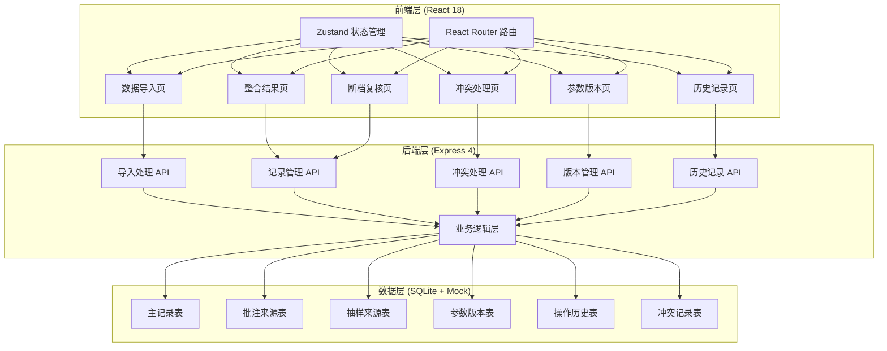
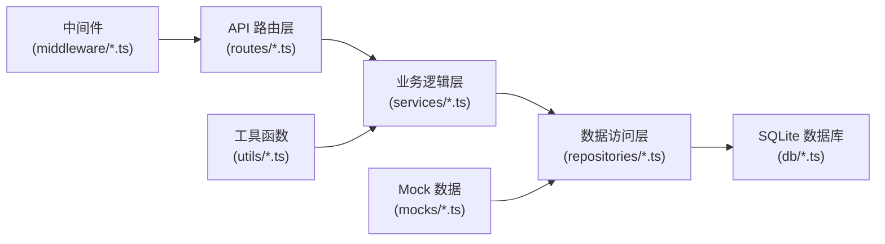

## 1. 架构设计



---

## 2. 技术描述

- **前端框架**: React@18 + TypeScript + Vite@5
- **状态管理**: Zustand@4 —— 轻量级、无需 Provider、支持 immer 中间件
- **路由管理**: react-router-dom@6
- **样式方案**: TailwindCSS@3 + CSS 变量
- **UI 组件**: 自定义组件 + Lucide React 图标库
- **后端框架**: Express@4 + TypeScript
- **数据库**: SQLite (better-sqlite3) —— 轻量级、无需独立服务、适合单机部署
- **数据解析**: papaparse (CSV) + xlsx (Excel)
- **HTTP 客户端**: fetch API (原生，避免额外依赖)
- **初始化工具**: vite-init

---

## 3. 路由定义

| 路由路径 | 页面名称 | 权限角色 |
|----------|----------|----------|
| `/` | 整合结果页（首页） | 所有登录用户 |
| `/import` | 数据导入页 | 行政老师 |
| `/result` | 整合结果页 | 所有登录用户 |
| `/conflict` | 冲突处理页 | 竞赛教练唐老师 |
| `/gap-review` | 断档复核页 | 教研组 |
| `/versions` | 参数版本页 | 所有登录用户 |
| `/history` | 历史记录页 | 所有登录用户 |
| `/login` | 登录页 | 公开 |

---

## 4. API 定义

### 4.1 TypeScript 类型定义

```typescript
// 记录状态枚举
type RecordStatus = 
  | 'smooth'      // 顺利匹配
  | 'gap'         // 编号断档
  | 'supplement'  // 旧口径补录
  | 'conflict'    // 数据冲突
  | 'pending'     // 待处理
  | 'approved'    // 已确认
  | 'rejected'    // 已驳回
  | 'reviewed_normal'   // 复核正常
  | 'reviewed_abnormal'; // 复核异常

// 来源类型
type SourceType = 'teacher_note' | 'sampling_list';

// 主记录
interface BillRecord {
  id: string;
  recordNo: string;           // 编号 001, 002...
  date: string;
  teacherName: string;
  amount: number;
  itemType: string;           // 项目类型：课时费/辅导费等
  status: RecordStatus;
  teacherNoteId?: string;     // 关联批注ID
  samplingListId?: string;    // 关联抽样ID
  createdAt: string;
  updatedAt: string;
}

// 老师批注来源
interface TeacherNote {
  id: string;
  recordNo: string;
  date: string;
  teacherName: string;
  amount: number;
  itemType: string;
  annotation: string;         // 批注内容
  importBatchId: string;
  importedAt: string;
  importedBy: string;
}

// 抽样名单来源
interface SamplingList {
  id: string;
  recordNo: string;
  date: string;
  teacherName: string;
  amount: number;
  itemType: string;
  sceneDescription: string;   // 现场说法
  isOldFormat: boolean;       // 是否旧口径
  importBatchId: string;
  importedAt: string;
  importedBy: string;
}

// 参数版本
interface ParamVersion {
  id: string;
  version: string;            // v1.0, v1.1...
  snapshot: Record<string, any>; // 参数快照
  changeSummary: string;
  operator: string;
  createdAt: string;
  recordCount: {
    smooth: number;
    gap: number;
    supplement: number;
    conflict: number;
  };
}

// 操作历史
interface OperationHistory {
  id: string;
  recordId?: string;          // 关联记录ID（可选，全系统操作可能不关联）
  operationType: 'import' | 'match' | 'conflict_resolve' | 'gap_review' | 'version_create';
  description: string;
  operator: string;
  operatorRole: string;
  beforeState?: Record<string, any>;
  afterState?: Record<string, any>;
  createdAt: string;
}

// 冲突记录
interface ConflictRecord {
  id: string;
  recordId: string;
  teacherNoteId: string;
  samplingListId: string;
  conflictingFields: {
    field: string;
    teacherNoteValue: any;
    samplingListValue: any;
  }[];
  resolution?: 'teacher_note' | 'sampling_list' | 'rejected';
  resolutionNote?: string;
  resolvedBy?: string;
  resolvedAt?: string;
  createdAt: string;
}

// 断档记录
interface GapRecord {
  id: string;
  recordId: string;
  missingRecordNo: string;    // 缺失的编号
  previousRecordNo: string;
  nextRecordNo: string;
  reviewStatus: 'pending' | 'normal' | 'abnormal';
  reviewNote?: string;
  reviewedBy?: string;
  reviewedAt?: string;
  createdAt: string;
}
```

### 4.2 API 接口

| 方法 | 路径 | 描述 | 请求体 | 响应体 |
|------|------|------|--------|--------|
| POST | `/api/auth/login` | 登录 | `{ username: string, password: string }` | `{ user: User, token: string }` |
| POST | `/api/import/teacher-notes` | 导入老师批注 | `File` (multipart/form-data) | `{ batchId: string, count: number, records: TeacherNote[] }` |
| POST | `/api/import/sampling-list` | 导入抽样名单 | `File` (multipart/form-data) | `{ batchId: string, count: number, records: SamplingList[] }` |
| GET | `/api/records` | 获取记录列表（支持按状态筛选） | query: `status?` | `{ records: BillRecord[], total: number }` |
| GET | `/api/records/:id` | 获取单条记录详情 | - | `{ record: BillRecord, teacherNote?: TeacherNote, samplingList?: SamplingList, history: OperationHistory[] }` |
| GET | `/api/conflicts` | 获取冲突列表 | - | `{ conflicts: ConflictRecord[] }` |
| POST | `/api/conflicts/:id/resolve` | 处理冲突 | `{ resolution: 'teacher_note' \| 'sampling_list' \| 'rejected', note: string }` | `{ conflict: ConflictRecord, newVersion: ParamVersion }` |
| GET | `/api/gaps` | 获取断档列表 | - | `{ gaps: GapRecord[] }` |
| POST | `/api/gaps/:id/review` | 复核断档 | `{ status: 'normal' \| 'abnormal', note: string }` | `{ gap: GapRecord, newVersion: ParamVersion }` |
| GET | `/api/versions` | 获取参数版本列表 | - | `{ versions: ParamVersion[] }` |
| GET | `/api/versions/:id` | 获取单版本详情 | - | `{ version: ParamVersion }` |
| GET | `/api/versions/compare` | 版本对比 | query: `from, to` | `{ diffs: DiffItem[] }` |
| GET | `/api/history` | 获取操作历史 | query: `recordId?, operator?, startDate?, endDate?` | `{ history: OperationHistory[] }` |
| GET | `/api/records/:id/evidence` | 获取证据链 | - | `{ evidence: EvidenceItem[] }` |

---

## 5. 后端架构分层



### 目录结构
```
api/
├── src/
│   ├── routes/           # API 路由定义
│   ├── services/         # 业务逻辑
│   ├── repositories/     # 数据访问
│   ├── middleware/       # Express 中间件（认证、日志等）
│   ├── utils/            # 工具函数（编号检测、冲突检测等）
│   ├── types/            # TypeScript 类型定义
│   ├── db/               # 数据库连接、初始化
│   ├── mocks/            # 预置样例数据
│   └── index.ts          # 应用入口
└── tsconfig.json
```

---

## 6. 数据模型

### 6.1 ER 图

```mermaid
erDiagram
    TEACHER_NOTE ||--o| BILL_RECORD : "关联"
    SAMPLING_LIST ||--o| BILL_RECORD : "关联"
    BILL_RECORD ||--o{ CONFLICT_RECORD : "可能有"
    BILL_RECORD ||--o{ GAP_RECORD : "可能有"
    BILL_RECORD ||--o{ OPERATION_HISTORY : "产生"
    PARAM_VERSION ||--o{ OPERATION_HISTORY : "产生"

    TEACHER_NOTE {
        string id PK
        string recordNo
        string date
        string teacherName
        number amount
        string itemType
        string annotation
        string importBatchId
        string importedAt
        string importedBy
    }

    SAMPLING_LIST {
        string id PK
        string recordNo
        string date
        string teacherName
        number amount
        string itemType
        string sceneDescription
        boolean isOldFormat
        string importBatchId
        string importedAt
        string importedBy
    }

    BILL_RECORD {
        string id PK
        string recordNo
        string date
        string teacherName
        number amount
        string itemType
        string status
        string teacherNoteId FK
        string samplingListId FK
        string createdAt
        string updatedAt
    }

    CONFLICT_RECORD {
        string id PK
        string recordId FK
        string teacherNoteId FK
        string samplingListId FK
        string conflictingFields JSON
        string resolution
        string resolutionNote
        string resolvedBy
        string resolvedAt
        string createdAt
    }

    GAP_RECORD {
        string id PK
        string recordId FK
        string missingRecordNo
        string previousRecordNo
        string nextRecordNo
        string reviewStatus
        string reviewNote
        string reviewedBy
        string reviewedAt
        string createdAt
    }

    PARAM_VERSION {
        string id PK
        string version
        string snapshot JSON
        string changeSummary
        string operator
        string createdAt
        string recordCount JSON
    }

    OPERATION_HISTORY {
        string id PK
        string recordId FK
        string operationType
        string description
        string operator
        string operatorRole
        string beforeState JSON
        string afterState JSON
        string createdAt
    }
```

### 6.2 DDL 语句

```sql
-- 老师批注来源表
CREATE TABLE teacher_notes (
  id TEXT PRIMARY KEY,
  record_no TEXT NOT NULL,
  date TEXT NOT NULL,
  teacher_name TEXT NOT NULL,
  amount REAL NOT NULL,
  item_type TEXT NOT NULL,
  annotation TEXT,
  import_batch_id TEXT NOT NULL,
  imported_at TEXT NOT NULL,
  imported_by TEXT NOT NULL
);

-- 抽样名单来源表
CREATE TABLE sampling_lists (
  id TEXT PRIMARY KEY,
  record_no TEXT NOT NULL,
  date TEXT NOT NULL,
  teacher_name TEXT NOT NULL,
  amount REAL NOT NULL,
  item_type TEXT NOT NULL,
  scene_description TEXT,
  is_old_format INTEGER DEFAULT 0,
  import_batch_id TEXT NOT NULL,
  imported_at TEXT NOT NULL,
  imported_by TEXT NOT NULL
);

-- 主记录表
CREATE TABLE bill_records (
  id TEXT PRIMARY KEY,
  record_no TEXT NOT NULL,
  date TEXT NOT NULL,
  teacher_name TEXT NOT NULL,
  amount REAL NOT NULL,
  item_type TEXT NOT NULL,
  status TEXT NOT NULL DEFAULT 'pending',
  teacher_note_id TEXT,
  sampling_list_id TEXT,
  created_at TEXT NOT NULL,
  updated_at TEXT NOT NULL,
  FOREIGN KEY (teacher_note_id) REFERENCES teacher_notes(id),
  FOREIGN KEY (sampling_list_id) REFERENCES sampling_lists(id)
);

-- 冲突记录表
CREATE TABLE conflict_records (
  id TEXT PRIMARY KEY,
  record_id TEXT NOT NULL,
  teacher_note_id TEXT NOT NULL,
  sampling_list_id TEXT NOT NULL,
  conflicting_fields TEXT NOT NULL, -- JSON array
  resolution TEXT,
  resolution_note TEXT,
  resolved_by TEXT,
  resolved_at TEXT,
  created_at TEXT NOT NULL,
  FOREIGN KEY (record_id) REFERENCES bill_records(id)
);

-- 断档记录表
CREATE TABLE gap_records (
  id TEXT PRIMARY KEY,
  record_id TEXT NOT NULL,
  missing_record_no TEXT NOT NULL,
  previous_record_no TEXT NOT NULL,
  next_record_no TEXT NOT NULL,
  review_status TEXT NOT NULL DEFAULT 'pending',
  review_note TEXT,
  reviewed_by TEXT,
  reviewed_at TEXT,
  created_at TEXT NOT NULL,
  FOREIGN KEY (record_id) REFERENCES bill_records(id)
);

-- 参数版本表
CREATE TABLE param_versions (
  id TEXT PRIMARY KEY,
  version TEXT NOT NULL,
  snapshot TEXT NOT NULL, -- JSON
  change_summary TEXT NOT NULL,
  operator TEXT NOT NULL,
  created_at TEXT NOT NULL,
  record_count TEXT NOT NULL -- JSON
);

-- 操作历史表
CREATE TABLE operation_histories (
  id TEXT PRIMARY KEY,
  record_id TEXT,
  operation_type TEXT NOT NULL,
  description TEXT NOT NULL,
  operator TEXT NOT NULL,
  operator_role TEXT NOT NULL,
  before_state TEXT, -- JSON
  after_state TEXT, -- JSON
  created_at TEXT NOT NULL,
  FOREIGN KEY (record_id) REFERENCES bill_records(id)
);

-- 索引
CREATE INDEX idx_bill_records_status ON bill_records(status);
CREATE INDEX idx_bill_records_record_no ON bill_records(record_no);
CREATE INDEX idx_operation_histories_record_id ON operation_histories(record_id);
CREATE INDEX idx_operation_histories_created_at ON operation_histories(created_at);
CREATE INDEX idx_conflict_records_record_id ON conflict_records(record_id);
CREATE INDEX idx_gap_records_record_id ON gap_records(record_id);
```

### 6.3 预置样例数据

系统启动时自动注入以下三条样例数据：

1. **顺利记录（003）**：
   - 批注和抽样数据完全一致，状态为 `smooth`
   
2. **编号断档记录（007）**：
   - 批注编号序列缺失 006，检测到断档，状态为 `gap`
   - 同时在 `gap_records` 表中创建待复核记录
   
3. **旧口径补录记录（012）**：
   - 仅在抽样名单中有，批注中无，`is_old_format = true`
   - 状态为 `supplement`

同时预置初始参数版本 `v1.0` 和导入历史记录。
