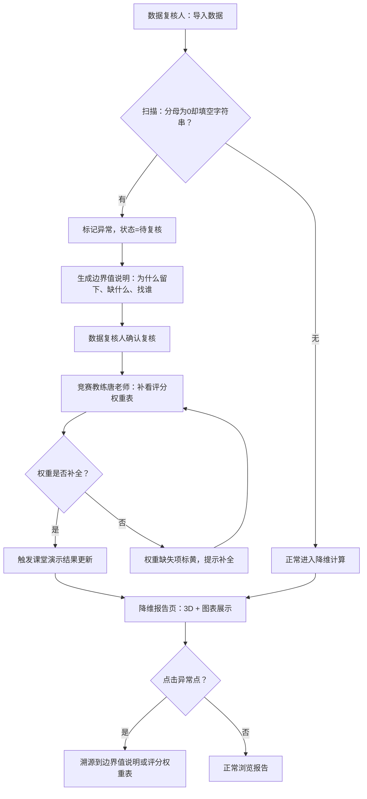

## 1. 产品概述

奇异值降维报告是一套面向竞赛教练（唐老师）和数据复核人的 SVD 降维分析看板。核心解决的问题是：数据中"分母为 0 却被填成空字符串"这类边界异常不应被静默吞掉，而应被标记、留痕、溯源，并在课堂演示中给出人话解释，告诉下一步该找谁。

- 目标用户：竞赛教练唐老师（补看评分权重表、课堂演示）、数据复核人（复核边界值）
- 核心价值：让"分母为 0 却填空字符串"不再被口头兜底，而是有据可查、有路可溯

## 2. 核心功能

### 2.1 用户角色

| 角色 | 进入方式 | 核心权限 |
|------|----------|----------|
| 数据复核人 | 导入数据后自动进入 | 查看边界值说明、标记异常、确认复核 |
| 竞赛教练唐老师 | 接到复核提醒后进入 | 补看评分权重表、补充权重、触发课堂演示更新 |

### 2.2 功能模块

1. **数据导入页**：CSV/JSON 导入，自动识别分母为 0 却填空字符串的行，生成边界值说明
2. **评分权重表页**：竞赛教练唐老师补看/补充权重，更新后自动触发课堂演示结果刷新
3. **奇异值降维报告页**：3D 散点图 + 图表展示降维结果，异常点可点击溯源到边界值说明或评分权重表

### 2.3 页面详情

| 页面名称 | 模块名称 | 功能说明 |
|----------|----------|----------|
| 数据导入页 | 文件上传区 | 拖拽或点击上传 CSV/JSON，自动解析列头与数值 |
| 数据导入页 | 边界值说明表 | 自动标注分母为 0 却填空字符串的行，状态为"待复核"，不可自动归正常 |
| 数据导入页 | 异常卡片 | 每条异常用卡片展示：行号、列名、当前值、为什么被留下、缺什么材料、下一步找谁 |
| 评分权重表页 | 权重编辑表 | 可编辑的评分权重矩阵，唐老师补充后自动计算 |
| 评分权重表页 | 影响预览 | 补充权重后预览对降维结果的影响 |
| 降维报告页 | 3D 散点图 | Three.js 3D 可旋转散点图，异常点高亮标红 |
| 降维报告页 | 二维图表 | 主成分贡献率柱状图 + 累计方差折线图 |
| 降维报告页 | 异常溯源面板 | 点击异常点弹出溯源卡片，可跳转至边界值说明或评分权重表 |

## 3. 核心流程

三步闭环流程：导入 → 补权重 → 课堂演示

## 4. 用户界面设计

### 4.1 设计风格

- 主色：深靛蓝 (#1a1a2e) + 琥珀黄 (#f0a500) 异常高亮
- 辅助色：石墨灰 (#16213e)、薄荷绿 (#0f3460) 正常状态
- 按钮风格：圆角 8px，异常按钮带脉冲动画
- 字体：标题用 Noto Serif SC（学术感），正文用 Noto Sans SC
- 布局：左侧导航 + 右侧内容区，卡片式信息展示
- 图标：Lucide 图标库
- 异常标记：琥珀黄脉冲光晕 + 侧边栏红点

### 4.2 页面设计概览

| 页面名称 | 模块名称 | UI 元素 |
|----------|----------|---------|
| 数据导入页 | 文件上传区 | 虚线拖拽区，上传后显示解析进度条 |
| 数据导入页 | 边界值说明表 | 表格行，异常行左侧琥珀色竖条 + 脉冲动画 |
| 数据导入页 | 异常卡片 | 卡片布局，标题带行号，底部"找数据复核人"/"找竞赛教练"按钮 |
| 评分权重表页 | 权重编辑表 | 可编辑单元格，缺失项黄色背景 |
| 评分权重表页 | 影响预览 | 迷你折线图预览权重变化影响 |
| 降维报告页 | 3D 散点图 | Three.js 场景，异常点琥珀色 + 放大，悬浮显示信息 |
| 降维报告页 | 二维图表 | 柱状图 + 折线图双轴 |
| 降维报告页 | 异常溯源面板 | 右侧滑出面板，含跳转按钮 |

### 4.3 响应式

- 桌面优先，最小宽度 1024px
- 3D 图表区域最小 600px 宽度
- 表格在窄屏下横向滚动

### 4.4 3D 场景指引

- 环境：深色背景 + 微弱网格地面，营造数据分析氛围
- 光照：环境光 + 点光源聚焦异常点
- 相机：OrbitControls 可旋转，默认 45° 俯视
- 焦点元素：异常点放大 1.5x + 琥珀色光晕
- 交互：点击异常点弹出溯源面板
- 后处理：Bloom 效果增强异常点视觉
