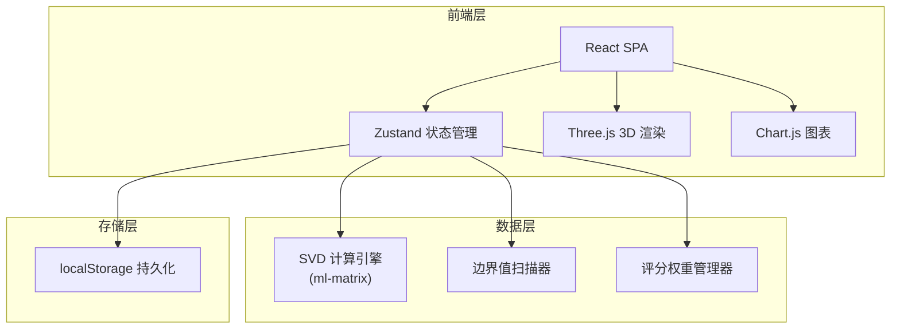

## 1. 架构设计



纯前端架构，无需后端服务。所有 SVD 计算在浏览器端完成，数据持久化使用 localStorage。

## 2. 技术说明

- 前端：React@18 + TypeScript + Tailwind CSS@3 + Vite
- 初始化工具：vite-init
- 3D 渲染：three + @react-three/fiber + @react-three/drei + @react-three/postprocessing
- 图表：chart.js + react-chartjs-2
- SVD 计算：ml-matrix（纯 JS 矩阵运算库）
- 状态管理：zustand
- 后端：无（纯前端）
- 数据库：无（localStorage）

## 3. 路由定义

| 路由 | 用途 |
|------|------|
| / | 数据导入页，上传数据 + 边界值说明 |
| /weights | 评分权重表页，唐老师补看权重 |
| /report | 奇异值降维报告页，3D + 图表 + 溯源 |

## 4. 数据模型

### 4.1 数据模型定义

```mermaid
erDiagram
    RAW_DATA ||--o{ BOUNDARY_RECORD : contains
    RAW_DATA {
        string id
        string fileName
        string[] headers
        number[][] matrix
        string uploadTime
    }
    BOUNDARY_RECORD {
        string id
        number rowIndex
        string columnName
        string currentValue
        string issueType
        string status
        string reason
        string missingMaterial
        string nextAction
    }
    WEIGHT_TABLE ||--o{ WEIGHT_ENTRY : contains
    WEIGHT_TABLE {
        string id
        string lastEditor
        string updateTime
    }
    WEIGHT_ENTRY {
        string id
        string columnName
        number weight
        boolean isComplete
    }
    SVD_RESULT {
        string id
        number[][] U
        number[] singularValues
        number[][] V
        number[] explainedVarianceRatio
        number[][] projectedData
        string[] anomalyIndices
    }
```



### 4.2 核心类型定义

```typescript
interface BoundaryRecord {
  id: string
  rowIndex: number
  columnName: string
  currentValue: string
  issueType: 'denominator_zero_empty' | 'normal'
  status: 'pending_review' | 'reviewed' | 'resolved'
  reason: string
  missingMaterial: string
  nextAction: '找数据复核人' | '找竞赛教练唐老师'
}

interface WeightEntry {
  columnName: string
  weight: number
  isComplete: boolean
}

interface AnomalyPoint {
  recordId: string
  projectedCoords: [number, number, number]
  linkedBoundaryId: string
  linkedWeightId: string | null
}
```

## 5. 关键算法

### 5.1 边界值扫描

扫描逻辑：遍历原始数据矩阵，若某单元格分母位置为 0 且值被填为空字符串，生成 BoundaryRecord，状态设为 `pending_review`，不可自动归为正常。

### 5.2 SVD 降维

使用 ml-matrix 对补全权重后的加权矩阵执行 SVD，取前 3 个主成分投影到 3D 空间。异常点（关联 BoundaryRecord 且 status ≠ resolved）在投影空间中高亮标记。

### 5.3 三步闭环

1. **导入**：数据进入 → 边界值扫描 → 生成 BoundaryRecord（status=pending_review）
2. **补权重**：唐老师编辑 WeightEntry → 触发 SVD 重算 → 课堂演示结果更新
3. **课堂演示**：3D/图表展示 → 点击异常点 → 溯源到 BoundaryRecord 或 WeightEntry
