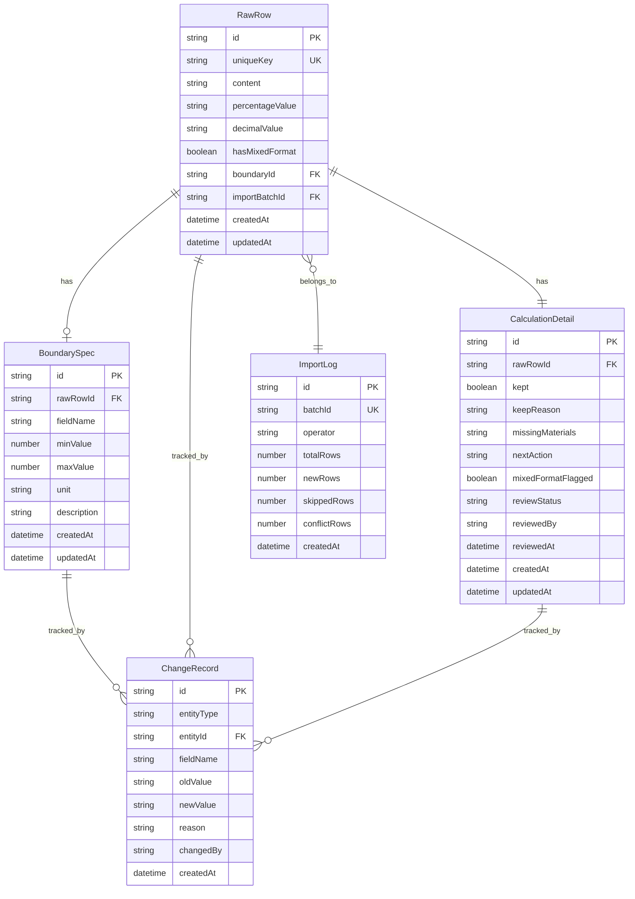

## 1. 架构设计

```mermaid
graph TB
    subgraph "前端层"
        "React App" --> "页面路由"
        "页面路由" --> "数据导入页"
        "页面路由" --> "数据复核页"
        "页面路由" --> "变更历史页"
        "页面路由" --> "可视化展示页"
        "页面路由" --> "报告生成页"
    end
    subgraph "后端层"
        "Express API" --> "导入服务"
        "Express API" --> "去重服务"
        "Express API" --> "变更追踪服务"
        "Express API" --> "计算服务"
        "Express API" --> "报告服务"
    end
    subgraph "数据层"
        "SQLite 数据库" --> "问卷原始行表"
        "SQLite 数据库" --> "边界值说明表"
        "SQLite 数据库" --> "变更历史表"
        "SQLite 数据库" --> "计算明细表"
        "SQLite 数据库" --> "导入日志表"
    end
    "React App" --> "Express API"
    "Express API" --> "SQLite 数据库"
```

## 2. 技术说明

- 前端：React@18 + TypeScript + Tailwind CSS@3 + Vite
- 初始化工具：vite-init
- 后端：Express@4 + TypeScript (ESM)
- 数据库：SQLite (better-sqlite3)
- 3D 渲染：three + @react-three/fiber + @react-three/drei + @react-three/postprocessing
- 图表：recharts
- 状态管理：zustand
- 路由：react-router-dom

## 3. 路由定义

| 路由 | 用途 |
|------|------|
| / | 首页仪表盘，概览待办与统计 |
| /import | 数据导入页：问卷原始行导入与去重 |
| /review | 数据复核页：三步流程与计算明细 |
| /history | 变更历史页：字段级 diff 与影响范围 |
| /visualization | 可视化展示页：3D 座位图与图表 |
| /report | 报告生成页：人可读报告与行动指引 |

## 4. API 定义

### 4.1 问卷原始行

```typescript
interface RawRow {
  id: string
  uniqueKey: string
  content: string
  percentageValue: string | null
  decimalValue: string | null
  hasMixedFormat: boolean
  boundaryId: string | null
  importBatchId: string
  createdAt: string
  updatedAt: string
}

POST   /api/raw-rows/import       // 批量导入（去重）
GET    /api/raw-rows              // 列表查询
GET    /api/raw-rows/:id          // 单条详情
PUT    /api/raw-rows/:id          // 更新（触发变更记录）
DELETE /api/raw-rows/:id          // 删除
```

### 4.2 边界值说明

```typescript
interface BoundarySpec {
  id: string
  rawRowId: string
  fieldName: string
  minValue: number | null
  maxValue: number | null
  unit: string
  description: string
  createdAt: string
  updatedAt: string
}

POST   /api/boundaries            // 创建
GET    /api/boundaries            // 列表
GET    /api/boundaries/:id        // 详情
PUT    /api/boundaries/:id        // 更新（触发变更记录）
DELETE /api/boundaries/:id        // 删除
```

### 4.3 变更历史

```typescript
interface ChangeRecord {
  id: string
  entityType: 'raw_row' | 'boundary' | 'calculation'
  entityId: string
  fieldName: string
  oldValue: string
  newValue: string
  reason: string
  changedBy: string
  affectedResults: string[]
  createdAt: string
}

GET    /api/changes               // 变更列表（支持按实体/字段筛选）
GET    /api/changes/:id           // 变更详情（含影响范围）
```

### 4.4 计算明细

```typescript
interface CalculationDetail {
  id: string
  rawRowId: string
  kept: boolean
  keepReason: string
  missingMaterials: string[]
  nextAction: 'contact_activity_leader' | 'contact_coach' | 'no_action'
  nextActionLabel: string
  mixedFormatFlagged: boolean
  reviewStatus: 'pending' | 'confirmed' | 'rejected'
  reviewedBy: string | null
  reviewedAt: string | null
  createdAt: string
  updatedAt: string
}

GET    /api/calculations          // 列表（支持按状态筛选）
PUT    /api/calculations/:id/review  // 复核确认/退回
```

### 4.5 导入日志

```typescript
interface ImportLog {
  id: string
  batchId: string
  operator: string
  totalRows: number
  newRows: number
  skippedRows: number
  conflictRows: number
  createdAt: string
}

GET    /api/import-logs           // 导入日志列表
```

### 4.6 报告

```typescript
interface Report {
  id: string
  title: string
  sections: ReportSection[]
  createdAt: string
}

interface ReportSection {
  heading: string
  content: string
  keptItems: KeptItem[]
  missingMaterials: string[]
  nextActions: NextAction[]
}

GET    /api/reports               // 报告列表
GET    /api/reports/:id           // 报告详情
POST   /api/reports/generate      // 生成报告
```

### 4.7 三步流程状态

```typescript
interface WorkflowStatus {
  rawRowImported: boolean
  rawRowImportedAt: string | null
  boundaryReviewed: boolean
  boundaryReviewedAt: string | null
  calculationUpdated: boolean
  calculationUpdatedAt: string | null
}

GET    /api/workflow/status       // 获取当前流程状态
POST   /api/workflow/advance      // 推进到下一步
```

## 5. 服务器架构图

```mermaid
graph LR
    "Controller 层" --> "Service 层"
    "Service 层" --> "Repository 层"
    "Repository 层" --> "SQLite 数据库"
```

## 6. 数据模型

### 6.1 数据模型定义



### 6.2 数据定义语言

```sql
CREATE TABLE import_logs (
    id TEXT PRIMARY KEY,
    batch_id TEXT NOT NULL UNIQUE,
    operator TEXT NOT NULL,
    total_rows INTEGER NOT NULL DEFAULT 0,
    new_rows INTEGER NOT NULL DEFAULT 0,
    skipped_rows INTEGER NOT NULL DEFAULT 0,
    conflict_rows INTEGER NOT NULL DEFAULT 0,
    created_at TEXT NOT NULL DEFAULT (datetime('now'))
);

CREATE TABLE raw_rows (
    id TEXT PRIMARY KEY,
    unique_key TEXT NOT NULL,
    content TEXT NOT NULL,
    percentage_value TEXT,
    decimal_value TEXT,
    has_mixed_format INTEGER NOT NULL DEFAULT 0,
    boundary_id TEXT,
    import_batch_id TEXT NOT NULL,
    created_at TEXT NOT NULL DEFAULT (datetime('now')),
    updated_at TEXT NOT NULL DEFAULT (datetime('now')),
    FOREIGN KEY (boundary_id) REFERENCES boundary_specs(id),
    FOREIGN KEY (import_batch_id) REFERENCES import_logs(batch_id),
    UNIQUE(unique_key)
);

CREATE TABLE boundary_specs (
    id TEXT PRIMARY KEY,
    raw_row_id TEXT NOT NULL,
    field_name TEXT NOT NULL,
    min_value REAL,
    max_value REAL,
    unit TEXT NOT NULL DEFAULT '',
    description TEXT NOT NULL DEFAULT '',
    created_at TEXT NOT NULL DEFAULT (datetime('now')),
    updated_at TEXT NOT NULL DEFAULT (datetime('now')),
    FOREIGN KEY (raw_row_id) REFERENCES raw_rows(id)
);

CREATE TABLE change_records (
    id TEXT PRIMARY KEY,
    entity_type TEXT NOT NULL CHECK(entity_type IN ('raw_row', 'boundary', 'calculation')),
    entity_id TEXT NOT NULL,
    field_name TEXT NOT NULL,
    old_value TEXT NOT NULL DEFAULT '',
    new_value TEXT NOT NULL DEFAULT '',
    reason TEXT NOT NULL DEFAULT '',
    changed_by TEXT NOT NULL,
    affected_results TEXT NOT NULL DEFAULT '[]',
    created_at TEXT NOT NULL DEFAULT (datetime('now'))
);

CREATE TABLE calculation_details (
    id TEXT PRIMARY KEY,
    raw_row_id TEXT NOT NULL UNIQUE,
    kept INTEGER NOT NULL DEFAULT 1,
    keep_reason TEXT NOT NULL DEFAULT '',
    missing_materials TEXT NOT NULL DEFAULT '[]',
    next_action TEXT NOT NULL DEFAULT 'no_action' CHECK(next_action IN ('contact_activity_leader', 'contact_coach', 'no_action')),
    mixed_format_flagged INTEGER NOT NULL DEFAULT 0,
    review_status TEXT NOT NULL DEFAULT 'pending' CHECK(review_status IN ('pending', 'confirmed', 'rejected')),
    reviewed_by TEXT,
    reviewed_at TEXT,
    created_at TEXT NOT NULL DEFAULT (datetime('now')),
    updated_at TEXT NOT NULL DEFAULT (datetime('now')),
    FOREIGN KEY (raw_row_id) REFERENCES raw_rows(id)
);

CREATE INDEX idx_raw_rows_batch ON raw_rows(import_batch_id);
CREATE INDEX idx_raw_rows_mixed ON raw_rows(has_mixed_format);
CREATE INDEX idx_boundary_specs_raw_row ON boundary_specs(raw_row_id);
CREATE INDEX idx_change_records_entity ON change_records(entity_type, entity_id);
CREATE INDEX idx_calculation_details_status ON calculation_details(review_status);
CREATE INDEX idx_calculation_details_flagged ON calculation_details(mixed_format_flagged);
```
