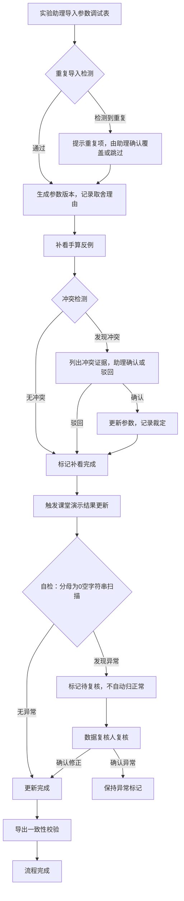

## 1. 产品概述

"序列对齐歌词纠错"是一套面向实验助理和业务复核人的歌词序列对齐与纠错工具，用于管理参数调试表、手算反例和课堂演示结果的闭环流程。核心目标是确保手算反例备注不被清洗丢失，参数与反例冲突时由人工裁定而非自动覆盖，分母为0却被填成空字符串等异常记录始终可见、可复核，且导出明细、页面展示和接口返回严格同源。

- 目标用户：实验助理（小穆等，负责日常导入和补看）、数据复核人（负责冲突裁定和异常复核）
- 核心价值：零数据丢失 + 人工裁定 + 异常留痕 + 单一数据源

## 2. 核心功能

### 2.1 用户角色

| 角色 | 进入方式 | 核心权限 |
|------|----------|----------|
| 实验助理 | 直接访问 | 导入参数调试表、补看手算反例、触发重算、确认/驳回冲突 |
| 数据复核人 | 直接访问 | 复核分母为0异常记录、裁定参数与反例冲突、审批导出 |

### 2.2 功能模块

1. **工作台首页**：三步流程引导（导入→补看→演示更新）、自检状态总览、待处理冲突/异常提示
2. **参数调试表管理**：导入、查看、版本追踪、重复导入检测
3. **手算反例管理**：备注原样保留（含换行、标记等）、与参数调试表的冲突检测与裁定
4. **自检面板**：重复导入、分母为0空字符串、补录后重算、导出一致性四项自检
5. **课堂演示结果**：参数版本与取舍理由标注、三步流程完成后自动更新、分母为0异常不自动归正常

### 2.3 页面详情

| 页面名称 | 模块名称 | 功能说明 |
|----------|----------|----------|
| 工作台首页 | 流程引导卡片 | 展示当前所处步骤（导入/补看/演示更新），可点击跳转 |
| 工作台首页 | 自检状态条 | 四项自检的通过/失败/警告状态 |
| 工作台首页 | 待处理提醒 | 冲突待裁定、分母为0待复核等提醒 |
| 参数调试表 | 导入面板 | 支持 CSV/JSON 导入，自动检测重复，显示导入结果摘要 |
| 参数调试表 | 版本列表 | 每次导入生成新版本，可查看版本差异 |
| 参数调试表 | 明细表格 | 展示参数项、值、来源版本、取舍理由 |
| 手算反例 | 反例列表 | 每条反例保留原始备注（含换行、标记），不清洗 |
| 手算反例 | 冲突检测 | 自动比对参数调试表，发现冲突时弹出裁定面板 |
| 手算反例 | 裁定面板 | 列出冲突证据，提供"确认/驳回"按钮，记录裁定人与时间 |
| 自检面板 | 四项自检 | 重复导入检测、分母为0空字符串扫描、补录后重算验证、导出一致性校验 |
| 自检面板 | 自检报告 | 每项的通过/失败详情，可展开查看问题行 |
| 课堂演示结果 | 结果表格 | 统一展示对齐纠错结果，每行附参数版本和取舍理由 |
| 课堂演示结果 | 异常标记 | 分母为0填空字符串的记录高亮显示，标注"待复核" |
| 课堂演示结果 | 导出 | 导出明细与页面展示和接口返回同源，确保一致性 |

## 3. 核心流程

**三步工作流**：实验助理首次导入参数调试表 → 补看手算反例（发现冲突时裁定） → 触发课堂演示结果更新。过程中遇到分母为0填空字符串时，标记为"待复核"，不自动归正常。

**冲突裁定流程**：系统发现参数调试表与手算反例矛盾 → 弹出裁定面板，展示冲突证据（参数值 vs 反例值 + 反例备注） → 实验助理选择确认（以反例为准）或驳回（保留参数） → 记录裁定人、时间、理由。

**分母为0处理流程**：任何环节检测到分母为0却被填成空字符串 → 记录标记为"待复核"，三个展示端（明细导出/页面/API）统一显示"⚠ 分母为0，值为空字符串（待复核）" → 数据复核人查看并裁定 → 裁定结果同步到三个端。

## 4. 用户界面设计

### 4.1 设计风格

- 主色调：深靛蓝 (#1e293b) + 琥珀强调色 (#f59e0b)，传达严谨实验工具感
- 辅助色：薄荷绿 (#10b981) 表示通过，玫红 (#ef4444) 表示异常/冲突
- 按钮风格：圆角微凸（rounded-lg + shadow-sm），主操作用实色填充，次操作用描边
- 字体：标题用 Noto Sans SC 700，正文用 Noto Sans SC 400，数据用 JetBrains Mono
- 布局：左侧固定导航 + 右侧内容区，卡片式分区，表格使用斑马纹

### 4.2 页面设计概览

| 页面名称 | 模块名称 | UI 元素 |
|----------|----------|---------|
| 工作台首页 | 流程引导 | 三张水平排列的步骤卡片，当前步骤高亮，完成步骤打勾 |
| 工作台首页 | 自检状态条 | 四个圆形状态图标 + 标签，hover 展开详情 |
| 工作台首页 | 待处理提醒 | 右上角铃铛图标 + 下拉通知列表 |
| 参数调试表 | 导入面板 | 拖拽上传区 + 导入结果摘要卡片 |
| 参数调试表 | 版本列表 | 时间线形式，每版本显示导入时间、条目数、变更摘要 |
| 参数调试表 | 明细表格 | 表头固定，每行显示参数名、当前值、版本号、取舍理由（可展开） |
| 手算反例 | 反例列表 | 卡片列表，备注区域保留原始格式（等宽字体 + 换行），不可编辑 |
| 手算反例 | 冲突检测 | 冲突项红色左边框高亮，点击弹出右侧裁定抽屉 |
| 手算反例 | 裁定抽屉 | 上半区冲突对比（左右分栏），下半区确认/驳回按钮 + 理由输入框 |
| 自检面板 | 四项自检 | 四张水平卡片，每张含图标、标题、状态徽章、展开查看问题行 |
| 课堂演示结果 | 结果表格 | 标准数据表，异常行琥珀色背景 + ⚠ 图标，取舍理由在行内折叠显示 |
| 课堂演示结果 | 导出按钮 | 右上角导出按钮，导出时运行一致性校验 |

### 4.3 响应式

桌面优先设计，最小支持 1280px 宽度。平板端导航折叠为汉堡菜单，表格支持横向滚动。移动端暂不作为主要适配目标。

### 4.4 3D 场景

不适用。
