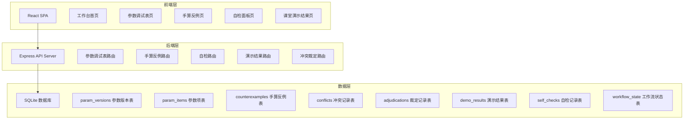
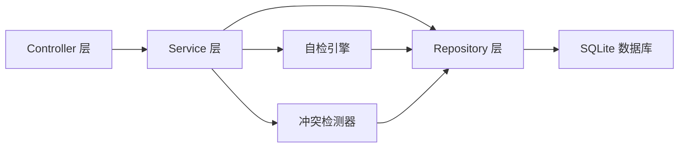
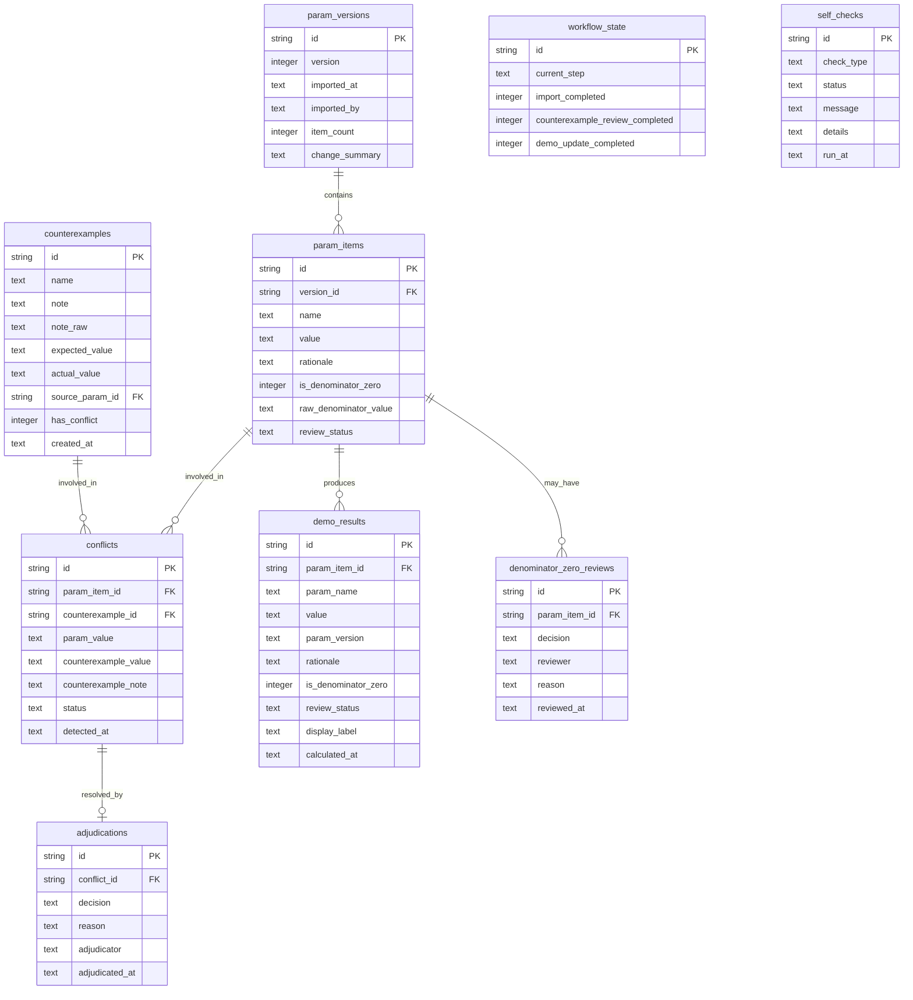

## 1. 架构设计



## 2. 技术说明

- 前端：React@18 + TailwindCSS@3 + Vite + Zustand
- 初始化工具：vite-init
- 后端：Express@4 + TypeScript (ESM)
- 数据库：SQLite (better-sqlite3)，mock 数据预置
- 图标：lucide-react

## 3. 路由定义

| 路由 | 用途 |
|------|------|
| / | 工作台首页：流程引导、自检状态、待处理提醒 |
| /params | 参数调试表管理：导入、版本、明细 |
| /counterexamples | 手算反例管理：列表、冲突检测、裁定 |
| /checks | 自检面板：四项自检与报告 |
| /demo | 课堂演示结果：结果表格、异常标记、导出 |

## 4. API 定义

### 4.1 参数调试表

```typescript
interface ParamVersion {
  id: string;
  version: number;
  importedAt: string;
  importedBy: string;
  itemCount: number;
  changeSummary: string;
}

interface ParamItem {
  id: string;
  versionId: string;
  name: string;
  value: string;
  rationale: string;
  isDenominatorZero: boolean;
  rawDenominatorValue: string;
  reviewStatus: "normal" | "pending_review" | "reviewed";
}

// POST /api/params/import
interface ImportParamsRequest {
  data: ParamItem[];
  source: string;
}

interface ImportParamsResponse {
  versionId: string;
  version: number;
  duplicateCount: number;
  importedCount: number;
  duplicates: ParamItem[];
}

// GET /api/params/versions
interface GetVersionsResponse {
  versions: ParamVersion[];
}

// GET /api/params/items?versionId=
interface GetParamItemsResponse {
  items: ParamItem[];
}
```

### 4.2 手算反例

```typescript
interface Counterexample {
  id: string;
  name: string;
  note: string;
  noteRaw: string;
  expectedValue: string;
  actualValue: string;
  sourceParamId: string;
  hasConflict: boolean;
  createdAt: string;
}

// GET /api/counterexamples
interface GetCounterexamplesResponse {
  items: Counterexample[];
}

// POST /api/counterexamples
interface CreateCounterexampleRequest {
  name: string;
  note: string;
  expectedValue: string;
  actualValue: string;
  sourceParamId: string;
}
```

### 4.3 冲突检测与裁定

```typescript
interface Conflict {
  id: string;
  paramItemId: string;
  counterexampleId: string;
  paramValue: string;
  counterexampleValue: string;
  counterexampleNote: string;
  status: "pending" | "confirmed" | "rejected";
  detectedAt: string;
}

interface Adjudication {
  id: string;
  conflictId: string;
  decision: "confirmed" | "rejected";
  reason: string;
  adjudicator: string;
  adjudicatedAt: string;
}

// GET /api/conflicts
interface GetConflictsResponse {
  conflicts: Conflict[];
}

// POST /api/conflicts/:id/adjudicate
interface AdjudicateConflictRequest {
  decision: "confirmed" | "rejected";
  reason: string;
  adjudicator: string;
}

interface AdjudicateConflictResponse {
  adjudication: Adjudication;
  updatedConflict: Conflict;
}
```

### 4.4 自检

```typescript
type CheckType = "duplicate_import" | "denominator_zero_empty" | "recalc_after_supplement" | "export_consistency";

interface SelfCheckResult {
  type: CheckType;
  status: "pass" | "fail" | "warning";
  message: string;
  details: Array<{
    id: string;
    description: string;
  }>;
}

// POST /api/checks/run
interface RunChecksResponse {
  results: SelfCheckResult[];
  runAt: string;
}

// GET /api/checks/latest
interface GetLatestChecksResponse {
  results: SelfCheckResult[];
  runAt: string;
}
```

### 4.5 课堂演示结果

```typescript
interface DemoResult {
  id: string;
  paramItemId: string;
  paramName: string;
  value: string;
  paramVersion: string;
  rationale: string;
  isDenominatorZero: boolean;
  reviewStatus: "normal" | "pending_review" | "reviewed";
  displayLabel: string;
}

// GET /api/demo/results
interface GetDemoResultsResponse {
  results: DemoResult[];
  sourceVersion: string;
  calculatedAt: string;
}

// POST /api/demo/recalculate
interface RecalculateRequest {
  triggerWorkflowStep: "import" | "counterexample_review" | "demo_update";
}

interface RecalculateResponse {
  results: DemoResult[];
  warnings: string[];
}

// GET /api/demo/export
interface ExportResponse {
  data: DemoResult[];
  exportedAt: string;
  checksum: string;
}
```

### 4.6 工作流状态

```typescript
interface WorkflowState {
  currentStep: "import" | "counterexample_review" | "demo_update";
  importCompleted: boolean;
  counterexampleReviewCompleted: boolean;
  demoUpdateCompleted: boolean;
  pendingConflicts: number;
  pendingReviews: number;
}

// GET /api/workflow/state
interface GetWorkflowStateResponse {
  state: WorkflowState;
}

// POST /api/workflow/advance
interface AdvanceWorkflowRequest {
  step: "import" | "counterexample_review" | "demo_update";
}

// POST /api/workflow/review-denominator-zero
interface ReviewDenominatorZeroRequest {
  itemId: string;
  decision: "confirm_anomaly" | "confirm_corrected";
  reviewer: string;
  reason: string;
}
```

## 5. 服务端架构图



## 6. 数据模型

### 6.1 数据模型定义



### 6.2 数据定义语言

```sql
CREATE TABLE param_versions (
    id TEXT PRIMARY KEY,
    version INTEGER NOT NULL,
    imported_at TEXT NOT NULL DEFAULT (datetime('now')),
    imported_by TEXT NOT NULL DEFAULT 'system',
    item_count INTEGER NOT NULL DEFAULT 0,
    change_summary TEXT NOT NULL DEFAULT ''
);

CREATE TABLE param_items (
    id TEXT PRIMARY KEY,
    version_id TEXT NOT NULL REFERENCES param_versions(id),
    name TEXT NOT NULL,
    value TEXT NOT NULL,
    rationale TEXT NOT NULL DEFAULT '',
    is_denominator_zero INTEGER NOT NULL DEFAULT 0,
    raw_denominator_value TEXT NOT NULL DEFAULT '',
    review_status TEXT NOT NULL DEFAULT 'normal' CHECK (review_status IN ('normal', 'pending_review', 'reviewed'))
);

CREATE INDEX idx_param_items_version ON param_items(version_id);
CREATE INDEX idx_param_items_name ON param_items(name);

CREATE TABLE counterexamples (
    id TEXT PRIMARY KEY,
    name TEXT NOT NULL,
    note TEXT NOT NULL,
    note_raw TEXT NOT NULL,
    expected_value TEXT NOT NULL,
    actual_value TEXT NOT NULL,
    source_param_id TEXT REFERENCES param_items(id),
    has_conflict INTEGER NOT NULL DEFAULT 0,
    created_at TEXT NOT NULL DEFAULT (datetime('now'))
);

CREATE TABLE conflicts (
    id TEXT PRIMARY KEY,
    param_item_id TEXT NOT NULL REFERENCES param_items(id),
    counterexample_id TEXT NOT NULL REFERENCES counterexamples(id),
    param_value TEXT NOT NULL,
    counterexample_value TEXT NOT NULL,
    counterexample_note TEXT NOT NULL,
    status TEXT NOT NULL DEFAULT 'pending' CHECK (status IN ('pending', 'confirmed', 'rejected')),
    detected_at TEXT NOT NULL DEFAULT (datetime('now'))
);

CREATE INDEX idx_conflicts_status ON conflicts(status);

CREATE TABLE adjudications (
    id TEXT PRIMARY KEY,
    conflict_id TEXT NOT NULL REFERENCES conflicts(id),
    decision TEXT NOT NULL CHECK (decision IN ('confirmed', 'rejected')),
    reason TEXT NOT NULL DEFAULT '',
    adjudicator TEXT NOT NULL DEFAULT '',
    adjudicated_at TEXT NOT NULL DEFAULT (datetime('now'))
);

CREATE TABLE demo_results (
    id TEXT PRIMARY KEY,
    param_item_id TEXT NOT NULL REFERENCES param_items(id),
    param_name TEXT NOT NULL,
    value TEXT NOT NULL,
    param_version TEXT NOT NULL,
    rationale TEXT NOT NULL DEFAULT '',
    is_denominator_zero INTEGER NOT NULL DEFAULT 0,
    review_status TEXT NOT NULL DEFAULT 'normal' CHECK (review_status IN ('normal', 'pending_review', 'reviewed')),
    display_label TEXT NOT NULL DEFAULT '',
    calculated_at TEXT NOT NULL DEFAULT (datetime('now'))
);

CREATE INDEX idx_demo_results_param ON demo_results(param_item_id);

CREATE TABLE denominator_zero_reviews (
    id TEXT PRIMARY KEY,
    param_item_id TEXT NOT NULL REFERENCES param_items(id),
    decision TEXT NOT NULL CHECK (decision IN ('confirm_anomaly', 'confirm_corrected')),
    reviewer TEXT NOT NULL DEFAULT '',
    reason TEXT NOT NULL DEFAULT '',
    reviewed_at TEXT NOT NULL DEFAULT (datetime('now'))
);

CREATE INDEX idx_dz_reviews_param ON denominator_zero_reviews(param_item_id);

CREATE TABLE workflow_state (
    id TEXT PRIMARY KEY DEFAULT 'singleton',
    current_step TEXT NOT NULL DEFAULT 'import' CHECK (current_step IN ('import', 'counterexample_review', 'demo_update')),
    import_completed INTEGER NOT NULL DEFAULT 0,
    counterexample_review_completed INTEGER NOT NULL DEFAULT 0,
    demo_update_completed INTEGER NOT NULL DEFAULT 0
);

INSERT INTO workflow_state (id, current_step, import_completed, counterexample_review_completed, demo_update_completed)
VALUES ('singleton', 'import', 0, 0, 0);

CREATE TABLE self_checks (
    id TEXT PRIMARY KEY,
    check_type TEXT NOT NULL CHECK (check_type IN ('duplicate_import', 'denominator_zero_empty', 'recalc_after_supplement', 'export_consistency')),
    status TEXT NOT NULL CHECK (status IN ('pass', 'fail', 'warning')),
    message TEXT NOT NULL DEFAULT '',
    details TEXT NOT NULL DEFAULT '[]',
    run_at TEXT NOT NULL DEFAULT (datetime('now'))
);

CREATE INDEX idx_self_checks_type ON self_checks(check_type);
```
