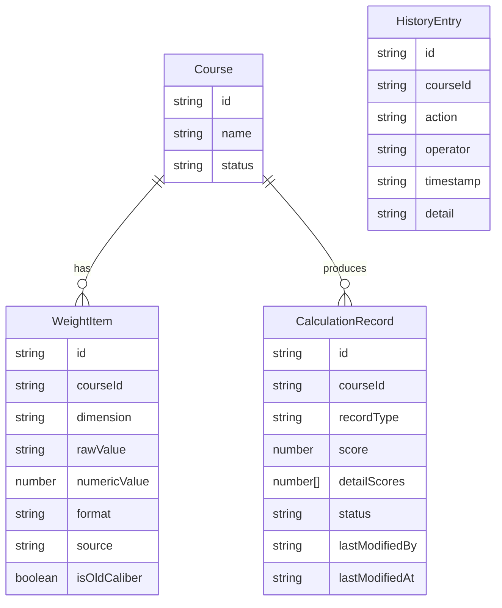

## 1. 架构设计

```mermaid
graph TD
    "前端 React 应用" --> "Zustand 状态管理"
    "Zustand 状态管理" --> "演示数据（内存）"
    "前端 React 应用" --> "页面路由"
    "页面路由" --> "流程总览页"
    "页面路由" --> "边界值说明导入页"
    "页面路由" --> "评分权重表补看页"
    "页面路由" --> "计算明细页"
```

纯前端应用，所有数据存储在 Zustand store 内存中，无需后端服务。演示数据在应用初始化时注入 store。

## 2. 技术说明

- 前端：React@18 + TypeScript + Tailwind CSS@3 + Vite
- 初始化工具：vite-init
- 状态管理：Zustand
- 路由：react-router-dom@6
- 后端：无
- 数据库：无，使用内存 mock 数据

## 3. 路由定义

| 路由 | 用途 |
|------|------|
| `/` | 流程总览页，展示三步流程状态和记录摘要 |
| `/import` | 边界值说明导入页，第一次导入数据并标记异常 |
| `/weights` | 评分权重表补看页，查看权重表并补录旧口径 |
| `/calculation` | 计算明细页，查看计算结果、执行修正和重跑 |

## 4. 数据模型

### 4.1 数据模型定义



### 4.2 数据定义

**Course（课程）**

| 字段 | 类型 | 说明 |
|------|------|------|
| id | string | 唯一标识 |
| name | string | 课程名称 |
| status | string | 当前状态：pending / reviewing / completed |

**WeightItem（权重项）**

| 字段 | 类型 | 说明 |
|------|------|------|
| id | string | 唯一标识 |
| courseId | string | 所属课程 ID |
| dimension | string | 评分维度名称 |
| rawValue | string | 原始值（如 "25%" 或 "0.3"） |
| numericValue | number | 数值化后的值 |
| format | string | 格式类型：decimal / percentage / mixed |
| source | string | 来源：import / supplement |
| isOldCaliber | boolean | 是否为旧口径补录 |

**CalculationRecord（计算记录）**

| 字段 | 类型 | 说明 |
|------|------|------|
| id | string | 唯一标识 |
| courseId | string | 所属课程 ID |
| recordType | string | 记录类型：smooth / mixed / supplement |
| score | number | 最终得分 |
| detailScores | number[] | 各维度得分明细 |
| status | string | 状态：pass / pending_review / corrected |
| lastModifiedBy | string | 最后修改人 |
| lastModifiedAt | string | 最后修改时间 |

**HistoryEntry（历史记录）**

| 字段 | 类型 | 说明 |
|------|------|------|
| id | string | 唯一标识 |
| courseId | string | 所属课程 ID |
| action | string | 操作类型：import / supplement / calculate / correct / rerun |
| operator | string | 操作人 |
| timestamp | string | 时间戳 |
| detail | string | 操作详情描述 |

## 5. 核心计算逻辑

PageRank 站内推荐评分公式：

```
最终得分 = Σ(各维度权重 × 各维度原始分) / Σ(各维度权重)
```

三种记录类型的处理差异：

1. **顺利记录**：权重全部为小数格式，来源全部为 import，直接计算
2. **混合格式记录**：部分权重为百分数部分为小数，系统先将百分数转为小数（25% → 0.25），但标记为"待复核"，等活动负责人确认后才参与计算
3. **旧口径补录记录**：部分权重来源为 supplement（旧口径），按补录的旧口径权重值计算，与按新口径计算的结果不同
