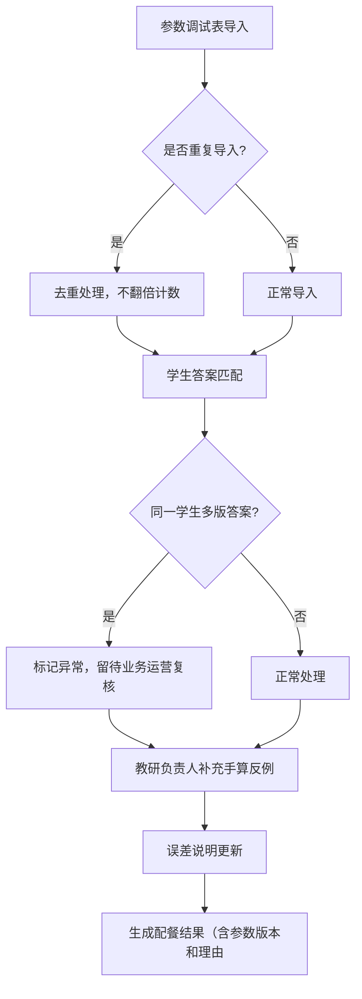

## 1. 产品概述

拉格朗日乘子配餐系统是面向教研团队的智能配餐分析平台，解决参数调试表导入、学生答案复核、误差分析报告生成等核心业务流程。核心用户为教研负责人吴老师和业务运营团队。

## 2. 核心功能

### 2.1 用户角色
| 角色 | 说明 | 核心权限 |
|------|------|----------|
| 教研负责人（吴老师） | 专业教研人员 | 参数导入、备注修改、手算反例补充、误差说明更新 |
| 业务运营 | 业务团队 | 复核异常答案、查看3D/图表展示、生成报告 |

### 2.2 功能模块
1. **参数调试表管理**：导入、去重、版本追踪
2. **学生答案管理**：同一学生多版答案处理、复核流程
3. **3D/图表展示**：数据可视化、可回溯原始数据
4. **历史记录**：备注修改追踪、参数版本对比
5. **报告生成**：人性化误差说明、下一步行动指引
6. **专业计算**：拉格朗日乘子配餐计算、参数版本记录

### 2.3 页面详情
| 页面名称 | 模块名称 | 功能描述 |
|-----------|----------|----------|
| 首页仪表盘 | 概览卡片 | 待复核数量、今日导入、异常统计 |
| 参数调试表 | 导入管理 | Excel导入、去重校验、版本列表 |
| 学生答案 | 答案列表 | 多版答案标识、复核状态流转 |
| 3D可视化 | 数据展示 | 可点击回溯、跳转原始数据 |
| 历史记录 | 修改追踪 | 备注对比、参数版本对比 |
| 报告中心 | 报告生成 | 误差说明、行动指引、参数版本标注 |

## 3. 核心流程

### 三步核心工作流程：
1. 参数调试表第一次导入 → 系统自动去重
2. 教研负责人吴老师补看手算反例 → 标注同一学生两版答案留待运营复核
3. 误差说明更新 → 生成完整报告

## 4. 用户界面设计

### 4.1 设计风格
- 主色调：深蓝 #1e3a5f，专业严谨
- 辅助色：琥珀 #d97706，高亮提示
- 按钮风格：圆角 6px，轻微阴影
- 字体：思源黑体，标题18-24px，正文14px
- 布局：卡片式布局，左侧导航
- 图标：线性图标，简约专业

### 4.2 页面设计概览
| 页面名称 | 模块名称 | UI元素 |
|-----------|----------|--------|
| 仪表盘 | 统计卡片 | 渐变背景、数字动画、状态徽章 |
| 参数列表 | 数据表格 | 悬停高亮、版本标签、操作按钮 |
| 答案详情 | 对比视图 | 左右分栏、版本差异高亮 |
| 3D展示 | 可视化区域 | 可交互点、tooltip、跳转按钮 |
| 报告页面 | 说明卡片 | 时间线、责任人标签、行动按钮 |

### 4.3 响应式
- 桌面端优先，1200px以上最佳体验
- 平板端适配，折叠导航
- 移动端简化视图

### 4.4 3D场景指导
- 环境：简约科技感，深蓝色调
- 光照：柔和漫反射，柔和阴影
- 相机：可旋转、缩放交互
- 交互：点击数据点显示详情，双击跳转原始数据
- 后处理：轻微辉光效果，突出重点数据点
