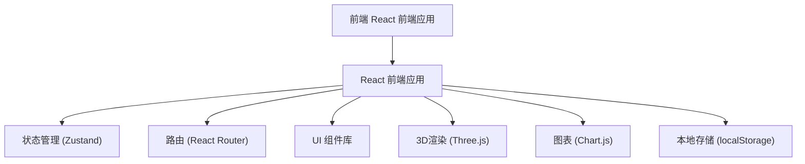
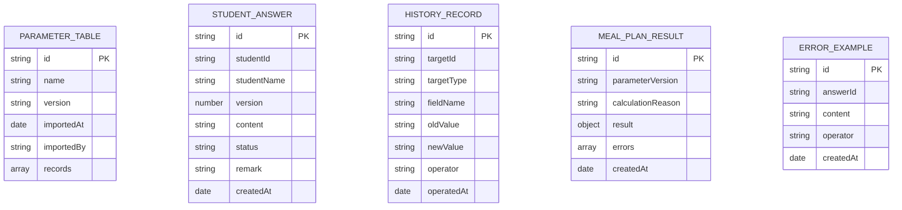

## 1. 架构设计



## 2. 技术描述

- 前端: React@18 + TypeScript + Vite
- 样式: TailwindCSS@3
- 状态管理: Zustand
- 3D可视化: Three.js + @react-three/fiber
- 图表: Chart.js + react-chartjs-2
- 路由: React Router@6
- 图标: Lucide React
- 数据: Mock 数据 + localStorage 持久化
- Excel导入: xlsx 库

## 3. 路由定义

| 路由 | 页面 | 用途 |
|-------|------|------|
| / | 仪表盘首页 | 概览统计、快捷操作 |
| /parameters | 参数调试表列表 | 参数导入、版本管理 |
| /answers | 学生答案列表 | 答案复核、多版答案处理 |
| /answers/:id | 答案详情 | 答案对比、手算反例 |
| /visualization | 3D可视化 | 数据可视化、回溯 |
| /history | 历史记录 | 修改追踪、版本对比 |
| /reports | 报告中心 | 报告生成、误差说明 |

## 4. 数据模型

### 4.1 数据模型定义



### 4.2 类型定义

```typescript
// 参数调试表
interface ParameterTable {
  id: string;
  name: string;
  version: string;
  importedAt: Date;
  importedBy: string;
  records: ParameterRecord[];
  hash: string; // 用于去重
}

// 学生答案
interface StudentAnswer {
  id: string;
  studentId: string;
  studentName: string;
  version: number;
  content: string;
  status: 'pending' | 'reviewing' | 'normal' | 'exception';
  remark: string;
  createdAt: Date;
}

// 历史记录
interface HistoryRecord {
  id: string;
  targetId: string;
  targetType: 'answer' | 'parameter';
  fieldName: string;
  oldValue: string;
  newValue: string;
  operator: string;
  operatedAt: Date;
}

// 配餐结果
interface MealPlanResult {
  id: string;
  parameterVersion: string;
  calculationReason: string;
  result: any;
  errors: ErrorItem[];
  createdAt: Date;
}

// 误差项
interface ErrorItem {
  id: string;
  description: string;
  reason: string;
  missingMaterials: string[];
  nextStep: 'business' | 'research';
  kept: boolean;
}
```

## 5. 核心功能实现

### 5.1 去重机制
- 基于内容哈希比对
- 重复导入时仅更新元数据，不增加记录数
- 保留历史版本可追溯

### 5.2 版本追踪
- 备注修改时记录前后对比
- 参数版本与配餐结果关联展示

### 5.3 复核流程
- 异常答案状态流转
- 责任人标注

### 5.4 3D可视化交互
- 点击数据点显示详情
- 可跳转原始数据
