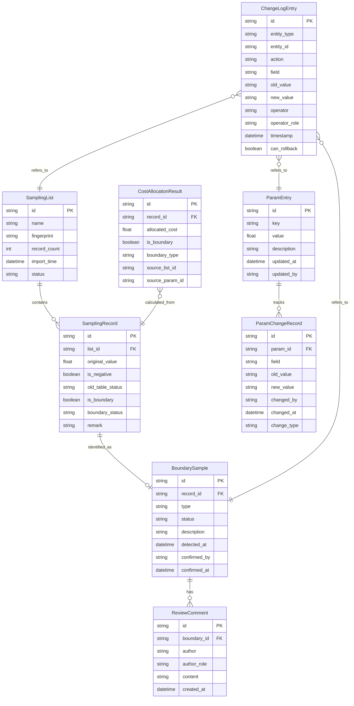

## 1. 架构设计

```mermaid
graph TB
    "前端 React SPA" --> "Express API 层"
    "Express API 层" --> "业务逻辑层 Service"
    "业务逻辑层 Service" --> "数据访问层 Repository"
    "数据访问层 Repository" --> "SQLite 数据库"
    "Express API 层" --> "变更历史服务"
    "变更历史服务" --> "SQLite 数据库"
    "前端 React SPA" --> "3D渲染引擎 Three.js"
```

## 2. 技术说明

- 前端：React@18 + TailwindCSS@3 + Vite + Zustand + Three.js
- 初始化工具：vite-init
- 后端：Express@4 + TypeScript (ESM)
- 数据库：SQLite（轻量级，无需额外服务），使用 better-sqlite3 驱动
- 3D渲染：three + @react-three/fiber + @react-three/drei + @react-three/postprocessing

## 3. 路由定义

| 路由 | 用途 |
|------|------|
| / | 仪表盘，系统概览与待处理提醒 |
| /sampling | 抽样名单管理，导入与查看 |
| /sampling/:id | 抽样名单详情 |
| /params | 参数调试表，参数编辑与边界规则配置 |
| /params/history | 参数变更历史 |
| /calculation | 公平分摊成本计算，3D/图表展示 |
| /boundary | 边界样本报告，审核与复核 |
| /history | 变更历史，全量操作日志 |

## 4. API 定义

### 4.1 抽样名单

```typescript
interface SamplingList {
  id: string;
  name: string;
  fingerprint: string;
  recordCount: number;
  importTime: string;
  status: "active" | "archived";
}

interface SamplingRecord {
  id: string;
  listId: string;
  originalValue: number;
  isNegative: boolean;
  oldTableStatus: "normal" | "missing" | "anomaly";
  isBoundary: boolean;
  boundaryStatus: "pending" | "confirmed" | "ignored";
  remark: string;
}

// POST /api/sampling/import
interface ImportSamplingRequest {
  file: File;
  listName: string;
}

interface ImportSamplingResponse {
  listId: string;
  importedCount: number;
  skippedCount: number;
  boundaryCount: number;
  message: string;
}

// GET /api/sampling
interface GetSamplingListsResponse {
  lists: SamplingList[];
  total: number;
}

// GET /api/sampling/:id
interface GetSamplingListDetailResponse {
  list: SamplingList;
  records: SamplingRecord[];
  relatedParams: ParamEntry[];
}
```

### 4.2 参数调试

```typescript
interface ParamEntry {
  id: string;
  key: string;
  value: number;
  description: string;
  updatedAt: string;
  updatedBy: string;
}

interface ParamChangeRecord {
  id: string;
  paramId: string;
  field: string;
  oldValue: string;
  newValue: string;
  changedBy: string;
  changedAt: string;
  changeType: "value" | "remark" | "boundary_rule";
}

// PUT /api/params/:id
interface UpdateParamRequest {
  value?: number;
  description?: string;
}

interface UpdateParamResponse {
  param: ParamEntry;
  changeRecord: ParamChangeRecord;
}

// GET /api/params/history
interface GetParamHistoryResponse {
  changes: ParamChangeRecord[];
  total: number;
}
```

### 4.3 公平分摊成本计算

```typescript
interface CostAllocationResult {
  id: string;
  sampleId: string;
  allocatedCost: number;
  isBoundary: boolean;
  boundaryType?: string;
  sourceListId: string;
  sourceParamId?: string;
}

interface CalculationSummary {
  totalSamples: number;
  totalCost: number;
  boundaryCount: number;
  pendingCount: number;
  confirmedCount: number;
  ignoredCount: number;
}

// GET /api/calculation
interface GetCalculationResponse {
  summary: CalculationSummary;
  results: CostAllocationResult[];
}

// GET /api/calculation/:id/trace
interface GetTraceResponse {
  samplingRecord: SamplingRecord;
  relatedList: SamplingList;
  relatedParams: ParamEntry[];
}
```

### 4.4 边界样本

```typescript
interface BoundarySample {
  id: string;
  recordId: string;
  type: "negative_as_missing" | "value_out_of_range" | "duplicate_detected";
  status: "pending" | "confirmed" | "ignored";
  description: string;
  detectedAt: string;
  confirmedBy?: string;
  confirmedAt?: string;
  reviewComments: ReviewComment[];
}

interface ReviewComment {
  id: string;
  boundaryId: string;
  author: string;
  authorRole: "教研负责人" | "学生助教";
  content: string;
  createdAt: string;
}

// PUT /api/boundary/:id/status
interface UpdateBoundaryStatusRequest {
  status: "confirmed" | "ignored";
  comment?: string;
}

// POST /api/boundary/:id/review
interface AddReviewCommentRequest {
  content: string;
}
```

### 4.5 变更历史

```typescript
interface ChangeLogEntry {
  id: string;
  entityType: "sampling" | "param" | "boundary";
  entityId: string;
  action: "import" | "update" | "confirm" | "ignore" | "rollback";
  field?: string;
  oldValue?: string;
  newValue?: string;
  operator: string;
  operatorRole: string;
  timestamp: string;
  canRollback: boolean;
}

// GET /api/history
interface GetHistoryResponse {
  entries: ChangeLogEntry[];
  total: number;
}

// POST /api/history/:id/rollback
interface RollbackResponse {
  success: boolean;
  rollbackEntry: ChangeLogEntry;
  message: string;
}
```

## 5. 服务器架构图

```mermaid
graph LR
    "Controller" --> "Service"
    "Service" --> "Repository"
    "Repository" --> "SQLite"
    "Service" --> "ChangeLogService"
    "ChangeLogService" --> "ChangeLogRepository"
    "ChangeLogRepository" --> "SQLite"
```

## 6. 数据模型

### 6.1 数据模型定义



### 6.2 数据定义语言

```sql
CREATE TABLE sampling_lists (
    id TEXT PRIMARY KEY,
    name TEXT NOT NULL,
    fingerprint TEXT NOT NULL UNIQUE,
    record_count INTEGER NOT NULL DEFAULT 0,
    import_time TEXT NOT NULL DEFAULT (datetime('now')),
    status TEXT NOT NULL DEFAULT 'active'
);

CREATE TABLE sampling_records (
    id TEXT PRIMARY KEY,
    list_id TEXT NOT NULL REFERENCES sampling_lists(id),
    original_value REAL NOT NULL,
    is_negative INTEGER NOT NULL DEFAULT 0,
    old_table_status TEXT NOT NULL DEFAULT 'normal',
    is_boundary INTEGER NOT NULL DEFAULT 0,
    boundary_status TEXT NOT NULL DEFAULT 'pending',
    remark TEXT NOT NULL DEFAULT ''
);

CREATE INDEX idx_records_list_id ON sampling_records(list_id);
CREATE INDEX idx_records_boundary ON sampling_records(is_boundary, boundary_status);

CREATE TABLE param_entries (
    id TEXT PRIMARY KEY,
    key TEXT NOT NULL UNIQUE,
    value REAL NOT NULL,
    description TEXT NOT NULL DEFAULT '',
    updated_at TEXT NOT NULL DEFAULT (datetime('now')),
    updated_by TEXT NOT NULL DEFAULT 'system'
);

CREATE TABLE param_change_records (
    id TEXT PRIMARY KEY,
    param_id TEXT NOT NULL REFERENCES param_entries(id),
    field TEXT NOT NULL,
    old_value TEXT NOT NULL,
    new_value TEXT NOT NULL,
    changed_by TEXT NOT NULL,
    changed_at TEXT NOT NULL DEFAULT (datetime('now')),
    change_type TEXT NOT NULL DEFAULT 'value'
);

CREATE INDEX idx_param_changes_param_id ON param_change_records(param_id);

CREATE TABLE boundary_samples (
    id TEXT PRIMARY KEY,
    record_id TEXT NOT NULL REFERENCES sampling_records(id),
    type TEXT NOT NULL,
    status TEXT NOT NULL DEFAULT 'pending',
    description TEXT NOT NULL DEFAULT '',
    detected_at TEXT NOT NULL DEFAULT (datetime('now')),
    confirmed_by TEXT,
    confirmed_at TEXT
);

CREATE INDEX idx_boundary_status ON boundary_samples(status);

CREATE TABLE review_comments (
    id TEXT PRIMARY KEY,
    boundary_id TEXT NOT NULL REFERENCES boundary_samples(id),
    author TEXT NOT NULL,
    author_role TEXT NOT NULL,
    content TEXT NOT NULL,
    created_at TEXT NOT NULL DEFAULT (datetime('now'))
);

CREATE INDEX idx_reviews_boundary_id ON review_comments(boundary_id);

CREATE TABLE cost_allocation_results (
    id TEXT PRIMARY KEY,
    record_id TEXT NOT NULL REFERENCES sampling_records(id),
    allocated_cost REAL NOT NULL,
    is_boundary INTEGER NOT NULL DEFAULT 0,
    boundary_type TEXT,
    source_list_id TEXT NOT NULL REFERENCES sampling_lists(id),
    source_param_id TEXT REFERENCES param_entries(id)
);

CREATE INDEX idx_results_boundary ON cost_allocation_results(is_boundary);

CREATE TABLE change_log (
    id TEXT PRIMARY KEY,
    entity_type TEXT NOT NULL,
    entity_id TEXT NOT NULL,
    action TEXT NOT NULL,
    field TEXT,
    old_value TEXT,
    new_value TEXT,
    operator TEXT NOT NULL,
    operator_role TEXT NOT NULL,
    timestamp TEXT NOT NULL DEFAULT (datetime('now')),
    can_rollback INTEGER NOT NULL DEFAULT 1
);

CREATE INDEX idx_change_log_entity ON change_log(entity_type, entity_id);
CREATE INDEX idx_change_log_timestamp ON change_log(timestamp);

-- 初始参数数据
INSERT INTO param_entries (id, key, value, description, updated_by) VALUES
    ('param-001', 'unit_cost', 100.0, '单位成本', 'system'),
    ('param-002', 'allocation_ratio', 1.0, '分摊比例', 'system'),
    ('param-003', 'min_sample_value', 0.0, '样本最小合理值（低于此值视为异常）', 'system'),
    ('param-004', 'max_sample_value', 999999.0, '样本最大合理值', 'system');
```
