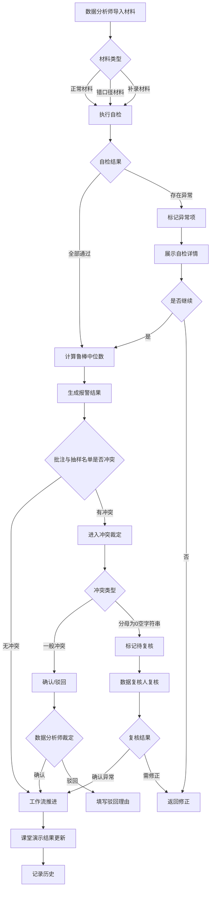

## 1. 产品概述

鲁棒中位数报警系统是一套面向数据分析师的教学质量数据校验与冲突裁定工具。核心目标是：在老师批注与抽样名单两条数据线之间自动发现矛盾、标记可疑项、留存完整证据链，由数据分析师人工确认或驳回，而非系统自动拍板。

- 解决的痛点：批注与抽样名单"补台又打架"、分母为 0 却被填成空字符串导致假正常、补录后重算不一致、导出数据与展示数据对不上
- 目标用户：数据分析师（小祁等）、数据复核人、授课教师

## 2. 核心功能

### 2.1 用户角色

| 角色 | 进入方式 | 核心权限 |
|------|----------|----------|
| 数据分析师 | 系统登录 | 导入材料、触发自检、查看冲突、确认/驳回、导出报告 |
| 数据复核人 | 系统登录 | 复核分母为 0 空字符串项、二次确认冲突裁定 |
| 授课教师 | 无需登录 | 提交批注文件（通过数据分析师代导入） |

### 2.2 功能模块

1. **报警总览页**：展示鲁棒中位数报警结果、历史趋势、当前待处理冲突数
2. **数据导入与自检页**：导入正常材料/错口径材料/补录材料，执行自检并展示结果
3. **冲突裁定页**：列出批注与抽样名单之间的矛盾证据，支持确认/驳回操作
4. **工作流追踪页**：追踪三步工作流（老师批注导入→数据分析师补看抽样名单→课堂演示结果更新），展示每步状态
5. **历史记录页**：查看每次导入、自检、裁定的完整证据链，支持回溯

### 2.3 页面详情

| 页面名称 | 模块名称 | 功能描述 |
|----------|----------|----------|
| 报警总览页 | 鲁棒中位数面板 | 展示当前中位数、报警阈值、报警状态 |
| 报警总览页 | 待处理冲突卡片 | 展示批注与抽样名单冲突数量及摘要 |
| 报警总览页 | 历史趋势图 | 展示报警值随时间变化折线 |
| 数据导入与自检页 | 材料导入区 | 支持三种材料类型导入，显示导入状态 |
| 数据导入与自检页 | 自检结果面板 | 展示四项自检结果：重复导入、分母为0空字符串、补录后重算、导出一致 |
| 数据导入与自检页 | 自检详情展开 | 点击自检项展开详细证据 |
| 冲突裁定页 | 冲突证据列表 | 每条冲突展示批注值 vs 抽样名单值，附带证据来源 |
| 冲突裁定页 | 确认/驳回操作 | 数据分析师对每条冲突选择确认或驳回，驳回需填理由 |
| 冲突裁定页 | 复核标记 | 分母为0空字符串项自动标记为"待复核"，不允许直接确认 |
| 工作流追踪页 | 三步流程指示器 | 可视化展示当前处于哪一步 |
| 工作流追踪页 | 步骤详情面板 | 展示每步的时间、操作人、数据快照 |
| 工作流追踪页 | 分母为0拦截提示 | 第三步遇到分母为0空字符串时弹出拦截提示 |
| 历史记录页 | 操作时间线 | 按时间排列所有导入、自检、裁定操作 |
| 历史记录页 | 证据链详情 | 点击任意操作展开完整证据链，可追溯到原始数据 |

## 3. 核心流程

用户打开系统后，首先在"数据导入与自检页"导入老师批注材料（正常材料/错口径材料/补录材料），系统自动执行四项自检。自检通过后进入"报警总览页"查看鲁棒中位数报警结果。若发现批注与抽样名单存在冲突，系统自动跳转至"冲突裁定页"，列出所有矛盾证据，数据分析师逐条确认或驳回。其中分母为0空字符串项不可直接确认，需标记为"待复核"交给数据复核人。整个流程通过"工作流追踪页"可实时追踪三步状态。所有操作均记录在"历史记录页"中，确保证据链完整可追溯。

## 4. 用户界面设计

### 4.1 设计风格

- 主色调：深灰（#1a1a2e）为底，搭配警示橙（#e94560）和冷静蓝（#0f3460）
- 辅助色：通过绿（#16c784）、警告黄（#f5a623）、复核紫（#8b5cf6）
- 按钮：圆角微凸起，确认用绿、驳回用红、待复核用紫
- 字体：数据展示用 JetBrains Mono，正文用 Noto Sans SC
- 布局：左侧导航栏 + 右侧内容区，卡片式布局
- 图标风格：线条图标（lucide-react），简洁克制

### 4.2 页面设计概览

| 页面名称 | 模块名称 | UI 元素 |
|----------|----------|---------|
| 报警总览页 | 鲁棒中位数面板 | 深色卡片、大号等宽数字、报警阈值指示条 |
| 报警总览页 | 待处理冲突卡片 | 橙色左边框卡片、冲突数角标 |
| 报警总览页 | 历史趋势图 | 折线图、悬停显示数值 |
| 数据导入与自检页 | 材料导入区 | 拖拽上传区、三种类型标签切换 |
| 数据导入与自检页 | 自检结果面板 | 四项自检状态图标、通过/失败色标 |
| 数据导入与自检页 | 自检详情展开 | 折叠面板、表格展示异常明细 |
| 冲突裁定页 | 冲突证据列表 | 左右对比布局（批注值 vs 抽样名单值）、证据来源标签 |
| 冲突裁定页 | 确认/驳回操作 | 行内按钮组、驳回弹出理由输入框 |
| 冲突裁定页 | 复核标记 | 紫色锁图标、禁用确认按钮 |
| 工作流追踪页 | 三步流程指示器 | 横向步骤条、当前步骤高亮 |
| 工作流追踪页 | 步骤详情面板 | 时间戳、操作人头像、数据快照缩略图 |
| 工作流追踪页 | 分母为0拦截提示 | 模态框拦截、橙色警示图标 |
| 历史记录页 | 操作时间线 | 竖向时间线、节点图标区分操作类型 |
| 历史记录页 | 证据链详情 | 展开式面板、原始数据表格 |

### 4.3 响应式

- 桌面优先设计，最小支持 1280px 宽度
- 冲突对比在窄屏时切换为上下布局
- 时间线在移动端简化为列表

### 4.4 3D 场景

不适用
