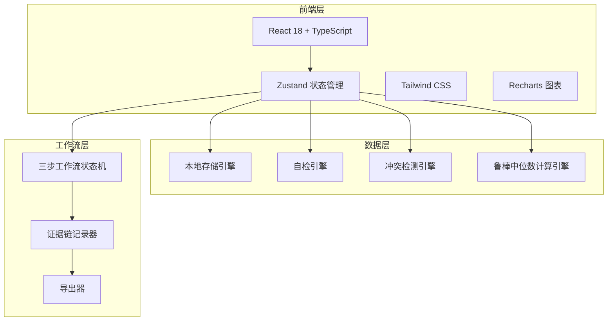
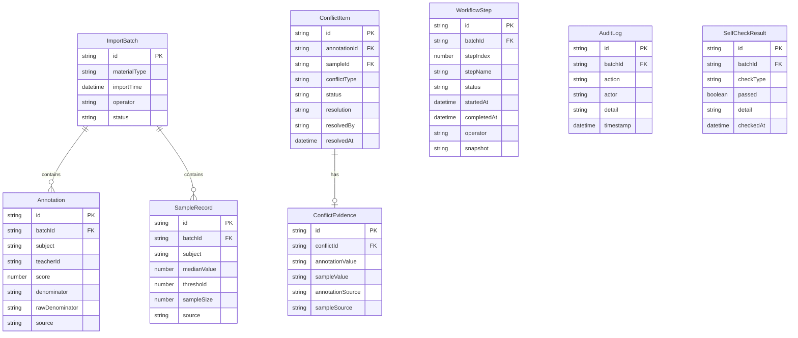

## 1. 架构设计



## 2. 技术说明

- 前端：React@18 + Tailwind CSS@3 + Vite + TypeScript
- 初始化工具：vite-init
- 后端：无（纯前端，数据存储在 localStorage）
- 数据库：无（使用 localStorage + 内存状态，mock 数据）
- 图表：Recharts
- 图标：lucide-react
- 日期处理：date-fns

## 3. 路由定义

| 路由 | 用途 |
|------|------|
| / | 报警总览页，展示鲁棒中位数报警结果与待处理冲突 |
| /import | 数据导入与自检页，导入材料并执行自检 |
| /conflicts | 冲突裁定页，查看冲突证据并确认/驳回 |
| /workflow | 工作流追踪页，追踪三步工作流状态 |
| /history | 历史记录页，查看完整操作证据链 |

## 4. API 定义

不适用（纯前端项目，无后端 API）

## 5. 服务器架构图

不适用（纯前端项目）

## 6. 数据模型

### 6.1 数据模型定义



### 6.2 数据定义语言

本项目为纯前端，数据存储于 localStorage，以下为 TypeScript 类型定义：

```typescript
interface ImportBatch {
  id: string;
  materialType: 'normal' | 'wrong_caliber' | 'supplement';
  importTime: string;
  operator: string;
  status: 'pending' | 'checking' | 'checked' | 'conflicted' | 'resolved';
}

interface Annotation {
  id: string;
  batchId: string;
  subject: string;
  teacherId: string;
  score: number;
  denominator: string;
  rawDenominator: string;
  source: string;
}

interface SampleRecord {
  id: string;
  batchId: string;
  subject: string;
  medianValue: number;
  threshold: number;
  sampleSize: number;
  source: string;
}

interface ConflictItem {
  id: string;
  annotationId: string;
  sampleId: string;
  conflictType: 'score_mismatch' | 'denominator_zero_empty' | 'median_deviation' | 'duplicate';
  status: 'pending' | 'confirmed' | 'rejected' | 'needs_review';
  resolution: string;
  resolvedBy: string;
  resolvedAt: string;
}

interface ConflictEvidence {
  id: string;
  conflictId: string;
  annotationValue: string;
  sampleValue: string;
  annotationSource: string;
  sampleSource: string;
}

interface WorkflowStep {
  id: string;
  batchId: string;
  stepIndex: 1 | 2 | 3;
  stepName: string;
  status: 'pending' | 'in_progress' | 'blocked' | 'completed';
  startedAt: string;
  completedAt: string;
  operator: string;
  snapshot: string;
}

interface AuditLog {
  id: string;
  batchId: string;
  action: string;
  actor: string;
  detail: string;
  timestamp: string;
}

interface SelfCheckResult {
  id: string;
  batchId: string;
  checkType: 'duplicate_import' | 'denominator_zero_empty' | 'recalc_after_supplement' | 'export_consistency';
  passed: boolean;
  detail: string;
  checkedAt: string;
}
```
