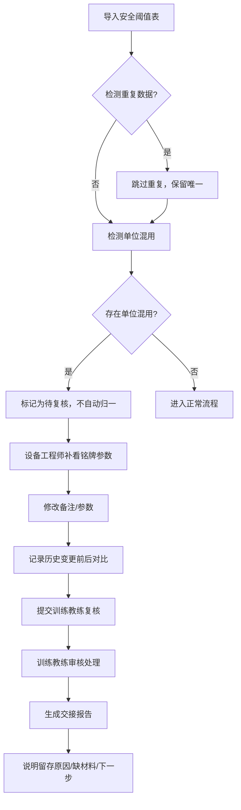

## 1. 产品概述
冷凝管结霜阈值安全管理系统，解决工业设备温度阈值管理中的单位混用、数据重复、历史追溯、工作流程衔接等问题，服务于设备工程师与训练教练的协作场景。

- 核心问题：摄氏度与开尔文单位混用导致阈值判断错误，重复导入数据造成冗余，修改痕迹无法追踪
- 目标用户：设备工程师（何工）、训练教练
- 产品价值：建立规范的阈值数据管理流程，确保数据准确性，实现可追溯的协作机制

## 2. 核心功能

### 2.1 用户角色
| 角色 | 核心权限 |
|------|----------|
| 设备工程师 | 导入安全阈值表、查看设备铭牌参数、修改备注、提交复核申请 |
| 训练教练 | 复核单位混用数据、审批异常处理、查看完整历史记录 |

### 2.2 功能模块
1. **阈值数据管理**：安全阈值表导入、去重校验、数据列表展示
2. **历史变更追踪**：修改记录对比、备注变更可视化、参数版本管理
3. **数据可视化**：3D展示、图表展示、数据溯源跳转
4. **工作流引擎**：三步审批流程、异常标记、任务分配
5. **交接报告生成**：智能报告、材料清单、下一步指引

### 2.3 页面详情
| 页面名称 | 模块名称 | 功能描述 |
|---------|---------|----------|
| 阈值数据概览 | 数据导入面板 | 支持Excel导入、重复数据检测、导入预览 |
| 阈值数据概览 | 数据列表 | 分页展示、搜索筛选、单位标记、状态标签 |
| 数据详情页 | 基本信息 | 阈值参数、单位显示、设备关联 |
| 数据详情页 | 历史记录 | 修改时间轴、前后对比、参数版本说明 |
| 数据详情页 | 计算模型 | 专业计算展示、参数版本记录、取舍理由说明 |
| 可视化展示 | 3D展示 | 冷凝管3D模型、阈值热点标记、点击溯源 |
| 可视化展示 | 图表展示 | 温度趋势图、阈值对比、异常高亮 |
| 工作流中心 | 待办任务 | 待复核列表、单位混用预警、快速处理 |
| 工作流中心 | 流程追踪 | 三步流程进度、当前处理人、时间节点 |
| 交接报告 | 报告生成 | 自动生成报告、原因说明、材料清单 |
| 交接报告 | 下一步指引 | 责任人推荐、行动项、时间节点 |

## 3. 核心流程

### 三步主工作流
1. 安全阈值表第一次导入 → 系统自动检测单位混用 → 标记异常数据
2. 设备工程师补看设备铭牌参数 → 更新备注信息 → 提交复核
3. 训练教练复核单位混用数据 → 确认或调整 → 交接报告更新

## 4. 用户界面设计

### 4.1 设计风格
- **主色调**：工业蓝 (#165DFF) 作为主色，体现专业可靠
- **辅助色**：警示橙 (#FF7D00) 标记单位混用异常，成功绿 (#00B42A) 标记已复核
- **中性色**：深灰背景 (#1D2129) 配合浅灰文字，营造工业科技感
- **按钮风格**：微立体、圆角 6px、悬浮阴影效果
- **字体**：标题使用 JetBrains Mono（等宽工业感），正文使用 PingFang SC
- **布局风格**：卡片式布局，清晰的模块分隔，数据表格使用斑马纹增强可读性
- **图标风格**：线性图标，工业设备风格，统一 24px 尺寸

### 4.2 页面设计概述
| 页面名称 | 模块名称 | UI 元素 |
|---------|---------|---------|
| 阈值数据概览 | 数据导入面板 | 拖拽区域、进度条、重复数据高亮提示 |
| 阈值数据概览 | 数据列表 | 状态徽章、单位标签（℃/K）、悬停预览 |
| 数据详情页 | 历史记录 | 时间轴设计、左右分栏对比、差异高亮 |
| 可视化展示 | 3D展示 | 旋转模型、热点闪烁、点击弹出数据卡片 |
| 工作流中心 | 待办任务 | 数字角标、优先级排序、一键处理按钮 |
| 交接报告 | 报告卡片 | 原因说明块、材料清单勾选框、责任人头像 |

### 4.3 响应式
- 桌面端优先设计（1920px）
- 平板自适应（1024px）：侧边栏收起，表格横向滚动
- 移动端（375px）：卡片堆叠，简化表格为列表

### 4.4 3D 场景指引
- **环境**：工业车间场景，低多边形风格
- **光照**：冷色调主光配合暖色补光，突出冷凝管金属质感
- **相机**：轨道控制器，默认 45° 俯视角
- **交互**：点击阈值热点弹出数据详情，可跳转回数据表
- **后处理**：泛光效果增强科技感，AO 提升立体感
