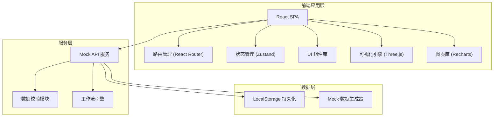
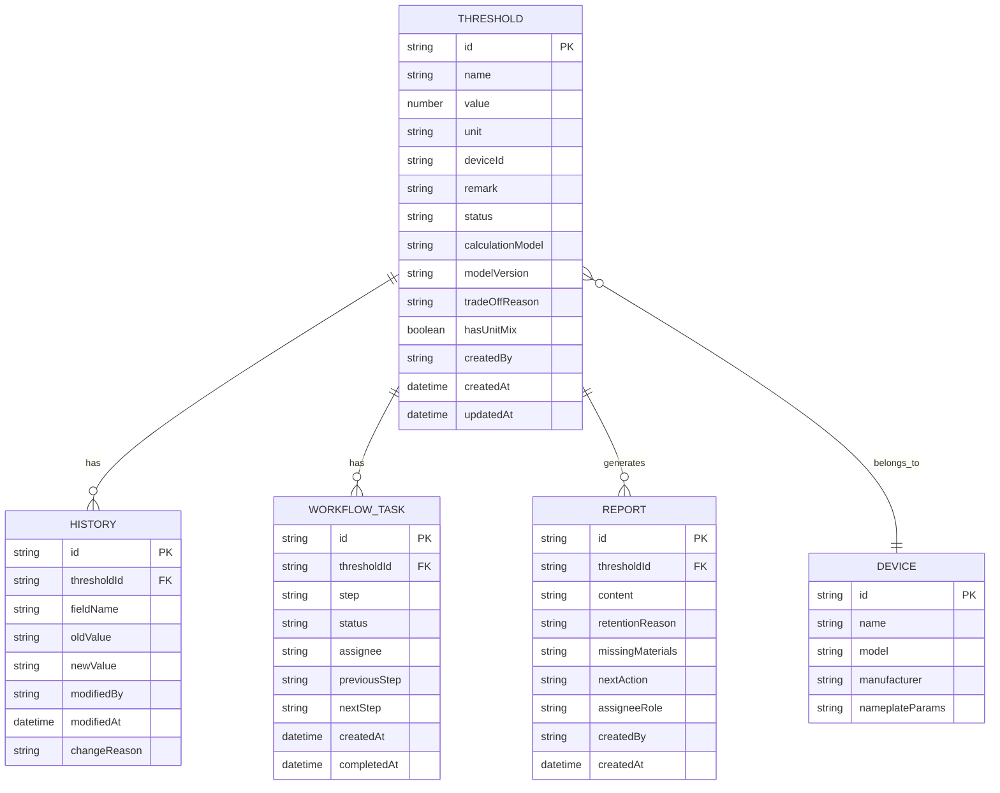

## 1. 架构设计



## 2. 技术描述
- **前端框架**：React@18 + TypeScript
- **构建工具**：Vite@5
- **样式方案**：TailwindCSS@3
- **状态管理**：Zustand（轻量级，适合中小型应用）
- **路由**：React Router@6
- **3D 可视化**：Three.js + @react-three/fiber + @react-three/drei
- **图表**：Recharts
- **数据持久化**：LocalStorage（无后端，纯前端演示）
- **代码规范**：ESLint + Prettier

## 3. 路由定义
| 路由 | 页面名称 | 主要功能 |
|------|---------|----------|
| / | 数据概览页 | 阈值数据列表、导入面板、统计卡片 |
| /threshold/:id | 数据详情页 | 阈值详情、历史记录、计算模型 |
| /visualization | 可视化展示页 | 3D 模型展示、图表分析、数据溯源 |
| /workflow | 工作流中心 | 待办任务、流程追踪、审批处理 |
| /report | 交接报告页 | 报告列表、报告详情、生成导出 |

## 4. 数据模型

### 4.1 数据模型定义



### 4.2 核心类型定义

```typescript
// 阈值数据
interface ThresholdData {
  id: string;
  name: string;
  value: number;
  unit: 'Celsius' | 'Kelvin';
  deviceId: string;
  remark: string;
  status: 'pending' | 'reviewing' | 'approved' | 'rejected';
  calculationModel?: string;
  modelVersion?: string;
  tradeOffReason?: string;
  hasUnitMix: boolean;
  createdBy: string;
  createdAt: string;
  updatedAt: string;
}

// 历史记录
interface HistoryRecord {
  id: string;
  thresholdId: string;
  fieldName: string;
  oldValue: string;
  newValue: string;
  modifiedBy: string;
  modifiedAt: string;
  changeReason: string;
}

// 工作流任务
interface WorkflowTask {
  id: string;
  thresholdId: string;
  step: 'import' | 'engineer_review' | 'coach_review' | 'report';
  status: 'pending' | 'in_progress' | 'completed';
  assignee: 'engineer' | 'coach';
  previousStep?: string;
  nextStep?: string;
  createdAt: string;
  completedAt?: string;
}

// 交接报告
interface HandoverReport {
  id: string;
  thresholdId: string;
  content: string;
  retentionReason: string;
  missingMaterials: string[];
  nextAction: string;
  assigneeRole: 'engineer' | 'coach';
  createdBy: string;
  createdAt: string;
}

// 设备信息
interface Device {
  id: string;
  name: string;
  model: string;
  manufacturer: string;
  nameplateParams: {
    ratedTemperature: number;
    temperatureUnit: 'Celsius' | 'Kelvin';
    [key: string]: any;
  };
}
```

## 5. 核心模块说明

### 5.1 数据去重模块
- **功能**：导入时根据阈值名称 + 设备 ID + 数值进行哈希校验
- **策略**：重复数据跳过不导入，返回导入统计（成功/重复/异常）

### 5.2 单位混用检测
- **功能**：检测同一设备下是否存在摄氏度与开尔文混用情况
- **策略**：仅标记异常，不自动转换，留待人工复核

### 5.3 历史变更追踪
- **功能**：记录字段级别的前后变化
- **展示**：左右分栏对比，差异部分高亮显示

### 5.4 三步工作流引擎
1. **导入阶段**：系统自动检测，标记异常
2. **工程师复核**：补看设备铭牌，修改备注
3. **教练审核**：最终确认，生成报告
