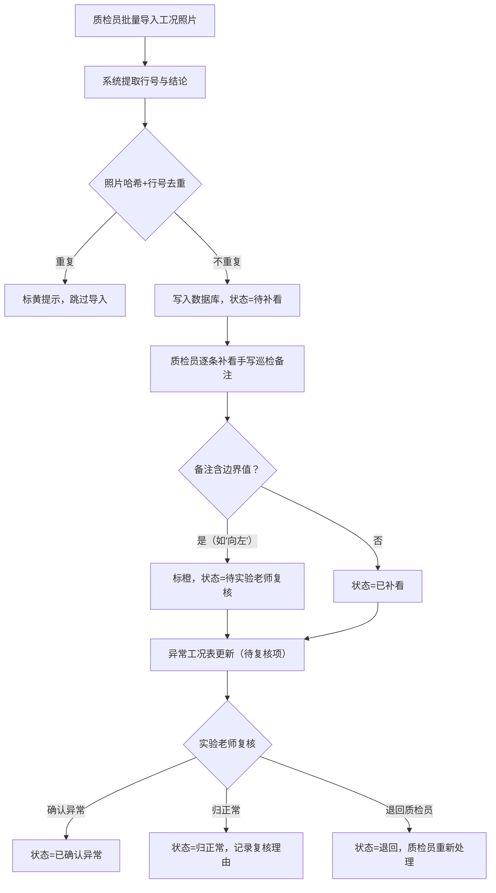

## 1. 产品概述

电梯制动距离核算系统——为质检员、现场师傅和实验老师提供一套可追溯、不可篡改的工况照片录入与审核工具。解决手写巡检备注补录后结论无法回溯、负方向等边界值被误归正常、重复导入导致数据翻倍等核心痛点，确保每一条核算结论都能追溯到原始证据。

- 目标用户：质检员（小白）、现场师傅、实验老师（复核人）
- 核心价值：结论可追证据，改动可查前后的差异，边界情况不靠口头约定

## 2. 核心功能

### 2.1 用户角色

| 角色 | 进入方式 | 核心权限 |
|------|----------|----------|
| 质检员 | 默认登录 | 导入工况照片、补看手写巡检备注、修改备注、查看变更历史 |
| 实验老师 | 管理员分配 | 复核异常工况（含边界值待判项）、审批或驳回 |
| 现场师傅 | 仅数据来源 | 工况照片中手写数据被读取（无系统账号） |

### 2.2 功能模块

1. **工况照片导入页**：批量导入工况照片，自动提取行号与结论，去重校验
2. **巡检备注补看页**：质检员逐条对照手写巡检备注，修改/补充备注字段
3. **异常工况表页**：展示所有异常项与待复核项，实验老师审批入口
4. **变更历史页**：任意核算条目的改动时间线，改前改后差异对比

### 2.3 页面详情

| 页面名称 | 模块名称 | 功能描述 |
|----------|----------|----------|
| 工况照片导入页 | 照片上传区 | 拖拽/选择批量上传工况照片，显示文件名、原始行号、提取结论 |
| 工况照片导入页 | 去重校验区 | 按照片哈希+行号判定重复，重复项标黄提示，不重复导入 |
| 工况照片导入页 | 导入确认区 | 展示本次即将导入条目数，已有重复条目数，一键确认 |
| 巡检备注补看页 | 备注对照区 | 左侧工况照片缩略图，右侧手写备注文本框，逐条编辑 |
| 巡检备注补看页 | 边界值标注区 | 检测到"向左"等非标表述自动标橙，状态设为"待实验老师复核" |
| 巡检备注补看页 | 保存确认区 | 保存时生成变更历史快照，仅改动的字段记入差异 |
| 异常工况表页 | 异常列表区 | 按状态筛选（异常/待复核/已复核），展示行号、结论、备注 |
| 异常工况表页 | 复核操作区 | 实验老师对"待复核"项进行判定：确认异常/归正常/退回质检员 |
| 变更历史页 | 时间线区 | 按时间倒序展示某条目的所有改动，每条展示改前值→改后值 |
| 变更历史页 | 差异高亮区 | 对备注等文本字段做字符级差异对比，新增绿色、删除红色 |

## 3. 核心流程

质检员导入工况照片 → 系统去重校验 → 质检员补看手写巡检备注 → 边界值自动拦截（如"向左"不归正常，标为待复核）→ 异常工况表更新 → 实验老师复核待判项 → 变更历史全程可查

## 4. 用户界面设计

### 4.1 设计风格

- 主色：#1B3A4B（深蓝灰，工业感）
- 辅助色：#D4A843（警示黄）、#C75C5C（异常红）、#4A9B7F（正常绿）
- 按钮风格：圆角4px，hover加深10%
- 字体：Noto Sans SC，标题16px加粗，正文14px常规
- 布局：左侧导航栏 + 右侧内容区，顶部状态条

### 4.2 页面设计概览

| 页面名称 | 模块名称 | UI 元素 |
|----------|----------|----------|
| 工况照片导入页 | 照片上传区 | 虚线拖拽框，文件列表表格（行号/结论/状态），状态徽标 |
| 工况照片导入页 | 去重校验区 | 黄色警示条，重复项行标黄，计数器 |
| 巡检备注补看页 | 备注对照区 | 左右分栏，左缩略图右文本框，底部翻页 |
| 巡检备注补看页 | 边界值标注区 | 橙色标签"待复核"，弹出规则说明浮层 |
| 异常工况表页 | 异常列表区 | 筛选标签栏，数据表格，状态列彩色徽标 |
| 异常工况表页 | 复核操作区 | 行内按钮组（确认/归正常/退回），理由输入弹窗 |
| 变更历史页 | 时间线区 | 竖向时间线，每节点显示改动人、时间、字段 |
| 变更历史页 | 差异高亮区 | 内联diff视图，红绿配色 |

### 4.3 响应式

桌面优先，最小宽度1024px。移动端暂不适配。

### 4.4 3D 场景

不适用
