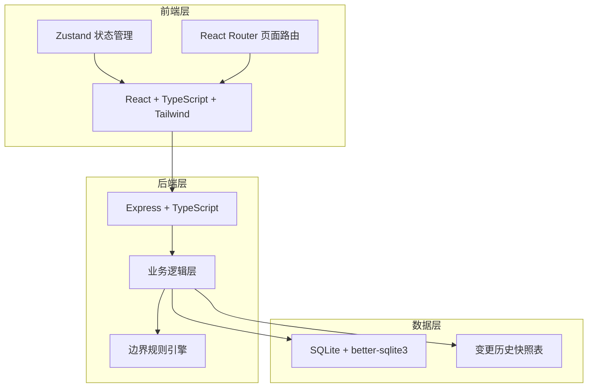
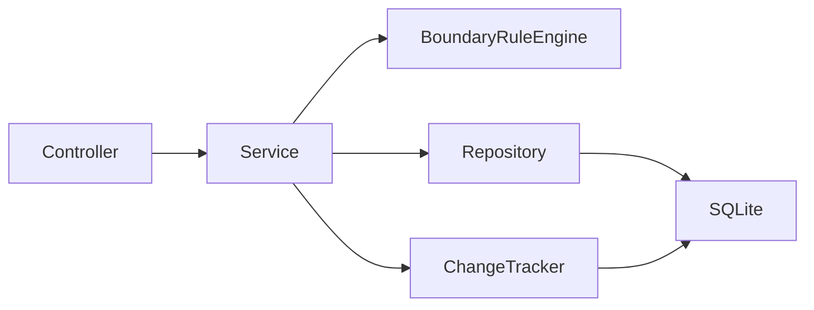
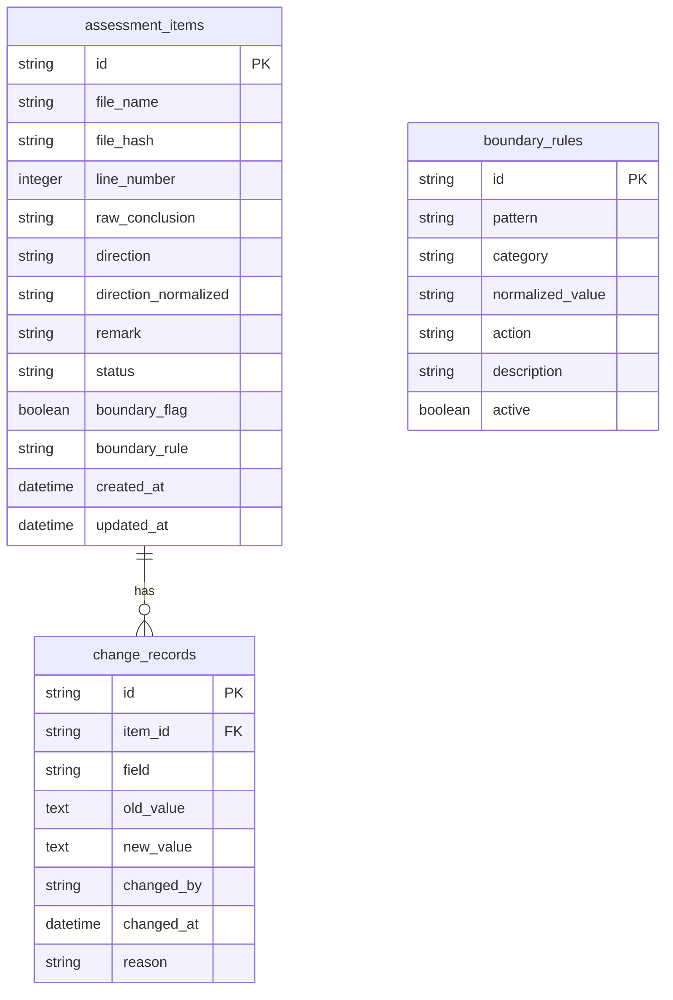

## 1. 架构设计



## 2. 技术说明

- 前端：React@18 + tailwindcss@3 + vite
- 初始化工具：vite-init
- 后端：Express@4 + TypeScript (ESM)
- 数据库：SQLite (better-sqlite3)，变更历史以 JSON 快照存于独立表
- 状态管理：Zustand
- 图标：lucide-react

## 3. 路由定义

| 路由 | 用途 |
|------|------|
| / | 重定向到 /import |
| /import | 工况照片导入页 |
| /review | 巡检备注补看页 |
| /abnormal | 异常工况表页 |
| /history/:id | 变更历史页（按条目ID查看） |

## 4. API 定义

### 4.1 工况照片导入

```typescript
interface ImportRequest {
  photos: {
    fileName: string;
    fileHash: string;
    lineNumber: number;
    rawConclusion: string;
    rawDirection?: string;
  }[];
}

interface ImportResponse {
  imported: number;
  duplicates: { fileName: string; lineNumber: number }[];
  items: AssessmentItem[];
}
```

### 4.2 核算条目

```typescript
interface AssessmentItem {
  id: string;
  fileName: string;
  fileHash: string;
  lineNumber: number;
  rawConclusion: string;
  direction: string;
  directionNormalized?: string;
  remark: string;
  status: "待补看" | "已补看" | "待实验老师复核" | "已确认异常" | "归正常" | "退回";
  boundaryFlag: boolean;
  boundaryRule?: string;
  createdAt: string;
  updatedAt: string;
}
```

### 4.3 备注修改

```typescript
interface RemarkUpdateRequest {
  itemId: string;
  remark: string;
  directionOverride?: string;
}

interface RemarkUpdateResponse {
  item: AssessmentItem;
  changeRecord: ChangeRecord;
}
```

### 4.4 变更记录

```typescript
interface ChangeRecord {
  id: string;
  itemId: string;
  field: string;
  oldValue: string;
  newValue: string;
  changedBy: string;
  changedAt: string;
  reason?: string;
}
```

### 4.5 复核操作

```typescript
interface ReviewRequest {
  itemId: string;
  action: "confirm_abnormal" | "mark_normal" | "return_to_inspector";
  reason: string;
}
```

### 4.6 API 路由表

| 方法 | 路径 | 用途 |
|------|------|------|
| POST | /api/assessments/import | 批量导入工况照片 |
| GET | /api/assessments | 获取核算条目列表（支持状态筛选） |
| GET | /api/assessments/:id | 获取单条核算条目详情 |
| PATCH | /api/assessments/:id/remark | 修改备注 |
| POST | /api/assessments/:id/review | 实验老师复核 |
| GET | /api/assessments/:id/history | 获取变更历史 |
| GET | /api/boundary-rules | 获取边界规则列表 |

## 5. 服务器架构图



## 6. 数据模型

### 6.1 数据模型定义



### 6.2 数据定义语言

```sql
CREATE TABLE assessment_items (
  id TEXT PRIMARY KEY,
  file_name TEXT NOT NULL,
  file_hash TEXT NOT NULL,
  line_number INTEGER NOT NULL,
  raw_conclusion TEXT NOT NULL,
  direction TEXT,
  direction_normalized TEXT,
  remark TEXT DEFAULT '',
  status TEXT NOT NULL DEFAULT '待补看',
  boundary_flag INTEGER NOT NULL DEFAULT 0,
  boundary_rule TEXT,
  created_at TEXT NOT NULL DEFAULT (datetime('now')),
  updated_at TEXT NOT NULL DEFAULT (datetime('now')),
  UNIQUE(file_hash, line_number)
);

CREATE TABLE change_records (
  id TEXT PRIMARY KEY,
  item_id TEXT NOT NULL REFERENCES assessment_items(id),
  field TEXT NOT NULL,
  old_value TEXT,
  new_value TEXT,
  changed_by TEXT NOT NULL,
  changed_at TEXT NOT NULL DEFAULT (datetime('now')),
  reason TEXT
);

CREATE INDEX idx_change_records_item_id ON change_records(item_id);
CREATE INDEX idx_assessment_items_status ON assessment_items(status);

CREATE TABLE boundary_rules (
  id TEXT PRIMARY KEY,
  pattern TEXT NOT NULL,
  category TEXT NOT NULL,
  normalized_value TEXT,
  action TEXT NOT NULL,
  description TEXT NOT NULL,
  active INTEGER NOT NULL DEFAULT 1
);

INSERT INTO boundary_rules (id, pattern, category, normalized_value, action, description) VALUES
  ('br001', '向左', 'direction', '负方向', 'flag_for_review', '现场师傅将负方向写成"向左"，不可自动归正常，需实验老师复核'),
  ('br002', '向右', 'direction', '正方向', 'flag_for_review', '现场师傅将正方向写成"向右"，需实验老师复核'),
  ('br003', '往上', 'direction', '上行', 'flag_for_review', '非标方向表述，需实验老师复核'),
  ('br004', '往下', 'direction', '下行', 'flag_for_review', '非标方向表述，需实验老师复核');
```
