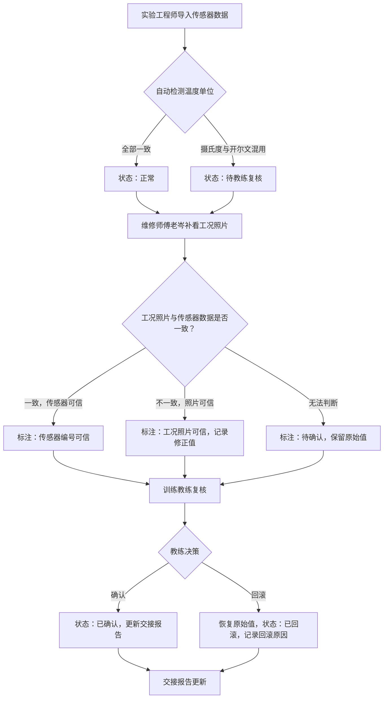

## 1. 产品概述

水槽波浪衰减实验数据管理系统，面向实验工程师、维修师傅和训练教练三类角色，解决传感器数据导入后温度单位混用（摄氏度/开尔文）导致记录不一致、无法追溯的问题。系统确保导出明细、页面展示和接口返回读同一份结果，保留每条记录的原始行号、人工改动和处理状态，使训练教练追问时可回到证据链而非只看汇总数。

- 核心价值：让"摄氏度与开尔文混用"不再靠口头约定处理，而是有明确的判定规则、修改流程和回滚能力
- 目标用户：实验工程师（数据导入）、维修师傅老岑（补看工况照片）、训练教练（复核与决策）

## 2. 核心功能

### 2.1 用户角色

| 角色 | 进入方式 | 核心权限 |
|------|----------|----------|
| 实验工程师 | 默认登录 | 导入传感器数据、查看处理结果、导出报告 |
| 维修师傅 | 默认登录 | 补看工况照片、标注传感器编号可信度、更新备注 |
| 训练教练 | 默认登录 | 复核混用记录、确认或回滚处理结果、签发交接报告 |

### 2.2 功能模块

1. **数据导入页**：传感器编号首次导入、原始行号记录、自动检测温度单位混用
2. **复核工作台**：工况照片查看、传感器编号与照片比对、混用记录处理状态管理
3. **交接报告页**：汇总报告生成、数据来源标注（传感器编号/待确认）、快速查阅视图

### 2.3 页面详情

| 页面名称 | 模块名称 | 功能描述 |
|----------|----------|----------|
| 数据导入页 | 文件上传区 | 支持 CSV/Excel 上传，自动解析传感器编号和温度列 |
| 数据导入页 | 导入预览表 | 显示原始行号、传感器编号、温度值、温度单位、检测状态（正常/混用/异常） |
| 数据导入页 | 混用检测结果 | 自动标红摄氏度与开尔文混用的行，标记为"待教练复核" |
| 复核工作台 | 待复核列表 | 筛选所有"待教练复核"状态的混用记录，显示原始行号和传感器编号 |
| 复核工作台 | 工况照片对比 | 左侧传感器数据、右侧工况照片，维修师傅可标注"照片可信"/"传感器可信" |
| 复核工作台 | 审计日志 | 显示每条记录的修改历史：谁改了什么、什么时间、原值→新值 |
| 交接报告页 | 报告汇总 | 按传感器编号分组，标注每条数据来源（传感器原始/照片修正/教练确认） |
| 交接报告页 | 快速查阅面板 | 十分钟临会场景：训练教练一眼看出哪条来自传感器、哪条等确认 |
| 交接报告页 | 导出功能 | 导出 CSV/PDF，内容与页面展示和接口返回完全一致 |

## 3. 核心流程

传感器编号第一次导入 → 维修师傅老岑补看工况照片 → 交接报告更新，三步走完。遇到摄氏度和开尔文混用时，不自动归正常，留给训练教练复核。

## 4. 用户界面设计

### 4.1 设计风格

- 主色调：深海军蓝（#0C2340）+ 琥珀警告色（#D97706）+ 翠绿确认色（#059669）
- 辅助色：浅灰底（#F8FAFC）、白色卡片、暗色文字
- 按钮风格：圆角 6px，带微妙阴影，状态色按钮（正常绿、警告琥珀、危险红）
- 字体：思源黑体 / Noto Sans SC 为主，数据表格用 JetBrains Mono 等宽字体
- 布局：左侧导航 + 右侧内容区，卡片式内容组织
- 图标风格：线性图标，与 lucide-react 图标库一致

### 4.2 页面设计概览

| 页面名称 | 模块名称 | UI 元素 |
|----------|----------|----------|
| 数据导入页 | 文件上传区 | 拖拽上传区、进度条、上传成功/失败动画 |
| 数据导入页 | 导入预览表 | 数据表格、行号列、温度单位标签（°C/K）、混用行高亮琥珀色 |
| 数据导入页 | 混用检测结果 | 统计卡片（正常/混用/异常数量）、混用行快捷跳转 |
| 复核工作台 | 待复核列表 | 可筛选表格、状态标签（待复核/照片可信/传感器可信/待确认） |
| 复核工作台 | 工况照片对比 | 双栏布局、照片缩略图、可信度标注按钮 |
| 复核工作台 | 审计日志 | 时间线样式、修改详情（原值→新值）、操作人头像 |
| 交接报告页 | 报告汇总 | 分组卡片、数据来源标签（传感器原始/照片修正/教练确认） |
| 交接报告页 | 快速查阅面板 | 顶置摘要条、颜色编码状态指示、展开详情折叠面板 |
| 交接报告页 | 导出功能 | 导出按钮下拉菜单（CSV/PDF）、导出进度提示 |

### 4.3 响应式设计

- 桌面优先设计，最小支持 1280px 宽度
- 表格在小屏幕下支持横向滚动
- 复核工作台照片对比在窄屏下切换为上下布局
- 快速查阅面板始终置顶，确保十分钟临会场景可用

### 4.4 设计理念

- **工业仪器感**：数据表格采用等宽字体，温度数值右对齐，模拟实验仪器读数面板
- **证据链可追溯**：每条记录旁始终可见原始行号和当前状态，审计日志按时间线排列
- **十分钟临会友好**：交接报告页顶部一屏即可看到关键信息：多少条正常、多少条混用待确认、哪些传感器编号需要关注
