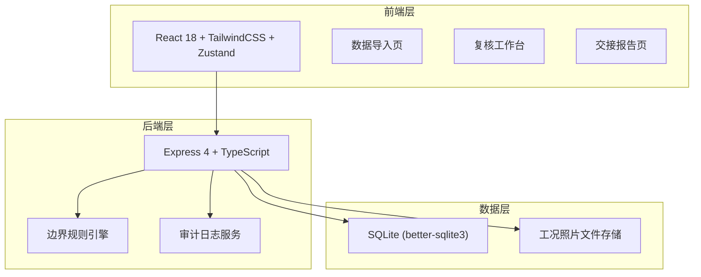
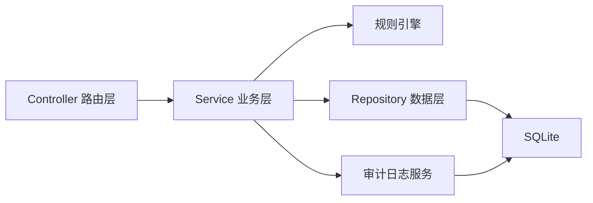
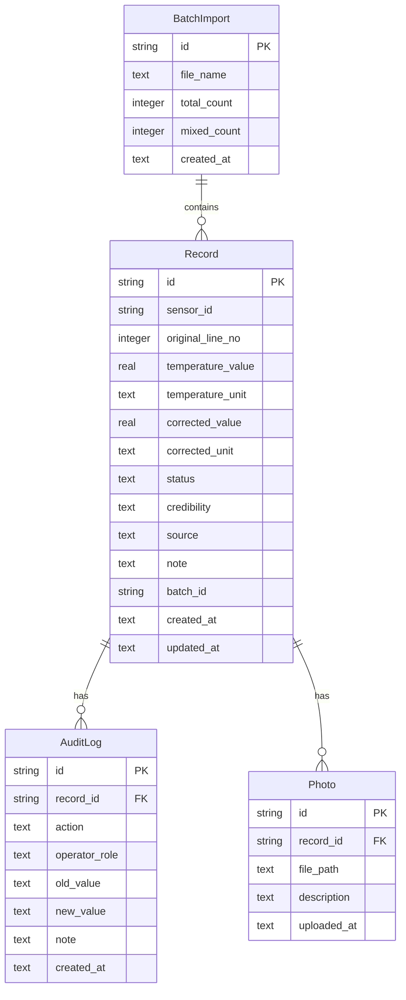

## 1. 架构设计



## 2. 技术说明

- 前端：React@18 + tailwindcss@3 + vite + zustand
- 初始化工具：vite-init
- 后端：Express@4 + TypeScript (ESM)
- 数据库：SQLite (better-sqlite3)，单文件数据库，便于备份和迁移
- 文件存储：工况照片存于 `uploads/` 目录，数据库记录路径引用

## 3. 路由定义

| 路由 | 用途 |
|------|------|
| `/` | 重定向到数据导入页 |
| `/import` | 数据导入页：文件上传、导入预览、混用检测 |
| `/review` | 复核工作台：待复核列表、照片对比、审计日志 |
| `/report` | 交接报告页：汇总、快速查阅、导出 |

## 4. API 定义

### 4.1 数据导入

```typescript
POST /api/records/import
Request: FormData { file: File }
Response: {
  imported: number
  mixed: number
  normal: number
  records: Array<{
    id: string
    sensorId: string
    originalLineNo: number
    temperatureValue: number
    temperatureUnit: "C" | "K"
    status: "normal" | "mixed_unit" | "anomaly"
    source: "sensor_original"
    createdAt: string
  }>
}

GET /api/records
Query: { status?: string, sensorId?: string, page?: number, pageSize?: number }
Response: {
  total: number
  records: Array<RecordDetail>
}
```

### 4.2 复核操作

```typescript
PATCH /api/records/:id/review
Request: {
  credibility: "sensor_trusted" | "photo_trusted" | "pending_confirmation"
  correctedValue?: number
  correctedUnit?: "C" | "K"
  note?: string
  operatorRole: "maintenance_worker" | "training_coach"
}
Response: RecordDetail

POST /api/records/:id/rollback
Request: { reason: string }
Response: RecordDetail

GET /api/records/:id/audit-log
Response: Array<{
  id: string
  recordId: string
  action: "import" | "review" | "confirm" | "rollback" | "edit"
  operatorRole: string
  oldValue: string | null
  newValue: string | null
  note: string | null
  createdAt: string
}>

POST /api/records/:id/photos
Request: FormData { file: File, description?: string }
Response: { id: string, url: string }

GET /api/records/:id/photos
Response: Array<{ id: string, url: string, description: string, uploadedAt: string }>
```

### 4.3 交接报告

```typescript
GET /api/report
Query: { format?: "json" | "csv" }
Response: {
  summary: {
    totalRecords: number
    normalCount: number
    mixedCount: number
    pendingCount: number
    confirmedCount: number
    rolledBackCount: number
  }
  groups: Array<{
    sensorId: string
    records: Array<RecordDetail>
  }>
}

POST /api/report/export
Request: { format: "csv" | "pdf" }
Response: 文件下载流
```

### 4.4 核心数据类型

```typescript
interface RecordDetail {
  id: string
  sensorId: string
  originalLineNo: number
  temperatureValue: number
  temperatureUnit: "C" | "K"
  correctedValue: number | null
  correctedUnit: "C" | "K" | null
  status: "normal" | "mixed_unit" | "anomaly" | "confirmed" | "rolled_back"
  credibility: "sensor_trusted" | "photo_trusted" | "pending_confirmation" | null
  source: "sensor_original" | "photo_corrected" | "coach_confirmed" | "rolled_back"
  note: string | null
  batchId: string
  createdAt: string
  updatedAt: string
}
```

## 5. 服务器架构图



## 6. 数据模型

### 6.1 数据模型定义



### 6.2 数据定义语言

```sql
CREATE TABLE batch_imports (
    id TEXT PRIMARY KEY,
    file_name TEXT NOT NULL,
    total_count INTEGER NOT NULL DEFAULT 0,
    mixed_count INTEGER NOT NULL DEFAULT 0,
    created_at TEXT NOT NULL DEFAULT (datetime('now'))
);

CREATE TABLE records (
    id TEXT PRIMARY KEY,
    sensor_id TEXT NOT NULL,
    original_line_no INTEGER NOT NULL,
    temperature_value REAL NOT NULL,
    temperature_unit TEXT NOT NULL CHECK (temperature_unit IN ('C', 'K')),
    corrected_value REAL,
    corrected_unit TEXT CHECK (corrected_unit IN ('C', 'K')),
    status TEXT NOT NULL DEFAULT 'normal' CHECK (status IN ('normal', 'mixed_unit', 'anomaly', 'confirmed', 'rolled_back')),
    credibility TEXT CHECK (credibility IN ('sensor_trusted', 'photo_trusted', 'pending_confirmation')),
    source TEXT NOT NULL DEFAULT 'sensor_original' CHECK (source IN ('sensor_original', 'photo_corrected', 'coach_confirmed', 'rolled_back')),
    note TEXT,
    batch_id TEXT NOT NULL REFERENCES batch_imports(id),
    created_at TEXT NOT NULL DEFAULT (datetime('now')),
    updated_at TEXT NOT NULL DEFAULT (datetime('now'))
);

CREATE TABLE audit_logs (
    id TEXT PRIMARY KEY,
    record_id TEXT NOT NULL REFERENCES records(id),
    action TEXT NOT NULL CHECK (action IN ('import', 'review', 'confirm', 'rollback', 'edit')),
    operator_role TEXT NOT NULL,
    old_value TEXT,
    new_value TEXT,
    note TEXT,
    created_at TEXT NOT NULL DEFAULT (datetime('now'))
);

CREATE TABLE photos (
    id TEXT PRIMARY KEY,
    record_id TEXT NOT NULL REFERENCES records(id),
    file_path TEXT NOT NULL,
    description TEXT,
    uploaded_at TEXT NOT NULL DEFAULT (datetime('now'))
);

CREATE INDEX idx_records_status ON records(status);
CREATE INDEX idx_records_sensor_id ON records(sensor_id);
CREATE INDEX idx_records_batch_id ON records(batch_id);
CREATE INDEX idx_audit_logs_record_id ON audit_logs(record_id);
CREATE INDEX idx_photos_record_id ON photos(record_id);
```

## 7. 边界规则引擎

### 7.1 摄氏度与开尔文混用判定规则

- 同一批次导入中，若存在温度单位不一致的记录（部分为 °C、部分为 K），则标记为 `mixed_unit`
- 判定阈值：当同一传感器编号下温度单位不唯一时触发
- 不自动转换或归正常，统一标记为"待教练复核"

### 7.2 处理流程

1. **判定**：导入时自动检测，标记 `status = mixed_unit`
2. **修改**：维修师傅或训练教练可修改温度值/单位，审计日志记录原值→新值
3. **确认**：训练教练确认后 `status = confirmed`，`source` 更新为实际来源
4. **回滚**：训练教练可回滚至原始值，`status = rolled_back`，`source = rolled_back`，审计日志记录回滚原因

### 7.3 数据一致性保证

- 导出明细、页面展示、接口返回均查询同一数据库视图
- 不在前端或 API 层做二次计算，所有状态和修正值以数据库为准
- 温度显示统一使用 `corrected_value`（若存在）否则使用 `temperature_value`，单位同理
