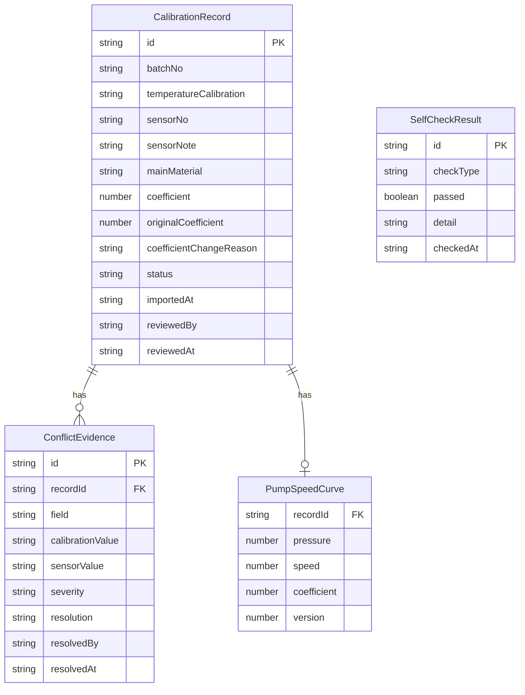

## 1. 架构设计

```mermaid
graph TB
    subgraph "前端层"
        "导入与校验页" --> "状态管理 Store"
        "参数回放页" --> "状态管理 Store"
        "导出与一致页" --> "状态管理 Store"
    end
    subgraph "数据层"
        "状态管理 Store" --> "统一数据源 DataSource"
        "统一数据源 DataSource" --> "Mock API"
    end
    subgraph "校验层"
        "统一数据源 DataSource" --> "自检引擎 SelfCheck"
        "统一数据源 DataSource" --> "冲突检测引擎 ConflictDetector"
        "统一数据源 DataSource" --> "一致性校验 ConsistencyChecker"
    end
```

核心原则：**单一数据源**。导出明细、页面展示、接口返回全部从 `DataSource` 读取，人工改系数无原因记录在任何端都保持可见，不会一个地方显示异常、另一个地方消失。

## 2. 技术说明

- 前端：React@18 + TypeScript + TailwindCSS@3 + Vite
- 初始化工具：Vite（react-ts 模板）
- 状态管理：Zustand（轻量、单一 store 保证数据源一致）
- 图表：Recharts（抽速曲线回放）
- 后端：无，使用 Mock 数据
- 数据库：无，使用内存数据 + localStorage 持久化

## 3. 路由定义

| 路由 | 用途 |
|------|------|
| `/` | 重定向到 `/import` |
| `/import` | 导入与校验页：温度校准记录导入、传感器编号补看、冲突检测 |
| `/replay` | 参数回放页：曲线参数回放、人工改系数标记、设备工程师复核 |
| `/export` | 导出与一致页：自检报告、明细导出、一致性校验 |

## 4. API 定义（Mock）

### 4.1 数据类型

```typescript
interface CalibrationRecord {
  id: string
  batchNo: string
  temperatureCalibration: string
  sensorNo: string
  sensorNote: string
  mainMaterial: string
  coefficient: number
  originalCoefficient: number | null
  coefficientChangeReason: string | null
  status: 'normal' | 'conflict' | 'pending_review' | 'reviewed'
  importedAt: string
  reviewedBy: string | null
  reviewedAt: string | null
}

interface ConflictEvidence {
  recordId: string
  field: string
  calibrationValue: string
  sensorValue: string
  severity: 'high' | 'medium'
}

interface SelfCheckResult {
  id: string
  checkType: 'duplicate_import' | 'coefficient_no_reason' | 'recalc_after_patch' | 'export_consistency'
  passed: boolean
  detail: string
  checkedAt: string
}

interface PumpSpeedCurve {
  recordId: string
  pressure: number[]
  speed: number[]
  coefficient: number
  version: number
}
```

### 4.2 Mock 接口

| 接口 | 方法 | 描述 |
|------|------|------|
| `/api/records` | GET | 获取所有校准记录 |
| `/api/records` | POST | 导入温度校准记录 |
| `/api/records/:id` | PATCH | 更新记录（确认冲突、补充原因等） |
| `/api/conflicts` | GET | 获取冲突证据列表 |
| `/api/conflicts/:id/confirm` | POST | 质检员确认冲突 |
| `/api/conflicts/:id/reject` | POST | 质检员驳回冲突 |
| `/api/curves/:recordId` | GET | 获取抽速曲线数据 |
| `/api/review/:recordId` | POST | 设备工程师复核 |
| `/api/self-check` | GET | 执行自检并返回结果 |
| `/api/export` | GET | 导出明细（返回与页面一致的数据） |

## 5. 服务器架构

不适用（纯前端项目）

## 6. 数据模型

### 6.1 数据模型定义



### 6.2 数据定义

使用 Zustand store + localStorage 持久化，初始 Mock 数据包含：

- 5 条校准记录（含 1 条重复导入、1 条人工改系数无原因、1 条温度校准与传感器编号冲突）
- 2 条冲突证据
- 4 条自检结果（对应四种自检类型）
- 3 条抽速曲线数据
