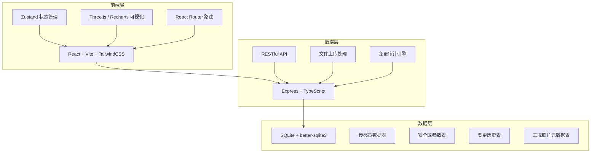
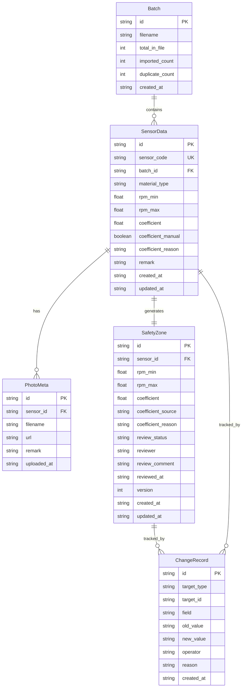

## 1. 架构设计



## 2. 技术说明

- 前端：React@18 + TailwindCSS@3 + Vite
- 初始化工具：vite-init
- 后端：Express@4 + TypeScript（ESM 模式）
- 数据库：SQLite（better-sqlite3），单文件部署，零配置
- 3D 渲染：Three.js + @react-three/fiber + @react-three/drei
- 图表：Recharts
- 状态管理：Zustand
- 图标：lucide-react

## 3. 路由定义

| 路由 | 用途 |
|------|------|
| `/` | 总览仪表盘，展示安全区状态概览与待复核条目 |
| `/sensors` | 传感器数据管理，批量导入、照片关联、备注编辑 |
| `/review` | 安全区参数复核，人工改动检测、溯源跳转、复核操作 |
| `/history` | 历史变更追踪，时间线、差异对比、回滚与命令导出 |
| `/visualization` | 可视化分析，3D 安全区与图表视图、点击穿透 |

## 4. API 定义

### 4.1 传感器数据 API

```typescript
interface SensorData {
  id: string;
  sensorCode: string;
  batchId: string;
  materialType: string;
  rpmMin: number;
  rpmMax: number;
  coefficient: number;
  coefficientManual: boolean;
  coefficientReason: string | null;
  photoIds: string[];
  remark: string;
  createdAt: string;
  updatedAt: string;
}

interface ImportResult {
  totalInFile: number;
  imported: number;
  duplicates: number;
  batchId: string;
}

// POST /api/sensors/import - 批量导入传感器编号
// Request: FormData { file: File }
// Response: ImportResult

// GET /api/sensors - 获取传感器列表
// Request: { batchId?: string, page?: number, pageSize?: number }
// Response: { data: SensorData[], total: number }

// PUT /api/sensors/:id/remark - 更新备注
// Request: { remark: string }
// Response: SensorData

// PUT /api/sensors/:id/coefficient - 修改系数
// Request: { coefficient: number, reason: string }
// Response: SensorData
```

### 4.2 工况照片 API

```typescript
interface PhotoMeta {
  id: string;
  sensorId: string;
  filename: string;
  url: string;
  remark: string;
  uploadedAt: string;
}

// POST /api/photos/upload - 上传工况照片
// Request: FormData { file: File, sensorId: string }
// Response: PhotoMeta

// GET /api/photos/:sensorId - 获取传感器关联照片
// Response: PhotoMeta[]
```

### 4.3 安全区参数 API

```typescript
interface SafetyZone {
  id: string;
  sensorId: string;
  rpmMin: number;
  rpmMax: number;
  coefficient: number;
  coefficientSource: "auto" | "manual";
  coefficientReason: string | null;
  reviewStatus: "pending" | "reviewed" | "rollback";
  reviewer: string | null;
  reviewComment: string | null;
  reviewedAt: string | null;
  version: number;
  createdAt: string;
}

// GET /api/safety-zones - 获取安全区参数列表
// Request: { status?: string, page?: number, pageSize?: number }
// Response: { data: SafetyZone[], total: number }

// POST /api/safety-zones/:id/review - 复核操作
// Request: { action: "approve" | "rollback", comment: string }
// Response: SafetyZone
```

### 4.4 变更历史 API

```typescript
interface ChangeRecord {
  id: string;
  targetType: "sensor" | "safety-zone";
  targetId: string;
  field: string;
  oldValue: string;
  newValue: string;
  operator: string;
  reason: string | null;
  createdAt: string;
}

interface HistoryDiff {
  record: ChangeRecord;
  snapshot: SensorData | SafetyZone;
}

// GET /api/history - 获取变更历史
// Request: { targetType?: string, targetId?: string, from?: string, to?: string }
// Response: { data: ChangeRecord[], total: number }

// GET /api/history/:id/diff - 获取单条变更的完整快照对比
// Response: { before: HistoryDiff, after: HistoryDiff }

// POST /api/history/:id/rollback - 回滚至某条历史版本
// Response: { success: boolean, newVersion: SafetyZone | SensorData }

// GET /api/history/export - 导出可重跑命令脚本
// Request: { from?: string, to?: string }
// Response: text/plain (shell script content)
```

## 5. 服务端架构图

```mermaid
graph LR
    "Controller 层" --> "Service 层"
    "Service 层" --> "Repository 层"
    "Repository 层" --> "SQLite 数据库"
    "Service 层" --> "审计引擎"
    "审计引擎" --> "变更历史表"
    "Controller 层" --> "文件上传中间件"
    "文件上传中间件" --> "uploads 目录"
```

## 6. 数据模型

### 6.1 数据模型定义



### 6.2 数据定义语言

```sql
CREATE TABLE IF NOT EXISTS batch (
    id TEXT PRIMARY KEY,
    filename TEXT NOT NULL,
    total_in_file INTEGER NOT NULL DEFAULT 0,
    imported_count INTEGER NOT NULL DEFAULT 0,
    duplicate_count INTEGER NOT NULL DEFAULT 0,
    created_at TEXT NOT NULL DEFAULT (datetime('now'))
);

CREATE TABLE IF NOT EXISTS sensor_data (
    id TEXT PRIMARY KEY,
    sensor_code TEXT NOT NULL UNIQUE,
    batch_id TEXT NOT NULL,
    material_type TEXT NOT NULL DEFAULT '',
    rpm_min REAL NOT NULL DEFAULT 0,
    rpm_max REAL NOT NULL DEFAULT 0,
    coefficient REAL NOT NULL DEFAULT 1.0,
    coefficient_manual INTEGER NOT NULL DEFAULT 0,
    coefficient_reason TEXT,
    remark TEXT NOT NULL DEFAULT '',
    created_at TEXT NOT NULL DEFAULT (datetime('now')),
    updated_at TEXT NOT NULL DEFAULT (datetime('now')),
    FOREIGN KEY (batch_id) REFERENCES batch(id)
);

CREATE INDEX IF NOT EXISTS idx_sensor_batch ON sensor_data(batch_id);
CREATE INDEX IF NOT EXISTS idx_sensor_code ON sensor_data(sensor_code);

CREATE TABLE IF NOT EXISTS photo_meta (
    id TEXT PRIMARY KEY,
    sensor_id TEXT NOT NULL,
    filename TEXT NOT NULL,
    url TEXT NOT NULL,
    remark TEXT NOT NULL DEFAULT '',
    uploaded_at TEXT NOT NULL DEFAULT (datetime('now')),
    FOREIGN KEY (sensor_id) REFERENCES sensor_data(id)
);

CREATE INDEX IF NOT EXISTS idx_photo_sensor ON photo_meta(sensor_id);

CREATE TABLE IF NOT EXISTS safety_zone (
    id TEXT PRIMARY KEY,
    sensor_id TEXT NOT NULL UNIQUE,
    rpm_min REAL NOT NULL DEFAULT 0,
    rpm_max REAL NOT NULL DEFAULT 0,
    coefficient REAL NOT NULL DEFAULT 1.0,
    coefficient_source TEXT NOT NULL DEFAULT 'auto',
    coefficient_reason TEXT,
    review_status TEXT NOT NULL DEFAULT 'pending',
    reviewer TEXT,
    review_comment TEXT,
    reviewed_at TEXT,
    version INTEGER NOT NULL DEFAULT 1,
    created_at TEXT NOT NULL DEFAULT (datetime('now')),
    updated_at TEXT NOT NULL DEFAULT (datetime('now')),
    FOREIGN KEY (sensor_id) REFERENCES sensor_data(id)
);

CREATE INDEX IF NOT EXISTS idx_safety_review ON safety_zone(review_status);
CREATE INDEX IF NOT EXISTS idx_safety_source ON safety_zone(coefficient_source);

CREATE TABLE IF NOT EXISTS change_record (
    id TEXT PRIMARY KEY,
    target_type TEXT NOT NULL,
    target_id TEXT NOT NULL,
    field TEXT NOT NULL,
    old_value TEXT NOT NULL,
    new_value TEXT NOT NULL,
    operator TEXT NOT NULL DEFAULT 'system',
    reason TEXT,
    created_at TEXT NOT NULL DEFAULT (datetime('now'))
);

CREATE INDEX IF NOT EXISTS idx_change_target ON change_record(target_type, target_id);
CREATE INDEX IF NOT EXISTS idx_change_time ON change_record(created_at);
```
