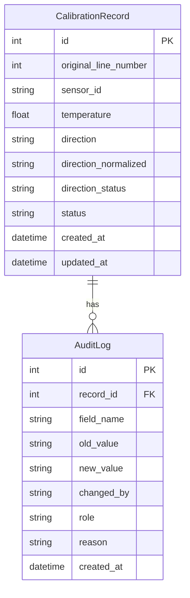

## 1. 架构设计

```mermaid
flowchart TD
    "Frontend[前端 React + Vite]" --> "|API调用|" "Backend[Express 后端]"
    "Backend" --> "|读写|" "DB[SQLite 数据库]"
    "Backend" --> "|单例结果源|" "ResultStore[统一结果数据源]"
    "Frontend" --> "|页面展示|" "ResultStore"
    "导出接口" --> "|读取|" "ResultStore"
```

核心原则：**导出明细、页面展示、接口返回读同一份结果数据**。后端维护一个统一的结果数据源（SQLite 表），所有读取操作（API 返回、页面渲染、CSV 导出）均从此表查询，不做任何二次加工或缓存。

## 2. 技术说明

- 前端：React@18 + TailwindCSS@3 + Vite
- 初始化工具：Vite (React + TypeScript 模板)
- 后端：Express@4
- 数据库：SQLite（better-sqlite3），嵌入式，零部署依赖
- 文件解析：xlsx 库处理 Excel，papaparse 处理 CSV

## 3. 路由定义

| 路由 | 用途 |
|------|------|
| `/` | 重定向到 `/import` |
| `/import` | 温度校准记录导入页 |
| `/review` | 传感器编号审阅页 |
| `/anomalies` | 异常工况表页 |

## 4. API 定义

### 4.1 温度校准记录

```typescript
interface CalibrationRecord {
  id: number;
  original_line_number: number;
  sensor_id: string;
  temperature: number;
  direction: string;
  direction_normalized: string | null;
  direction_status: "normal" | "abnormal" | "pending_review";
  status: "imported" | "reviewed" | "confirmed" | "rolled_back";
  created_at: string;
  updated_at: string;
}

interface AuditLog {
  id: number;
  record_id: number;
  field_name: string;
  old_value: string;
  new_value: string;
  changed_by: string;
  role: "technician" | "lab_teacher";
  reason: string;
  created_at: string;
}

// POST /api/calibration/import - 导入温度校准记录
// Request: FormData (file)
// Response: { success: boolean; imported: number; abnormal: number; pending_review: number }

// GET /api/calibration/records - 获取所有记录（分页+筛选）
// Response: { data: CalibrationRecord[]; total: number }

// PATCH /api/calibration/records/:id - 更新单条记录（触发审计日志）
// Request: { field_name: string; new_value: string; reason: string; changed_by: string; role: string }
// Response: { success: boolean; record: CalibrationRecord }

// GET /api/calibration/records/:id/audit - 获取单条记录的审计日志
// Response: { data: AuditLog[] }

// POST /api/calibration/records/:id/rollback - 回滚到指定审计日志版本
// Request: { audit_log_id: number; reason: string; changed_by: string }
// Response: { success: boolean; record: CalibrationRecord }
```

### 4.2 异常工况

```typescript
interface AnomalySummary {
  type: string;
  count: number;
  pending_review: number;
  confirmed: number;
  rolled_back: number;
}

// GET /api/anomalies/summary - 异常工况汇总
// Response: { data: AnomalySummary[] }

// GET /api/anomalies/records - 异常工况明细（与 /api/calibration/records 读同一张表）
// Query: { type?: string; status?: string }
// Response: { data: CalibrationRecord[] }

// PATCH /api/anomalies/records/:id/confirm - 实验老师确认
// Request: { confirmed_by: string }
// Response: { success: boolean }

// PATCH /api/anomalies/records/:id/rollback - 实验老师驳回回滚
// Request: { reason: string; rolled_back_by: string }
// Response: { success: boolean }

// GET /api/anomalies/export - 导出异常工况明细（CSV）
// Query: { status?: string; type?: string }
// Response: text/csv
```

## 5. 服务端架构图

```mermaid
flowchart LR
    "Controller[路由控制器]" --> "|参数校验|" "Service[业务逻辑层]"
    "Service" --> "|数据读写|" "Repository[数据访问层]"
    "Repository" --> "|SQL|" "SQLite[(SQLite)]"
    "Service" --> "|审计日志|" "AuditService[审计服务]"
    "AuditService" --> "Repository"
```

### 5.1 方向边界规则引擎

```typescript
type DirectionRule = {
  pattern: RegExp;
  normalizedValue: string | null;
  action: "auto_fix" | "mark_pending_review";
  description: string;
};

const DIRECTION_RULES: DirectionRule[] = [
  { pattern: /^负方向$/, normalizedValue: "negative", action: "auto_fix", description: "标准值，自动映射" },
  { pattern: /^正方向$/, normalizedValue: "positive", action: "auto_fix", description: "标准值，自动映射" },
  { pattern: /^向左$/, normalizedValue: null, action: "mark_pending_review", description: "现场口语化表达，可能对应负方向但不自动归正常，留给实验老师复核" },
  { pattern: /^向右$/, normalizedValue: null, action: "mark_pending_review", description: "现场口语化表达，可能对应正方向但不自动归正常，留给实验老师复核" },
  { pattern: /^反方向$/, normalizedValue: null, action: "mark_pending_review", description: "含义模糊，需确认是正还是负" },
];
```

**关键原则**：方向边界规则写在代码常量 `DIRECTION_RULES` 中，同时记录在 README 里。只有 `action: "auto_fix"` 的规则才会自动修正，其余一律标记为"待复核"，由实验老师人工确认。回滚操作会恢复原始值并写入审计日志。

## 6. 数据模型

### 6.1 数据模型定义



### 6.2 数据定义语言

```sql
CREATE TABLE calibration_records (
  id INTEGER PRIMARY KEY AUTOINCREMENT,
  original_line_number INTEGER NOT NULL,
  sensor_id TEXT NOT NULL,
  temperature REAL NOT NULL,
  direction TEXT NOT NULL,
  direction_normalized TEXT,
  direction_status TEXT NOT NULL DEFAULT 'normal' CHECK(direction_status IN ('normal', 'abnormal', 'pending_review')),
  status TEXT NOT NULL DEFAULT 'imported' CHECK(status IN ('imported', 'reviewed', 'confirmed', 'rolled_back')),
  created_at TEXT NOT NULL DEFAULT (datetime('now')),
  updated_at TEXT NOT NULL DEFAULT (datetime('now'))
);

CREATE TABLE audit_logs (
  id INTEGER PRIMARY KEY AUTOINCREMENT,
  record_id INTEGER NOT NULL,
  field_name TEXT NOT NULL,
  old_value TEXT NOT NULL,
  new_value TEXT NOT NULL,
  changed_by TEXT NOT NULL,
  role TEXT NOT NULL CHECK(role IN ('technician', 'lab_teacher')),
  reason TEXT NOT NULL,
  created_at TEXT NOT NULL DEFAULT (datetime('now')),
  FOREIGN KEY (record_id) REFERENCES calibration_records(id)
);

CREATE INDEX idx_calibration_status ON calibration_records(status);
CREATE INDEX idx_calibration_direction_status ON calibration_records(direction_status);
CREATE INDEX idx_audit_record_id ON audit_logs(record_id);
```
