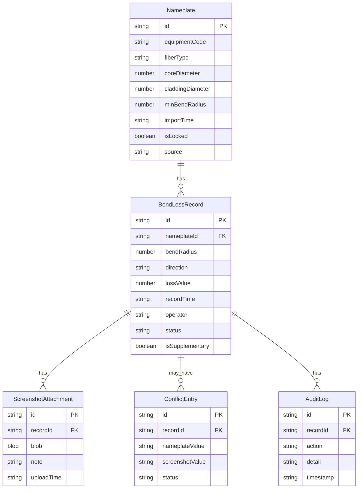

## 1. 架构设计

```mermaid
flowchart TB
    subgraph "前端层"
        "A[React SPA]" --> "B[状态管理 - Zustand]"
        "A" --> "C[路由 - React Router]"
    end
    subgraph "数据层"
        "B" --> "D[LocalStorage 持久化]"
        "B" --> "E[IndexedDB - 截图存储]"
    end
    subgraph "业务逻辑层"
        "A" --> "F[冲突检测引擎]"
        "A" --> "G[自检引擎]"
        "A" --> "H[导出引擎]"
    end
```

纯前端架构，数据持久化至浏览器本地存储，无需后端服务。

## 2. 技术说明

- **前端**：React@18 + TypeScript + Tailwind CSS@3 + Vite
- **初始化工具**：Vite (react-ts 模板)
- **后端**：无（纯前端，数据存储于浏览器）
- **数据库**：LocalStorage（结构化数据）+ IndexedDB（截图二进制）
- **状态管理**：Zustand（轻量、类型安全）
- **路由**：React Router v6
- **UI组件**：Headless UI + Lucide Icons
- **图表**：不涉及
- **导出**：原生 Blob + FileSaver

## 3. 路由定义

| 路由 | 用途 |
|------|------|
| `/` | 首页/数据录入页 |
| `/anomaly` | 异常工况表 |
| `/history` | 历史记录页 |
| `/selfcheck` | 自检与导出页 |

## 4. API定义

无后端API。前端通过 Zustand store 管理状态，数据模型如下：

```typescript
interface Nameplate {
  id: string;
  equipmentCode: string;
  fiberType: string;
  coreDiameter: number;
  claddingDiameter: number;
  minBendRadius: number;
  importTime: string;
  isLocked: boolean;
  source: 'nameplate' | 'screenshot';
}

interface BendLossRecord {
  id: string;
  nameplateId: string;
  bendRadius: number;
  direction: '+' | '-' | '向左' | '向右';
  lossValue: number;
  recordTime: string;
  operator: string;
  screenshotIds: string[];
  status: 'normal' | 'conflict' | 'pending_review' | 'reviewed';
  isSupplementary: boolean;
  supplementaryNote?: string;
  reviewConclusion?: string;
  reviewer?: string;
}

interface ConflictEntry {
  id: string;
  recordId: string;
  nameplateValue: string;
  screenshotValue: string;
  nameplateEvidence: string;
  screenshotEvidence: string;
  status: 'pending' | 'confirmed_nameplate' | 'confirmed_screenshot' | 'rejected';
  resolvedBy?: string;
  resolvedAt?: string;
}

interface ScreenshotAttachment {
  id: string;
  recordId: string;
  blob: Blob;
  note: string;
  uploadTime: string;
  uploader: string;
}

interface AuditLog {
  id: string;
  recordId: string;
  action: 'import' | 'create' | 'supplementary' | 'conflict_detected' | 'conflict_resolved' | 'review' | 'selfcheck';
  detail: string;
  operator: string;
  timestamp: string;
}

interface SelfCheckResult {
  type: 'duplicate_import' | 'negative_direction' | 'supplementary_recalc' | 'export_consistency';
  passed: boolean;
  message: string;
  details: string[];
}
```

## 5. 服务器架构图

不适用（纯前端）

## 6. 数据模型

### 6.1 数据模型定义



### 6.2 数据定义语言

不适用（使用浏览器本地存储，通过 TypeScript 类型约束数据结构）
