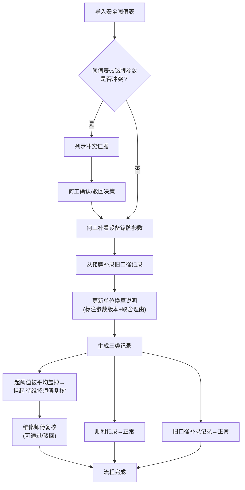

## 1. 产品概述

雨滴终端速度演示系统，用于展示雨滴测速设备的数据处理全流程，解决维修师傅对"超阈值记录被平均值盖掉"前后不一致的追问，实现设备工程师、维修师傅多角色协同的数据复核机制。

- 核心目标：可视化展示三种数据处理结果（顺利记录、超阈值被平均盖掉、旧口径补录），明确冲突处理流程
- 目标用户：设备工程师（何工）、维修师傅、数据分析人员
- 业务价值：减少手工解释成本，建立可追溯的数据处理链条

## 2. 核心功能

### 2.1 用户角色

| 角色 | 注册方式 | 核心权限 |
|------|----------|----------|
| 设备工程师（何工） | 系统内置 | 查看设备铭牌参数、阈值冲突决策、确认/驳回冲突 |
| 维修师傅 | 系统内置 | 复核超阈值被平均盖掉的记录、查看历史处理记录 |
| 数据分析员 | 系统内置 | 导入安全阈值表、运行演示、查看单位换算说明 |

### 2.2 功能模块

1. **演示主页面**：数据记录列表、三种记录类型对比展示、业务流程进度条
2. **阈值导入模块**：安全阈值表导入、参数版本管理、专业计算标注
3. **铭牌参数模块**：设备铭牌参数展示、旧口径补录、冲突证据列示
4. **单位换算模块**：换算说明展示、历史版本对比、参数取舍理由标注
5. **复核流程模块**：维修师傅复核界面、超阈值记录挂起状态、处理记录追溯

### 2.3 页面详情

| 页面名称 | 模块名称 | 功能描述 |
|----------|----------|----------|
| 演示主页面 | 记录列表 | 展示三类记录，颜色区分状态，点击查看详情 |
| 演示主页面 | 流程进度 | 三步流程可视化：阈值导入→何工补看铭牌→单位换算更新 |
| 演示主页面 | 记录对比 | 三列并排展示三类记录的处理差异 |
| 阈值冲突页面 | 冲突列示 | 阈值表与铭牌参数冲突项逐条展示，附证据链 |
| 阈值冲突页面 | 决策面板 | 何工确认/驳回按钮，决策理由输入 |
| 复核页面 | 待复核列表 | 超阈值被平均盖掉的记录，标记"待复核"不自动归正常 |
| 复核页面 | 历史追溯 | 每条记录的完整处理链路，含参数版本和取舍理由 |
| 单位换算页面 | 换算说明 | 详细公式、参数版本、取舍理由标注 |
| 单位换算页面 | 历史对比 | 不同版本换算说明的差异对比 |

## 3. 核心流程

### 3.1 主业务流程

数据分析员导入安全阈值表 → 系统检测阈值表与设备铭牌参数是否冲突 → 如有冲突，列示证据等待何工决策（确认/驳回）→ 何工补看设备铭牌参数 → 更新旧口径记录 → 更新单位换算说明 → 生成三类记录 → 超阈值被平均盖掉的记录挂起"待复核" → 维修师傅复核 → 完成闭环

### 3.2 业务流程图

## 4. 用户界面设计

### 4.1 设计风格

- 主色调：工业蓝 `#1e3a5f`，体现工程设备的专业感
- 辅助色：警示橙 `#e67e22`（超阈值/待复核）、正常绿 `#27ae60`（顺利记录）、补录紫 `#8e44ad`（旧口径补录）
- 字体：使用 JetBrains Mono 作为数字显示字体（专业数据感），Noto Sans SC 作为中文显示字体
- 布局：卡片式布局，三类记录并排对比展示
- 设计风格：工业科技风，带数据可视化元素（图表、仪表盘、进度条），精细的边框和分隔线
- 按钮风格：直角矩形，带细微边框，hover 时颜色加深，点击时有按压效果

### 4.2 页面设计概述

| 页面名称 | 模块名称 | UI 元素 |
|----------|----------|---------|
| 演示主页面 | 顶部导航 | 系统标题、用户角色切换、三步流程进度指示器 |
| 演示主页面 | 记录对比区 | 三列卡片布局，分别为绿色（顺利）、橙色（待复核）、紫色（补录） |
| 演示主页面 | 记录详情 | 点击卡片展开详情，含数据表格、参数版本、取舍理由 |
| 演示主页面 | 流程时间线 | 垂直时间线展示三步流程，当前步骤高亮 |
| 阈值冲突页面 | 冲突列表 | 表格展示冲突项，每行含"阈值表值"、"铭牌值"、"证据来源"、"操作" |
| 阈值冲突页面 | 决策面板 | 模态框，何工输入决策理由，确认/驳回按钮 |
| 复核页面 | 待复核卡片 | 橙色边框，醒目标识"待维修师傅复核"，禁止自动标记为正常 |
| 复核页面 | 历史记录 | 折叠面板展示完整处理链路，每步操作人、时间、理由 |
| 单位换算页面 | 公式展示 | 数学公式排版，参数高亮标注版本号 |
| 单位换算页面 | 取舍说明 | 侧边栏标注："使用 v1.2 版本参数，因 v1.3 口径与铭牌冲突，故沿用" |

### 4.3 响应式

- Desktop-first 设计，主内容区最小宽度 1200px
- 三列记录对比在平板端变为上下排列
- 移动端单列展示，流程时间线改为水平滚动

### 4.4 动效设计

- 页面加载时，三类记录卡片依次从底部滑入，间隔 150ms
- 状态变化时（如待复核→已复核），卡片有 300ms 的颜色渐变动画
- 流程进度条每完成一步，有平滑的填充动画
- 冲突项高亮时有呼吸灯效果，吸引何工注意
