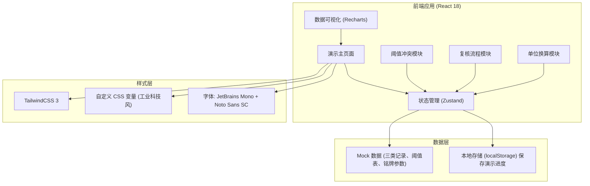
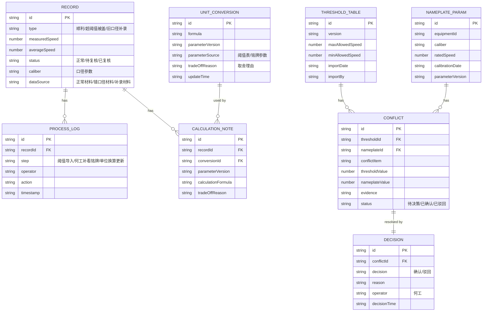

## 1. 架构设计



## 2. 技术描述

- **前端框架**: React@18.2.0 + TypeScript@5
- **构建工具**: Vite@5
- **样式方案**: TailwindCSS@3.4 + PostCSS
- **状态管理**: Zustand@4 (轻量级，适合演示应用)
- **图表库**: Recharts@2 (展示速度数据、阈值对比)
- **路由**: React Router DOM@6
- **图标**: Lucide React (工业风图标)
- **后端**: 无（纯前端演示，使用 Mock 数据）
- **数据持久化**: localStorage 保存演示进度和用户决策

## 3. 路由定义

| 路由 | 页面名称 | 主要用途 |
|------|----------|----------|
| `/` | 演示主页面 | 三类记录对比展示、流程进度、数据列表 |
| `/threshold-conflict` | 阈值冲突页面 | 阈值表与铭牌参数冲突列示、何工决策 |
| `/review` | 复核页面 | 维修师傅复核超阈值被平均盖掉的记录 |
| `/conversion` | 单位换算页面 | 换算公式、参数版本、取舍理由展示 |

## 4. 数据模型

### 4.1 数据模型 ER 图



### 4.2 Mock 数据定义

#### 三类记录数据

```typescript
interface RecordData {
  id: string;
  type: 'smooth' | 'overwritten' | 'supplemented';
  typeLabel: string;
  measuredSpeed: number; // m/s
  averageSpeed: number; // m/s
  thresholdMax: number;
  isOverThreshold: boolean;
  isOverwrittenByAverage: boolean;
  caliber: string;
  caliberSource: 'measurement' | 'nameplate';
  status: 'normal' | 'pending_review' | 'reviewed';
  dataSource: 'normal' | 'wrong_caliber' | 'supplemented';
  processLogs: ProcessLog[];
  calculationNote: CalculationNote;
}

const mockRecords: RecordData[] = [
  {
    id: 'REC-001',
    type: 'smooth',
    typeLabel: '顺利记录',
    measuredSpeed: 4.2,
    averageSpeed: 4.1,
    thresholdMax: 6.0,
    isOverThreshold: false,
    isOverwrittenByAverage: false,
    caliber: '0.5mm',
    caliberSource: 'measurement',
    status: 'normal',
    dataSource: 'normal',
    // ...
  },
  {
    id: 'REC-002',
    type: 'overwritten',
    typeLabel: '超阈值被平均值盖掉',
    measuredSpeed: 7.8, // 超过阈值6.0
    averageSpeed: 4.5,  // 被平均值掩盖
    thresholdMax: 6.0,
    isOverThreshold: true,
    isOverwrittenByAverage: true,
    caliber: '0.5mm',
    caliberSource: 'measurement',
    status: 'pending_review', // 待维修师傅复核，不归正常
    dataSource: 'normal',
    // ...
  },
  {
    id: 'REC-003',
    type: 'supplemented',
    typeLabel: '旧口径补录（来自设备铭牌）',
    measuredSpeed: 5.1,
    averageSpeed: 5.0,
    thresholdMax: 6.0,
    isOverThreshold: false,
    isOverwrittenByAverage: false,
    caliber: '0.3mm', // 从铭牌补录的旧口径
    caliberSource: 'nameplate',
    status: 'normal',
    dataSource: 'supplemented',
    // ...
  }
];
```

#### 阈值表与铭牌参数冲突数据

```typescript
interface ConflictData {
  id: string;
  item: string;
  thresholdValue: number;
  thresholdSource: string;
  thresholdVersion: string;
  nameplateValue: number;
  nameplateSource: string;
  nameplateVersion: string;
  evidence: string[];
  status: 'pending' | 'confirmed' | 'rejected';
  decision?: {
    type: 'confirm' | 'reject';
    reason: string;
    operator: string;
    time: string;
  };
}

const mockConflicts: ConflictData[] = [
  {
    id: 'CONF-001',
    item: '最大允许速度阈值',
    thresholdValue: 6.0,
    thresholdSource: '安全阈值表 v1.3',
    thresholdVersion: 'v1.3',
    nameplateValue: 5.5,
    nameplateSource: '设备铭牌 #EQ-2024-001',
    nameplateVersion: 'v1.0',
    evidence: [
      '阈值表导入日期：2024-06-01',
      '设备铭牌校准日期：2024-03-15',
      '差值：0.5 m/s，超出允许误差范围 ±0.2'
    ],
    status: 'pending'
  }
];
```

## 5. 核心业务逻辑

### 5.1 三步流程状态机

```typescript
type ProcessStep = 'threshold_import' | 'nameplate_review' | 'conversion_update';
type ProcessStatus = 'pending' | 'in_progress' | 'completed';

interface ProcessState {
  currentStep: ProcessStep;
  steps: Record<ProcessStep, ProcessStatus>;
  thresholdImported: boolean;
  nameplateReviewedByHe: boolean;
  conversionUpdated: boolean;
}
```

### 5.2 超阈值处理规则

- 检测到 `measuredSpeed > thresholdMax` 时，标记 `isOverThreshold = true`
- 如果该记录同时被平均值覆盖（`isOverwrittenByAverage = true`），则：
  - `status = 'pending_review'`
  - 禁止自动设置为 `'normal'`
  - 必须由维修师傅手动复核后才能改变状态
  - 界面显示醒目橙色"待维修师傅复核"标签

### 5.3 冲突处理规则

- 系统自动对比 `THRESHOLD_TABLE` 和 `NAMEPLATE_PARAM` 的关键字段
- 发现差异时生成 `CONFLICT` 记录，状态为 `'pending'`
- 冲突必须由"何工"角色处理，其他角色只读
- 何工决策后，更新 `CONFLICT.status` 和关联的 `DECISION` 记录
- 决策结果影响后续 `UNIT_CONVERSION` 的参数选择

### 5.4 单位换算参数标注规则

- 每次换算必须标注 `parameterVersion` 和 `parameterSource`
- 如果存在冲突且已决策，必须在 `tradeOffReason` 中说明：
  - "使用阈值表 v1.3 参数，何工于 2024-06-15 确认"
  - 或 "使用铭牌参数 v1.0，何工于 2024-06-15 驳回阈值表 v1.3"
- 计算结果旁必须显示完整的取舍理由
