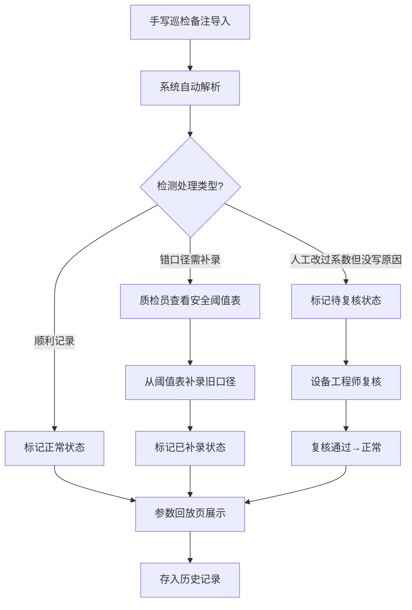

## 1. 产品概述
陶瓷窑炉升温曲线演示系统，用于展示窑炉温度监控的完整工作流程，包括手写巡检备注导入、安全阈值校验、人工修正复核等环节。帮助质检员小白向新人讲解流程，设备工程师可查看可解释的升温曲线结果。

## 2. 核心功能

### 2.1 用户角色
| 角色 | 说明 | 核心权限 |
|------|------|----------|
| 质检员小白 | 日常巡检数据录入和校验 | 导入巡检备注、查看安全阈值、提交补录、查看历史记录 |
| 设备工程师 | 技术复核和结果确认 | 查看升温曲线、复核人工修正、确认最终结果 |
| 新人员工 | 学习流程 | 浏览演示数据、观看流程回放 |

### 2.2 功能模块
1. **数据导入页**：手写巡检备注导入、三种样例数据选择
2. **安全阈值表**：温度阈值配置、历史口径查询
3. **参数回放页**：升温曲线可视化、处理状态展示、人工修正复核
4. **历史记录页**：所有批次记录、三种处理结果对比

### 2.3 页面详情
| 页面名称 | 模块名称 | 功能描述 |
|---------|----------|----------|
| 数据导入页 | 样例数据选择 | 提供三种演示数据：正常材料、错口径材料、补录材料 |
| 数据导入页 | 手写备注导入 | 模拟手写巡检备注导入过程，显示原始手写内容 |
| 安全阈值表 | 阈值展示 | 展示各温区的安全上下限、预警阈值 |
| 安全阈值表 | 历史口径 | 展示旧口径标准，支持补录查询 |
| 参数回放页 | 升温曲线 | 实时/回放模式展示温度曲线，标注异常点和修正点 |
| 参数回放页 | 状态面板 | 显示处理状态：正常/待复核/已补录 |
| 参数回放页 | 复核操作 | 人工改过系数但没写原因的记录需工程师复核 |
| 历史记录页 | 记录列表 | 展示所有批次，按处理状态分类 |
| 历史记录页 | 结果对比 | 并排展示三种处理结果的差异 |

## 3. 核心流程

### 三步主流程
1. **第一步**：手写巡检备注第一次导入 → 系统自动解析温度数据
2. **第二步**：质检员小白补看安全阈值表 → 发现口径问题从阈值表补录旧口径
3. **第三步**：参数回放页更新 → 展示最终曲线和处理结果

### 特殊处理规则
- 遇到"人工改过系数但没写原因"的记录，系统标记为"待复核"状态，不自动归为正常
- "待复核"状态需设备工程师手动确认后才能结案
- 补录的旧口径数据需要标注来源和时间

## 4. 用户界面设计

### 4.1 设计风格
- **主色调**：工业蓝色系 (#165DFF) 代表专业、可靠
- **辅助色**：
  - 正常状态：绿色 (#00B42A)
  - 待复核：橙色 (#FF7D00) 
  - 已补录：紫色 (#722ED1)
  - 异常：红色 (#F53F3F)
- **按钮风格**：圆角矩形，轻微阴影，hover时有上浮效果
- **字体**：标题使用 Noto Sans SC Bold，正文使用 Noto Sans SC Regular
- **布局风格**：卡片式布局，顶部导航+侧边栏+主内容区
- **图标风格**：线性图标，工业风，使用 Lucide 图标库

### 4.2 页面设计概览
| 页面名称 | 模块名称 | UI元素 |
|---------|----------|--------|
| 数据导入页 | 样例选择卡片 | 三张卡片并排，不同颜色边框代表不同类型，点击选中动效 |
| 安全阈值表 | 数据表格 | 斑马纹表格，阈值超限时高亮显示，悬停显示详情 |
| 参数回放页 | 温度曲线图 | 使用 ECharts 绘制，多曲线对比，异常点用圆点标注 |
| 参数回放页 | 状态徽章 | 不同颜色的圆角徽章，带动画效果 |
| 历史记录页 | 时间轴 | 垂直时间轴展示处理流程，每个节点有状态图标 |

### 4.3 响应式
- 桌面端优先设计（1440px）
- 平板端（1024px）：侧边栏收起为图标菜单
- 移动端（768px）：顶部导航折叠，表格改为卡片列表展示

### 4.4 动效设计
- 页面加载：元素淡入+上移，staggered 动画
- 曲线回放：温度线从左到右逐渐绘制
- 状态变更：徽章颜色渐变过渡
- 按钮交互：scale(1.02) 放大效果 + 阴影加深
