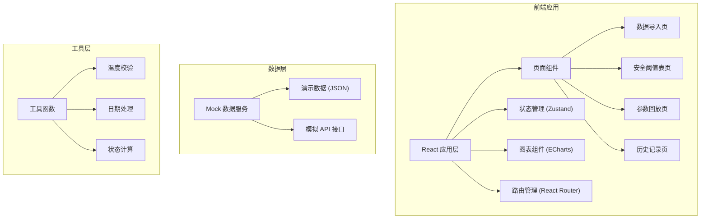
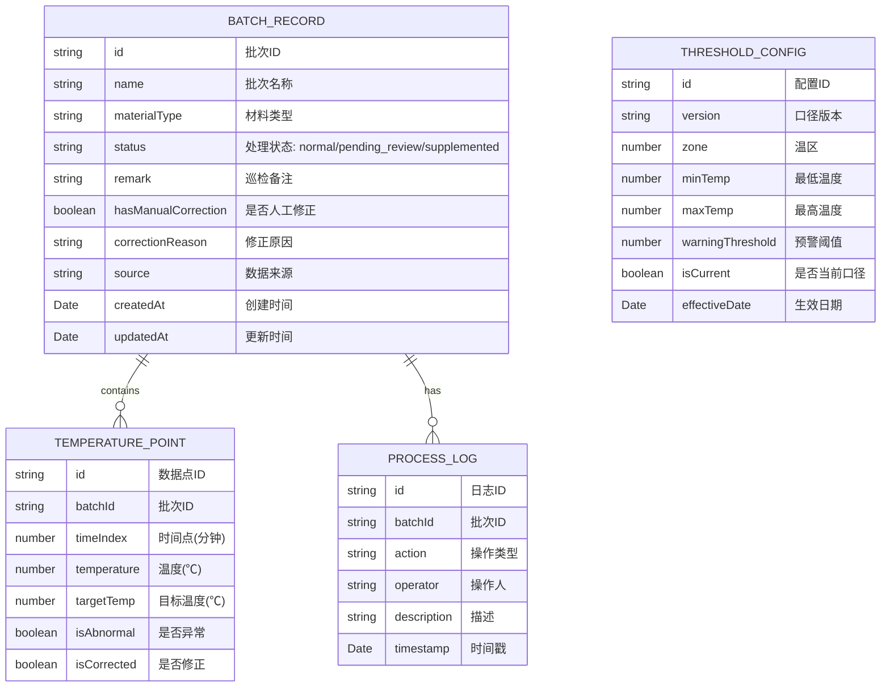

## 1. 架构设计

## 2. 技术描述
- **前端框架**: React@18 + TypeScript
- **构建工具**: Vite@5
- **样式方案**: TailwindCSS@3
- **路由管理**: React Router@6
- **状态管理**: Zustand@4
- **图表库**: ECharts@5
- **图标库**: Lucide React@0.344
- **后端**: 无后端，使用 Mock 数据模拟

## 3. 路由定义
| 路由 | 页面 | 说明 |
|------|------|------|
| / | 数据导入页 | 首页，选择演示数据并导入 |
| /threshold | 安全阈值表页 | 查看温度阈值和历史口径 |
| /playback/:id | 参数回放页 | 展示升温曲线和处理详情 |
| /history | 历史记录页 | 所有批次记录和对比 |

## 4. 数据模型

### 4.1 数据模型定义

### 4.2 演示数据定义

#### 三种类型批次数据
1. **正常批次 (normal)**
   - 顺利记录，无人工修改
   - 温度曲线在安全范围内
   - 状态：正常

2. **待复核批次 (pending_review)**
   - 人工改过系数但没写原因
   - 系统标记为待复核
   - 需设备工程师确认

3. **补录批次 (supplemented)**
   - 错口径材料
   - 从安全阈值表补录旧口径
   - 标注补录来源和时间

## 5. 核心工具函数

### 温度校验函数
- 输入：温度值、阈值配置
- 输出：校验结果、异常信息
- 错误提示：使用自然语言描述，如"第15分钟温度超过上限10℃"而非"temp_out_of_range"

### 状态计算函数
- 输入：批次数据、修正记录
- 输出：处理状态、操作建议

### 曲线生成函数
- 输入：温度点数组
- 输出：ECharts 配置对象
