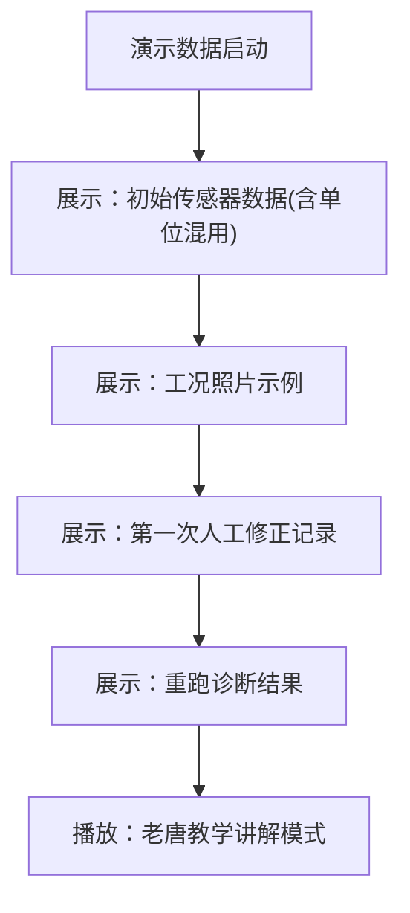

## 1. 产品概述

风扇叶片平衡诊断系统是一个面向工业设备维护场景的诊断工具，用于训练教练老唐带领新人完成风扇叶片平衡检测的完整工作流程。系统解决了传感器数据导入、工况照片补录、温度单位混用复核、交接报告自动生成等核心问题，形成可复盘、可重复执行的标准化作业流程。

## 2. 核心功能

### 2.1 用户角色

| 角色 | 说明 | 核心权限 |
|------|------|----------|
| 训练教练老唐 | 资深诊断专家，负责复核和教学 | 全部权限：数据导入、照片补录、人工修正、报告生成、流程复盘 |
| 新人 | 学习诊断流程的学员 | 查看演示数据、跟随流程、执行基本操作 |

### 2.2 功能模块

1. **诊断看板首页**：任务列表、演示数据入口、流程进度追踪
2. **传感器数据导入**：CSV/JSON导入、温度单位混用检测与标注、传感器编号解析
3. **工况照片补录**：照片上传、时间线关联、标注说明
4. **人工修正与重跑**：修正记录、重新诊断、版本对比
5. **交接报告生成**：问题说明、材料缺失清单、下一步责任人、自动更新机制
6. **流程复盘**：完整操作记录、可重跑命令、教学演示模式

### 2.3 页面详情

| 页面名称 | 模块名称 | 功能描述 |
|-----------|-------------|---------------------|
| 诊断看板 | 任务概览 | 显示待处理诊断任务、演示数据快捷入口、流程状态卡片 |
| 诊断看板 | 流程时间线 | 可视化展示三步流程进度：导入→补照片→生成报告 |
| 数据导入页 | 文件上传 | 支持拖拽上传传感器数据文件，实时解析预览 |
| 数据导入页 | 单位检测 | 自动识别摄氏度(℃)和开尔文(K)混用，醒目标注待复核 |
| 数据导入页 | 传感器编号 | 解析传感器编号，展示对应测点信息 |
| 照片补录页 | 照片上传 | 支持多图上传，关联诊断节点，添加文字说明 |
| 照片补录页 | 照片预览 | 缩略图网格，点击放大查看细节，支持标注 |
| 人工修正页 | 修正记录 | 记录每次人工修正的内容、时间、操作人 |
| 人工修正页 | 重跑诊断 | 基于修正后的数据重新执行诊断算法 |
| 交接报告页 | 报告详情 | 说明问题为何留下、缺失材料清单、下一步对接人 |
| 交接报告页 | 版本历史 | 报告自动更新记录，可追溯每次变更 |
| 复盘中心 | 操作日志 | 完整记录每一步操作，支持筛选和搜索 |
| 复盘中心 | 命令重跑 | 生成可执行的命令行指令，一键复现诊断过程 |

## 3. 核心流程

### 三步标准作业流程

1. **传感器编号第一次导入**：上传传感器数据文件，系统自动检测温度单位混用但不自动修正，标注为"待老唐复核"状态
2. **训练教练老唐补看工况照片**：老唐回看群里补传的工况照片，对照数据进行人工复核
3. **交接报告更新**：根据复核结果更新交接报告，明确问题原因、缺失材料、下一步行动

### 演示数据流程

## 4. 用户界面设计

### 4.1 设计风格

- **主色调**：工业蓝 (#1E3A5F) - 体现专业、可靠的工业属性
- **辅助色**：警示橙 (#FF6B35) - 标注待复核、需要关注的内容
- **成功色**：校验绿 (#2ECC71) - 标记已完成、已确认
- **警告色**：醒目黄 (#F1C40F) - 温度单位混用提醒
- **按钮风格**：扁平化圆角按钮，hover时有轻微上浮效果，强调操作感
- **字体**：标题使用 Noto Sans SC Bold，正文使用 Noto Sans SC Regular，专业易读
- **布局风格**：卡片式模块化布局，左侧流程导航 + 右侧内容区
- **图标风格**：线性工业风图标，统一使用24px网格

### 4.2 页面设计概览

| 页面名称 | 模块名称 | UI 元素 |
|-----------|-------------|-------------|
| 诊断看板 | 任务概览 | 大卡片展示任务状态，顶部进度条显示三步完成度 |
| 数据导入页 | 单位检测 | 表格中混用温度单位的行用黄色高亮，右侧显示"待复核"徽章 |
| 照片补录页 | 照片预览 | 瀑布流布局，hover放大效果，支持拖拽排序 |
| 交接报告页 | 报告详情 | 类文档排版，重要内容用边框高亮，底部签名区域 |
| 复盘中心 | 命令重跑 | 终端风格的代码块，一键复制按钮，显示执行历史 |

### 4.3 响应式

- 桌面端优先设计，适配 1440px 及以上分辨率
- 平板端自适应布局，卡片可堆叠
- 移动端简化操作，核心流程可用
- 触摸设备优化按钮尺寸，确保可点击区域 ≥ 44px

### 4.4 交互动效

- 页面加载：元素按序淡入，流程节点依次点亮
- 状态变更：平滑过渡动画，进度条增量动画
- 警告提示：轻微抖动效果吸引注意，但不过度干扰
- 照片查看：平滑放大过渡，支持手势缩放
