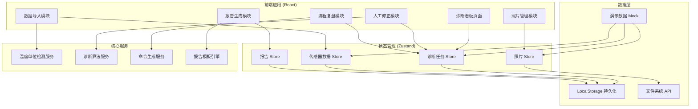
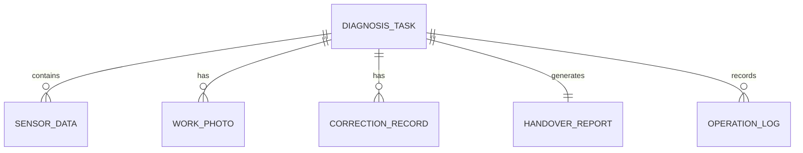

## 1. 架构设计



## 2. 技术描述

- **前端框架**：React@18 + TypeScript
- **构建工具**：Vite@5
- **样式方案**：TailwindCSS@3 + CSS Variables
- **状态管理**：Zustand（轻量级，适合中小规模应用）
- **路由**：React Router@6
- **图表可视化**：Recharts（展示温度趋势）
- **日期处理**：date-fns
- **文件处理**：原生 File API + PapaParse（CSV解析）
- **后端**：无（纯前端应用，数据本地持久化）
- **数据库**：LocalStorage + IndexedDB（照片存储）

## 3. 路由定义

| 路由 | 页面名称 | 用途 |
|-------|---------|------|
| / | 诊断看板 | 首页，任务列表和流程概览 |
| /diagnosis/:id/import | 数据导入 | 导入传感器数据，检测单位混用 |
| /diagnosis/:id/photos | 照片补录 | 上传和管理工况照片 |
| /diagnosis/:id/review | 人工复核 | 老唐复核修正，重跑诊断 |
| /diagnosis/:id/report | 交接报告 | 查看和导出交接报告 |
| /diagnosis/:id/replay | 流程复盘 | 查看操作日志，重跑命令 |
| /demo | 演示模式 | 内置演示数据，教学模式 |

## 4. 类型定义

```typescript
// 传感器数据
interface SensorData {
  id: string;
  sensorNo: string;
  timestamp: Date;
  temperature: number;
  temperatureUnit: 'C' | 'K';
  vibration: number;
  position: string;
}

// 工况照片
interface WorkPhoto {
  id: string;
  diagnosisId: string;
  url: string;
  thumbnail: string;
  filename: string;
  uploadTime: Date;
  uploadBy: string;
  description: string;
  nodeIndex: number; // 关联到诊断流程的哪个节点
}

// 修正记录
interface CorrectionRecord {
  id: string;
  diagnosisId: string;
  field: string;
  oldValue: any;
  newValue: any;
  reason: string;
  correctedBy: string;
  correctedAt: Date;
}

// 交接报告
interface HandoverReport {
  id: string;
  diagnosisId: string;
  problemStatement: string; // 为什么留下这条
  missingMaterials: string[]; // 还缺什么材料
  nextAction: 'contact_coach' | 'contact_laotang';
  nextHandler: string;
  generatedAt: Date;
  updatedAt: Date;
  version: number;
}

// 诊断任务
interface DiagnosisTask {
  id: string;
  title: string;
  status: 'importing' | 'pending_review' | 'photo_added' | 'reviewing' | 'completed';
  currentStep: number; // 1-3: 导入/补照片/生成报告
  sensorData: SensorData[];
  photos: WorkPhoto[];
  corrections: CorrectionRecord[];
  report: HandoverReport | null;
  hasUnitMixing: boolean;
  createdAt: Date;
  createdBy: string;
}

// 操作日志
interface OperationLog {
  id: string;
  diagnosisId: string;
  action: string;
  details: any;
  operator: string;
  timestamp: Date;
}
```

## 5. 数据模型

### 5.1 实体关系图



### 5.2 演示数据定义

```typescript
// 小而真的演示数据
const demoData = {
  task: {
    id: 'demo-001',
    title: '风扇叶片平衡诊断 - 教学演示',
    status: 'completed',
    currentStep: 3,
    hasUnitMixing: true
  },
  sensorData: [
    { id: 's1', sensorNo: 'FAN-001-A', temperature: 85, unit: 'C', vibration: 2.3, position: '叶片A' },
    { id: 's2', sensorNo: 'FAN-001-B', temperature: 358, unit: 'K', vibration: 2.1, position: '叶片B' },
    { id: 's3', sensorNo: 'FAN-001-C', temperature: 82, unit: 'C', vibration: 2.5, position: '叶片C' },
    { id: 's4', sensorNo: 'FAN-001-D', temperature: 355, unit: 'K', vibration: 2.2, position: '叶片D' }
  ],
  photos: [
    { id: 'p1', description: '叶片A磨损情况实拍', nodeIndex: 1 },
    { id: 'p2', description: '整体振动检测现场', nodeIndex: 2 }
  ],
  corrections: [
    { 
      id: 'c1', 
      field: 'temperature',
      oldValue: 358,
      newValue: 85,
      reason: '开尔文转摄氏度，统一单位便于分析',
      correctedBy: '老唐'
    }
  ],
  report: {
    problemStatement: '传感器数据存在摄氏度和开尔文混用，需人工复核后统一单位',
    missingMaterials: ['出厂校准证书', '上次维护记录'],
    nextAction: 'contact_laotang',
    nextHandler: '训练教练老唐'
  }
};
```

## 6. 核心服务设计

### 6.1 温度单位检测服务

```typescript
class TemperatureUnitDetector {
  // 检测数据集中是否存在摄氏度和开尔文混用
  detectMixing(data: SensorData[]): {
    hasMixing: boolean;
    celsiusCount: number;
    kelvinCount: number;
    affectedRows: string[];
  }
  
  // 转换单位但不自动应用，返回建议值供人工复核
  suggestConversion(data: SensorData[]): SensorData[]
}
```

### 6.2 命令生成服务

```typescript
class CommandGenerator {
  // 生成可重跑的命令行指令
  generateReplayCommand(taskId: string): string
  
  // 生成完整复盘脚本
  generateReplayScript(taskId: string): string
}
```

### 6.3 报告自动更新服务

```typescript
class ReportAutoUpdater {
  // 照片补录后自动更新报告
  onPhotoAdded(task: DiagnosisTask): HandoverReport
  
  // 人工修正后自动更新报告
  onCorrectionMade(task: DiagnosisTask): HandoverReport
}
```
