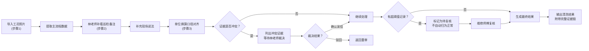

## 1. 产品概述

材料拉伸应变清洗系统是面向材料力学实验数据处理的专业应用，核心解决工况照片（主流程数据）与手写巡检备注（现场说法）两种证据的整合问题，确保数据清洗过程可追溯、冲突可裁决、结论可验证。

- **核心价值**：打破数据清洗的"黑盒"，每一条处理结果都能追溯到原始证据，支持单位换算口径的历史对齐，保障实验数据的严谨性。
- **目标用户**：实验老师林老师、维修师傅、材料实验相关业务人员。

---

## 2. 核心功能

### 2.1 用户角色

| 角色 | 注册方式 | 核心权限 |
|------|----------|----------|
| 实验老师（林老师） | 系统内置 | 审阅手写巡检备注、裁决证据冲突、确认单位换算口径 |
| 维修师傅 | 系统内置 | 复核超阈值记录、标记维修状态 |
| 业务操作人员 | 系统内置 | 导入工况照片、执行数据清洗、查看处理结果 |

### 2.2 功能模块

1. **数据清洗工作台**：三步工作流主界面，整合工况照片与手写巡检备注
2. **证据链追溯面板**：展示每条记录的原始证据、处理过程、单位换算说明
3. **冲突裁决中心**：列出工况照片与手写巡检备注的矛盾点，供人工裁决
4. **超阈值复核区**：展示被平均值覆盖的超阈值记录，待维修师傅复核
5. **样例展示区**：内置三类典型处理结果的演示样例

### 2.3 页面详情

| 页面名称 | 模块名称 | 功能描述 |
|---------|----------|----------|
| 数据清洗工作台 | 三步工作流导航 | 步骤1导入工况照片 → 步骤2林老师补看巡检备注 → 步骤3单位换算说明更新 |
| 数据清洗工作台 | 数据记录列表 | 展示所有拉伸应变记录，按处理结果分类（正常/超阈值/补录） |
| 数据清洗工作台 | 记录详情面板 | 显示单条记录的完整证据链：工况照片截图、巡检备注原文、单位换算过程、历史口径对比 |
| 冲突裁决中心 | 冲突证据列表 | 逐条列出工况照片与巡检备注的矛盾点，包含证据原文对比、影响范围说明 |
| 冲突裁决中心 | 裁决操作区 | 提供"确认采信照片"、"确认采信备注"、"驳回待重审"三种操作选项 |
| 超阈值复核区 | 超阈值记录列表 | 展示被平均值覆盖的超阈值记录，标记原始数值、平均值、偏差率 |
| 超阈值复核区 | 复核操作区 | 维修师傅可标记"设备异常已修复"、"数据确属异常"、"需进一步核查" |
| 样例展示区 | 三类样例卡片 | 顺利记录、超阈值被盖、补录旧口径各一条，点击查看完整处理流程对比 |

---

## 3. 核心流程

### 3.1 数据清洗主流程

业务人员导入工况照片后，系统自动提取主流程数据。林老师补看手写巡检备注，补充现场说法。系统自动对齐单位换算说明与历史记录。若发现证据冲突，暂停自动处理，提交冲突裁决。超阈值记录被平均值覆盖时，不直接归为正常，流转至维修师傅复核。全部确认后生成最终清洗结果，附带完整证据链。

### 3.2 三类记录处理流程对比

```mermaid
flowchart TD
    subgraph "顺利记录"
        A1["工况照片：数值正常"] --> A2["巡检备注：无异常"]
        A2 --> A3["单位换算：口径一致"]
        A3 --> A4["结果：正常记录 ✓"]
    end
    
    subgraph "超阈值被平均值盖掉"
        B1["工况照片：数值超限"] --> B2["平均值计算：覆盖原值"]
        B2 --> B3["系统标记：待维修复核"]
        B3 --> B4["维修师傅：确认/驳回"]
        B4 --> B5["结果：按复核结论处理 ⚠"]
    end
    
    subgraph "补录旧口径"
        C1["工况照片：无对应记录"] --> C2["巡检备注：发现旧口径数据"]
        C2 --> C3["单位换算：对齐历史口径"]
        C3 --> C4["结果：补录记录，标注口径来源 📝"]
    end
```

---

## 4. 用户界面设计

### 4.1 设计风格

- **主色调**：工业蓝 `#1e3a5f`（严谨专业）+ 警示橙 `#e67e22`（超阈值/冲突）+ 确认绿 `#27ae60`（正常）
- **字体**：标题使用 `JetBrains Mono`（等宽字体，适合数据展示），正文使用 `Noto Sans SC`（清晰易读）
- **按钮风格**：扁平化直角按钮，强调状态指示（正常/待处理/冲突使用不同边框颜色）
- **布局风格**：左右分栏布局，左侧为工作流导航与记录列表，右侧为详情面板与证据展示
- **视觉风格**：科技工业风，使用细边框、数据网格背景、状态指示灯，强调数据的可追溯性

### 4.2 页面设计概述

| 页面名称 | 模块名称 | UI 元素 |
|---------|----------|---------|
| 数据清洗工作台 | 三步工作流导航 | 垂直步骤条，每步包含状态指示灯（未完成/进行中/已完成/有冲突），步骤名称与操作按钮 |
| 数据清洗工作台 | 记录列表 | 表格展示，每行显示记录ID、材料类型、原始值、清洗后值、处理状态、证据来源标签 |
| 数据清洗工作台 | 详情面板 | 证据双栏对比（左：工况照片截图与元数据，右：巡检备注文字与手写图片），单位换算时间线，历史记录对齐表 |
| 冲突裁决中心 | 冲突列表 | 卡片式布局，每张卡片顶部显示冲突等级标识，中间为证据对比，底部为裁决按钮组 |
| 超阈值复核区 | 复核列表 | 数据表格，突出显示超阈值数值（红色背景），偏差率进度条，复核状态标签 |
| 样例展示区 | 样例卡片 | 三张并排卡片，不同底色区分类型，点击展开显示完整流程图与证据链 |

### 4.3 响应式设计

- **桌面优先**：核心功能面向桌面端操作，左右分栏宽度比例 1:2
- **平板适配**：记录列表与详情面板改为上下堆叠，冲突卡片保持横向排列
- **移动端**：简化为单栏布局，优先展示核心数据，高级操作保留入口

### 4.4 交互细节

- **证据悬停**：鼠标悬停在记录上时，显示证据来源缩略预览
- **状态动画**：超阈值记录使用呼吸灯效果提示待处理
- **时间线动画**：单位换算说明更新时，高亮显示变更部分，渐显新口径
- **冲突标记**：证据矛盾处使用红色虚线框标注，点击显示详细对比
