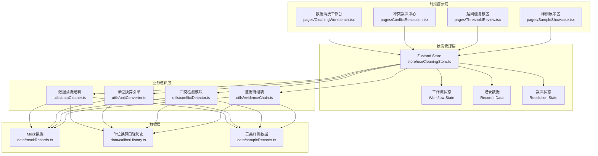
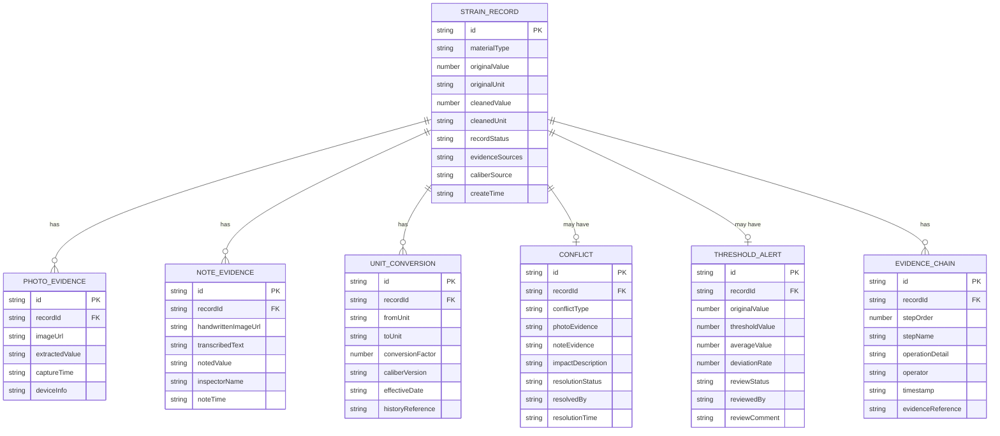

## 1. 架构设计

本系统采用纯前端架构，所有数据处理与状态管理在客户端完成，无需后端服务。通过Mock数据模拟三种典型场景（正常记录、超阈值记录、补录记录），便于离线演示与功能验证。



## 2. 技术描述

- **前端框架**：React@18 + TypeScript
- **构建工具**：Vite@5
- **样式方案**：Tailwind CSS@3
- **状态管理**：Zustand@4
- **路由管理**：react-router-dom@6
- **图标库**：lucide-react
- **初始化工具**：vite-init，使用 `react-ts` 模板
- **后端服务**：无，纯前端架构，使用Mock数据
- **数据存储**：浏览器内存 + localStorage 持久化

## 3. 路由定义

| 路由 | 页面 | 用途 |
|------|------|------|
| `/` | 数据清洗工作台 | 主工作界面，三步工作流导航 + 记录列表 + 详情面板 |
| `/conflicts` | 冲突裁决中心 | 展示证据冲突列表，提供林老师裁决操作 |
| `/review` | 超阈值复核区 | 展示超阈值记录，维修师傅复核操作 |
| `/samples` | 样例展示区 | 三类典型处理结果的演示对比 |

## 4. 数据模型

### 4.1 ER图



### 4.2 TypeScript 类型定义

```typescript
// 记录状态枚举
export type RecordStatus = 'normal' | 'over_threshold' | 'supplemented' | 'pending_review' | 'conflict';

// 冲突裁决状态
export type ConflictResolutionStatus = 'pending' | 'accept_photo' | 'accept_note' | 'rejected';

// 超阈值复核状态
export type ThresholdReviewStatus = 'pending' | 'equipment_fixed' | 'data_abnormal' | 'further_check';

// 工作流步骤
export type WorkflowStep = 'import_photo' | 'review_note' | 'update_conversion';

// 拉伸应变记录
export interface StrainRecord {
  id: string;
  materialType: 'normal' | 'wrong_caliber' | 'supplemented';
  originalValue: number;
  originalUnit: string;
  cleanedValue: number;
  cleanedUnit: string;
  recordStatus: RecordStatus;
  evidenceSources: ('photo' | 'note')[];
  caliberSource: string;
  createTime: string;
  updateTime: string;
}

// 工况照片证据
export interface PhotoEvidence {
  id: string;
  recordId: string;
  imageUrl: string;
  extractedValue: number;
  captureTime: string;
  deviceInfo: string;
}

// 手写巡检备注证据
export interface NoteEvidence {
  id: string;
  recordId: string;
  handwrittenImageUrl: string;
  transcribedText: string;
  notedValue: number;
  inspectorName: string;
  noteTime: string;
}

// 单位换算记录
export interface UnitConversion {
  id: string;
  recordId: string;
  fromUnit: string;
  toUnit: string;
  conversionFactor: number;
  caliberVersion: string;
  effectiveDate: string;
  historyReference: string;
}

// 证据冲突
export interface EvidenceConflict {
  id: string;
  recordId: string;
  conflictType: 'value_mismatch' | 'unit_mismatch' | 'caliber_mismatch';
  photoEvidence: string;
  noteEvidence: string;
  impactDescription: string;
  resolutionStatus: ConflictResolutionStatus;
  resolvedBy?: string;
  resolutionTime?: string;
}

// 超阈值告警
export interface ThresholdAlert {
  id: string;
  recordId: string;
  originalValue: number;
  thresholdValue: number;
  averageValue: number;
  deviationRate: number;
  reviewStatus: ThresholdReviewStatus;
  reviewedBy?: string;
  reviewComment?: string;
}

// 证据链节点
export interface EvidenceChainNode {
  id: string;
  recordId: string;
  stepOrder: number;
  stepName: string;
  operationDetail: string;
  operator: string;
  timestamp: string;
  evidenceReference: string;
}

// 工作流状态
export interface WorkflowState {
  currentStep: WorkflowStep;
  stepCompleted: Record<WorkflowStep, boolean>;
  activeRecordId: string | null;
}

// 应用状态
export interface CleaningStore {
  records: StrainRecord[];
  photoEvidence: PhotoEvidence[];
  noteEvidence: NoteEvidence[];
  unitConversions: UnitConversion[];
  conflicts: EvidenceConflict[];
  thresholdAlerts: ThresholdAlert[];
  evidenceChains: EvidenceChainNode[];
  workflow: WorkflowState;
}
```

## 5. 目录结构

```
src/
├── components/
│   ├── layout/
│   │   ├── AppLayout.tsx          # 主布局组件
│   │   ├── Sidebar.tsx            # 侧边导航
│   │   └── StepNavigator.tsx      # 三步工作流导航
│   ├── records/
│   │   ├── RecordsTable.tsx       # 记录列表表格
│   │   ├── RecordDetailPanel.tsx  # 记录详情面板
│   │   └── EvidenceChain.tsx      # 证据链展示
│   ├── evidence/
│   │   ├── PhotoEvidenceCard.tsx  # 工况照片卡片
│   │   └── NoteEvidenceCard.tsx   # 巡检备注卡片
│   ├── conflicts/
│   │   ├── ConflictCard.tsx       # 冲突卡片
│   │   └── ConflictCompare.tsx    # 证据对比组件
│   ├── review/
│   │   ├── ThresholdAlertCard.tsx # 超阈值告警卡片
│   │   └── ReviewActions.tsx      # 复核操作组件
│   └── common/
│       ├── StatusBadge.tsx        # 状态标签
│       ├── UnitConverter.tsx      # 单位换算展示
│       └── Timeline.tsx           # 时间线组件
├── pages/
│   ├── CleaningWorkbench.tsx      # 数据清洗工作台
│   ├── ConflictResolution.tsx     # 冲突裁决中心
│   ├── ThresholdReview.tsx        # 超阈值复核区
│   └── SampleShowcase.tsx         # 样例展示区
├── store/
│   └── useCleaningStore.ts        # Zustand状态管理
├── utils/
│   ├── dataCleaner.ts             # 数据清洗逻辑
│   ├── unitConverter.ts           # 单位换算引擎
│   ├── conflictDetector.ts        # 冲突检测模块
│   └── evidenceChain.ts           # 证据链组装
├── data/
│   ├── mockRecords.ts             # Mock记录数据
│   ├── caliberHistory.ts          # 单位换算口径历史
│   └── sampleRecords.ts           # 三类样例数据
├── types/
│   └── index.ts                   # TypeScript类型定义
├── App.tsx
├── main.tsx
└── index.css
```

## 6. 核心业务逻辑说明

### 6.1 数据清洗流程

1. **工况照片导入**：系统自动从照片中提取应变数值和单位，创建记录
2. **巡检备注审阅**：林老师查看手写巡检备注，补充现场说法
3. **单位换算对齐**：系统自动匹配历史口径，执行单位换算
4. **冲突检测**：比对照片与备注数据，发现冲突则暂停处理
5. **超阈值检测**：检测数值是否超出阈值，若被平均值覆盖则标记待复核
6. **证据链生成**：记录每一步操作，生成完整可追溯的证据链

### 6.2 三类记录处理逻辑

- **正常材料**：照片数值正常，备注无异常，单位口径一致 → 直接标记为正常
- **错口径材料**：照片数值超限，被相邻平均值覆盖 → 标记为待维修复核，不自动归为正常
- **补录材料**：照片无对应记录，备注发现旧口径数据 → 从备注补录，标注口径来源为历史版本

### 6.3 冲突裁决机制

当照片与备注数据不一致时：
1. 系统自动识别冲突类型（数值/单位/口径）
2. 双栏对比展示双方证据原文
3. 说明冲突可能影响的数据范围
4. 仅林老师可操作：确认采信照片 / 确认采信备注 / 驳回待重审
5. 裁决结果永久记录在证据链中
