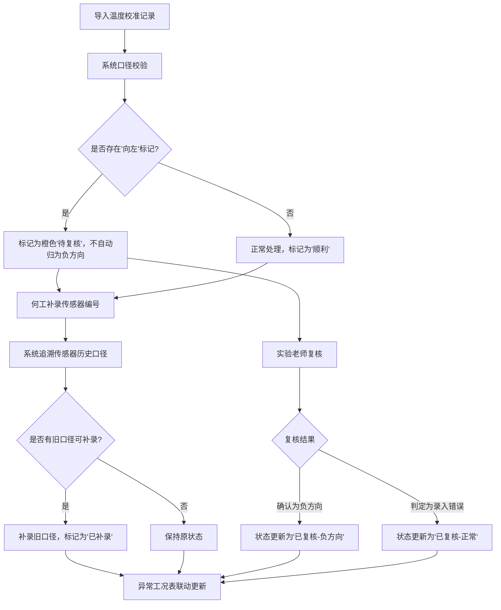

## 1. 产品概述

桥面热胀伸缩估算是桥梁运维领域的专业数据处理工具，解决温度校准记录与传感器编号分散、现场口径不统一导致的估算偏差问题。面向设备工程师、现场师傅、实验老师三类用户，提供标准化的三步式数据处理流程。

核心价值在于将原本"临时拼接"的处理逻辑固化为可追溯的系统流程，特别是针对"负方向被现场师傅写成向左"这类常见人工录入错误，建立"识别-标记-复核"的严谨机制，同时通过传感器编号补录实现异常工况表的联动更新。

---

## 2. 核心功能

### 2.1 用户角色

| 角色 | 识别方式 | 核心权限 |
|------|----------|----------|
| 设备工程师（何工） | 系统默认操作人 | 导入记录、补录传感器编号、查看异常表、人工修正、重跑估算 |
| 现场师傅 | 数据录入来源 | 提交温度校准记录（可能存在口径错误） |
| 实验老师 | 复核人 | 对"向左"标记的记录进行最终复核判定 |

### 2.2 功能模块

1. **小看板主页**：三步流程进度展示、记录列表、异常工况表
2. **数据导入模块**：温度校准记录批量导入、口径校验、异常标记
3. **传感器补录模块**：传感器编号关联、历史口径追溯、旧口径补录
4. **估算处理模块**：热胀伸缩量计算、人工修正、重跑估算
5. **异常工况表**：联动更新、状态流转、复核标记
6. **命令行/API接口**：支持程序化调用和系统集成

### 2.3 页面详情

| 页面名称 | 模块名称 | 功能描述 |
|----------|----------|----------|
| 小看板主页 | 三步流程进度条 | 可视化展示"导入→补录→更新"三步当前状态，已完成步骤打勾，当前步骤高亮 |
| 小看板主页 | 记录列表卡片 | 展示所有温度校准记录，按处理结果分类：顺利/待复核/已补录 |
| 小看板主页 | 异常工况表 | 实时展示异常记录，支持状态筛选和跳转 |
| 数据导入弹窗 | 文件导入区 | 支持拖拽导入温度校准记录（JSON/CSV格式） |
| 数据导入弹窗 | 口径校验结果 | 导入后即时显示口径识别结果，"向左"标记为橙色待复核 |
| 传感器补录面板 | 编号搜索框 | 根据传感器编号查询历史口径数据 |
| 传感器补录面板 | 补录确认区 | 展示旧口径信息，确认后关联到当前记录 |
| 记录详情页 | 估算结果展示 | 显示热胀伸缩量计算结果、方向判定、处理状态 |
| 记录详情页 | 操作区 | 人工修正数值、重跑估算、提交复核 |

---

## 3. 核心流程

### 三步核心处理流程

设备工程师何工导入温度校准记录后，系统自动校验数据口径。当识别到"负方向"被写成"向左"时，不急着归为正常，而是标记为"待实验老师复核"状态。何工补录传感器编号后，系统自动追溯该传感器的历史口径数据，补录旧口径信息，同时异常工况表联动更新。

### 演示数据流程

系统内置演示数据，包含一次完整的处理周期：
1. 记录A（顺利）：导入→口径正常→估算完成
2. 记录B（向左）：导入→标记待复核→何工人工修正→重跑估算
3. 记录C（补录）：导入→补录传感器编号→系统补录旧口径→异常表更新

---

## 4. 用户界面设计

### 4.1 设计风格

- **主色调**：工业蓝 `#1E3A5F`（代表专业、可靠），辅以警示橙 `#F59E0B`（待复核标记）、成功绿 `#10B981`（正常）、补录紫 `#8B5CF6`（补录标记）
- **字体**：标题使用「思源宋体」体现专业感，正文使用「JetBrains Mono」等宽字体保证数据可读性
- **按钮风格**：扁平直角设计，悬停时有细微描边动画，操作按钮带有状态指示灯
- **布局风格**：工业仪表盘式布局，左侧三步流程导航，右侧数据区采用卡片式网格
- **视觉元素**：细线条分隔、数据点阵背景、状态徽章、进度时间轴

### 4.2 页面设计概述

| 页面名称 | 模块名称 | UI元素 |
|----------|----------|--------|
| 小看板主页 | 顶部标题区 | 产品名称+版本号、当前用户（何工）、演示模式标识 |
| 小看板主页 | 三步流程时间轴 | 垂直时间轴布局，每步包含：步骤编号、名称、状态图标、完成时间 |
| 小看板主页 | 记录列表区 | 三色卡片区分状态：绿色（顺利）、橙色边框（待复核）、紫色标签（已补录） |
| 小看板主页 | 异常工况表 | 表格布局，带行高亮、状态标签、操作列按钮 |
| 小看板主页 | 操作工具栏 | 导入按钮、重置演示数据按钮、命令行/API切换开关 |
| 记录详情弹窗 | 数据面板 | 键值对布局展示温度校准数据、传感器信息、估算结果 |
| 记录详情弹窗 | 时间线 | 展示该记录的完整操作历史：导入→标记→补录→修正→重跑 |

### 4.3 响应性

- 桌面端优先设计，最小支持1280px宽度
- 平板端自适应布局，三步流程改为水平时间轴
- 移动端优化为单列滚动，卡片堆叠展示

### 4.4 交互细节

- 导入时的文件拖拽区域有脉冲动画提示
- "向左"标记的记录在列表中有呼吸灯效果提醒
- 补录传感器编号后，异常表更新有平滑过渡动画
- 人工修正时需要二次确认，重跑按钮有加载动画
- 状态变更时有toast提示，显示变更内容和操作人

---

## 5. 演示数据规范

### 5.1 演示数据构成

| 记录ID | 类型 | 温度数据 | 方向标记 | 传感器编号 | 处理结果 | 包含操作 |
|--------|------|----------|----------|------------|----------|----------|
| REC-001 | 顺利 | 23.5℃→38.2℃，温差14.7K | 负方向 | SNS-BR-001 | 估算完成，伸缩量-12.4mm | 导入→估算完成 |
| REC-002 | 向左 | 21.0℃→35.8℃，温差14.8K | 向左 | SNS-BR-002 | 待复核→人工修正→重跑完成 | 导入→标记待复核→人工修正→重跑 |
| REC-003 | 补录 | 25.1℃→39.7℃，温差14.6K | 负方向 | SNS-BR-003（补录） | 已补录旧口径 | 导入→补录传感器编号→系统补录旧口径 |

### 5.2 异常工况表演示

| 记录ID | 异常类型 | 状态 | 关联传感器 | 更新时间 | 操作人 |
|--------|----------|------|------------|----------|--------|
| REC-002 | 方向口径不统一（向左≠负方向） | 待实验老师复核 | SNS-BR-002 | 2026-06-04 10:30 | 系统 |
| REC-003 | 缺失传感器编号（后补录） | 已补录 | SNS-BR-003 | 2026-06-04 10:45 | 何工 |
