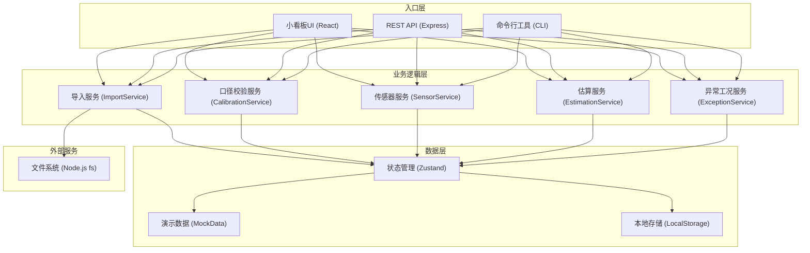
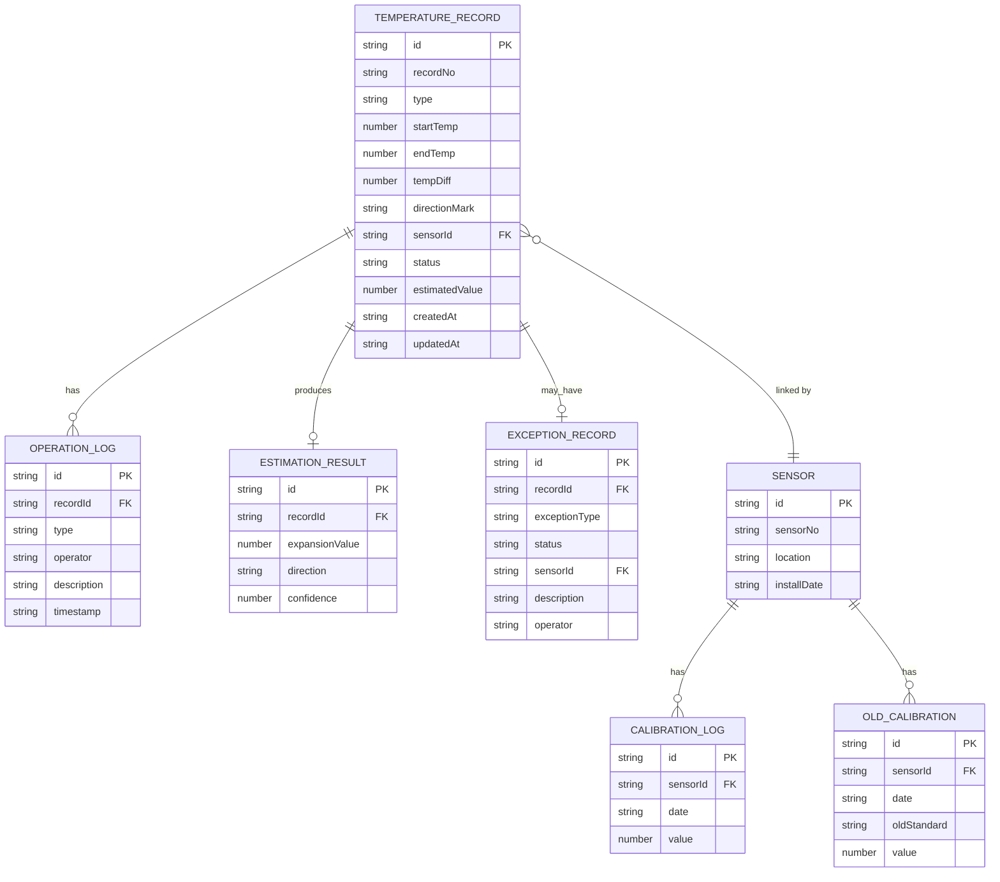

## 1. 架构设计



---

## 2. 技术描述

- **前端框架**：React@18 + TypeScript@5
- **构建工具**：Vite@5
- **样式方案**：TailwindCSS@3
- **状态管理**：Zustand@4（轻量、简单、适合中小型应用）
- **UI组件**：Headless UI + Heroicons
- **后端框架**：Express@4（提供API接口）
- **命令行工具**：Commander.js
- **数据持久化**：LocalStorage（浏览器端）+ 文件系统（CLI端）
- **演示数据**：内置Mock数据，无需数据库

---

## 3. 目录结构

```
/
├── src/
│   ├── frontend/              # 前端应用
│   │   ├── components/        # React组件
│   │   │   ├── StepTimeline.tsx      # 三步流程时间轴
│   │   │   ├── RecordCard.tsx        # 记录卡片
│   │   │   ├── ExceptionTable.tsx    # 异常工况表
│   │   │   ├── ImportModal.tsx       # 导入弹窗
│   │   │   ├── SensorPanel.tsx       # 传感器补录面板
│   │   │   ├── RecordDetail.tsx      # 记录详情
│   │   │   └── Toast.tsx             # 提示组件
│   │   ├── store/             # 状态管理
│   │   │   └── useAppStore.ts
│   │   ├── types/             # TypeScript类型定义
│   │   │   └── index.ts
│   │   ├── utils/             # 工具函数
│   │   │   ├── calibration.ts        # 口径校验
│   │   │   ├── estimation.ts         # 估算计算
│   │   │   └── formatters.ts         # 格式化
│   │   ├── data/              # 演示数据
│   │   │   └── mockData.ts
│   │   ├── App.tsx
│   │   ├── main.tsx
│   │   └── index.css
│   ├── backend/               # 后端API
│   │   ├── server.js
│   │   └── routes/
│   │       ├── records.js
│   │       ├── sensors.js
│   │       └── exceptions.js
│   └── cli/                   # 命令行工具
│       └── index.js
├── package.json
├── vite.config.ts
├── tsconfig.json
└── tailwind.config.js
```

---

## 4. 路由定义

| 路由 | 用途 |
|------|------|
| / | 小看板主页（三步流程+记录列表+异常表） |
| /api/records | 温度校准记录CRUD |
| /api/records/:id | 单条记录详情 |
| /api/records/import | 导入记录 |
| /api/sensors | 传感器信息查询 |
| /api/sensors/:id/history | 传感器历史口径 |
| /api/exceptions | 异常工况表 |
| /api/estimate/:id | 执行估算 |
| /api/estimate/:id/rerun | 重跑估算 |

---

## 5. API 类型定义

```typescript
// 温度校准记录
interface TemperatureRecord {
  id: string;
  recordNo: string;           // 记录编号 REC-001
  type: 'normal' | 'left' | 'supplement';  // 记录类型
  startTime: string;
  endTime: string;
  startTemp: number;          // 起始温度 ℃
  endTemp: number;            // 结束温度 ℃
  tempDiff: number;           // 温差 K
  directionMark: string;      // 方向标记：负方向 / 向左
  sensorId?: string;          // 传感器编号（可能缺失后补录）
  status: RecordStatus;
  estimatedValue?: number;    // 估算伸缩量 mm
  operationHistory: OperationLog[];
  createdAt: string;
  updatedAt: string;
}

type RecordStatus = 
  | 'pending_import'
  | 'imported'
  | 'calibrating'
  | 'success'               // 顺利
  | 'pending_review'        // 待复核（向左）
  | 'supplemented'          // 已补录
  | 'reviewed_negative'     // 已复核-负方向
  | 'reviewed_normal'       // 已复核-正常
  | 'manual_corrected'      // 已人工修正
  | 'rerun';                // 已重跑

// 传感器信息
interface Sensor {
  id: string;
  sensorNo: string;          // SNS-BR-001
  location: string;          // 安装位置
  installDate: string;
  calibrationHistory: CalibrationLog[];
  oldCalibrationData?: OldCalibration[];  // 旧口径数据
}

// 异常工况
interface ExceptionRecord {
  id: string;
  recordId: string;
  recordNo: string;
  exceptionType: 'direction_mismatch' | 'missing_sensor' | 'supplemented';
  status: ExceptionStatus;
  sensorId?: string;
  description: string;
  operator: string;
  createdAt: string;
  updatedAt: string;
}

type ExceptionStatus = 
  | 'pending'
  | 'pending_review'
  | 'supplemented'
  | 'resolved';

// 操作日志
interface OperationLog {
  id: string;
  type: 'import' | 'calibrate' | 'supplement' | 'correct' | 'rerun' | 'review';
  operator: string;
  description: string;
  timestamp: string;
  oldValue?: any;
  newValue?: any;
}

// 估算结果
interface EstimationResult {
  recordId: string;
  expansionValue: number;     // 伸缩量 mm（负值表示收缩）
  direction: 'positive' | 'negative';
  confidence: number;         // 置信度 0-1
  calculationFormula: string;
  timestamp: string;
}
```

---

## 6. 数据模型

### 6.1 ER图



### 6.2 核心业务逻辑实现要点

**口径校验逻辑 (calibration.ts)：**
```typescript
function validateDirection(directionMark: string): {
  isValid: boolean;
  needsReview: boolean;
  normalizedDirection?: 'positive' | 'negative';
  warning?: string;
} {
  const normalized = directionMark.trim().toLowerCase();
  
  if (normalized === '负方向' || normalized === 'negative') {
    return { isValid: true, needsReview: false, normalizedDirection: 'negative' };
  }
  
  if (normalized === '正方向' || normalized === 'positive') {
    return { isValid: true, needsReview: false, normalizedDirection: 'positive' };
  }
  
  // 关键逻辑：向左不自动转为负方向，标记待复核
  if (normalized === '向左' || normalized === 'left') {
    return { 
      isValid: true, 
      needsReview: true, 
      warning: '方向标记为"向左"，需实验老师复核确认是否为负方向'
    };
  }
  
  return { isValid: false };
}
```

**热胀伸缩估算公式 (estimation.ts)：**
```typescript
function calculateExpansion(
  tempDiff: number, 
  length: number = 1000,  // 默认桥梁长度 1000mm
  alpha: number = 0.000012  // 钢的线膨胀系数
): number {
  // 伸缩量 = 温度差 × 原长 × 线膨胀系数
  return tempDiff * length * alpha;
}
```

**异常工况表联动更新逻辑：**
- 导入记录时发现"向左"→ 自动添加异常记录（类型：direction_mismatch，状态：pending_review）
- 补录传感器编号时→ 更新异常记录（类型：missing_sensor→supplemented，状态：supplemented）
- 实验老师复核后→ 更新异常记录状态为resolved

---

## 7. 命令行工具

使用Commander.js实现CLI接口：

```bash
# 导入温度校准记录
bridge-expansion import --file ./records.json

# 查看记录列表
bridge-expansion list --status pending_review

# 补录传感器编号
bridge-expansion supplement --record REC-003 --sensor SNS-BR-003

# 执行估算
bridge-expansion estimate --record REC-001

# 重跑估算
bridge-expansion rerun --record REC-002

# 查看异常工况表
bridge-expansion exceptions

# 重置演示数据
bridge-expansion reset-demo
```
