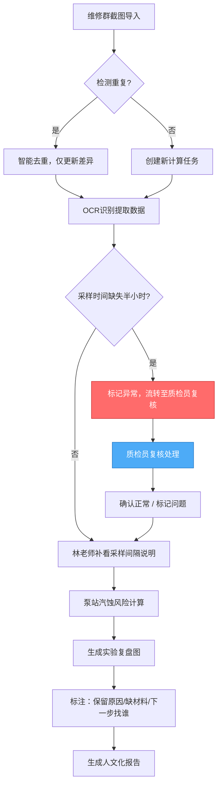
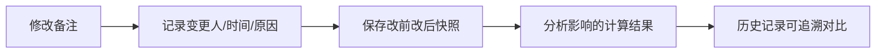

## 1. 产品概述

面向水利工程实验室的泵站汽蚀风险智能计算与复核系统，解决实验老师林老师在维修群截图、采样间隔说明多源数据整合中的数据重复、变更追溯难、复核流程不清晰等痛点。

- 核心价值：实现多源数据去重导入、全链路变更审计、可视化风险计算、人文化实验复盘
- 目标用户：实验老师林老师、质检员、实验室管理人员

## 2. 核心功能

### 2.1 用户角色

| 角色 | 注册方式 | 核心权限 |
|------|----------|----------|
| 实验老师（林老师） | 系统内置账号 | 导入维修群截图、补录采样间隔说明、修改备注、查看风险计算、生成复盘报告 |
| 质检员 | 系统内置账号 | 复核采样时间缺失数据、标记异常、确认复核结果 |
| 管理员 | 系统内置账号 | 全功能权限、用户管理 |

### 2.2 功能模块

1. **数据导入中心**：维修群截图导入（含去重）、采样间隔说明管理
2. **风险计算工作台**：泵站汽蚀风险计算、3D可视化、图表展示、数据溯源
3. **变更审计中心**：修改历史追踪、改前改后对比、变更影响分析
4. **实验复盘模块**：复盘图生成、人文化报告、待办事项指派
5. **复核流程引擎**：三步工作流、质检员复核、异常标记与流转

### 2.3 页面详情

| 页面名称 | 模块名称 | 功能描述 |
|----------|----------|----------|
| 首页仪表盘 | 概览卡片 | 待复核数、异常数、近期计算、快速入口 |
| 数据导入中心 | 维修群截图导入 | 拖拽上传、智能去重、OCR识别、导入预览 |
| 数据导入中心 | 采样间隔说明 | 表格录入、批量导入、版本管理 |
| 风险计算工作台 | 计算列表 | 计算任务列表、状态标签、操作入口 |
| 风险计算工作台 | 3D可视化 | 泵站3D模型、汽蚀风险热力图、时间轴播放 |
| 风险计算工作台 | 图表展示 | 压力曲线、流量趋势、风险等级分布 |
| 风险计算工作台 | 数据溯源面板 | 点击数据点回溯原始截图/采样说明 |
| 变更审计中心 | 历史记录 | 谁改了什么、为什么改、改前改后对比 |
| 变更审计中心 | 影响分析 | 变更关联的计算结果差异 |
| 实验复盘模块 | 复盘图 | 决策路径标注、保留原因、缺失材料说明 |
| 实验复盘模块 | 报告生成 | 人文化报告、下一步责任人指派 |
| 复核工作区 | 三步流程 | 导入→补说明→更新复盘，异常停留等待复核 |

## 3. 核心流程

### 三步核心工作流

维修群截图第一次导入 → 实验老师林老师补看采样间隔说明 → 实验复盘图更新

### 变更追溯流程

## 4. 用户界面设计

### 4.1 设计风格

- **主色调**：工业深蓝 `#0f172a`，体现专业严谨
- **辅助色**：警示橙 `#f59e0b`（异常/待复核）、确认绿 `#10b981`（正常）、风险红 `#ef4444`（高风险）
- **字体**：标题用 Space Grotesk，正文用 JetBrains Mono，体现工程科技感
- **布局**：左侧导航 + 主工作区 + 右侧溯源面板的三栏结构
- **视觉元素**：工业风网格背景、数据流线条、泵站图标、金属质感按钮
- **动效**：数据加载时的脉冲动画、风险高亮的呼吸效果、3D模型的平滑旋转

### 4.2 页面设计概览

| 页面名称 | 模块名称 | UI元素 |
|----------|----------|--------|
| 首页仪表盘 | 概览卡片 | 深色渐变卡片、状态指示灯、数据微动效 |
| 数据导入中心 | 截图导入区 | 虚线拖拽框、文件缩略图、去重检测进度条 |
| 风险计算工作台 | 3D场景 | 深蓝色金属质感泵站模型、热力图叠加、时间轴滑块 |
| 风险计算工作台 | 图表 | 深色背景图表、高亮数据点、点击涟漪效果 |
| 变更审计中心 | 对比视图 | 左右分栏对比、差异高亮、变更原因标注 |
| 实验复盘模块 | 复盘图 | 决策树状图、彩色标注气泡、责任人头像 |

### 4.3 响应式

- Desktop-first 设计，主工作区最小宽度 1280px
- 平板端折叠右侧溯源面板为抽屉式
- 移动端保留核心列表和操作，3D视图降级为2D示意图

### 4.4 3D场景指引

- **环境**：暗蓝工业风背景，微弱环境光 + 方向性主光
- **模型**：简化泵站模型，突出叶轮、进水口、出水口等关键部位
- **热力图**：根据汽蚀风险值在模型表面叠加红-黄-绿渐变
- **交互**：鼠标悬停显示部位名称和风险值，点击跳转数据溯源
- **动画**：缓慢自动旋转，水流粒子效果体现运行状态
- **后处理**：轻微 bloom 效果，增强科技感
