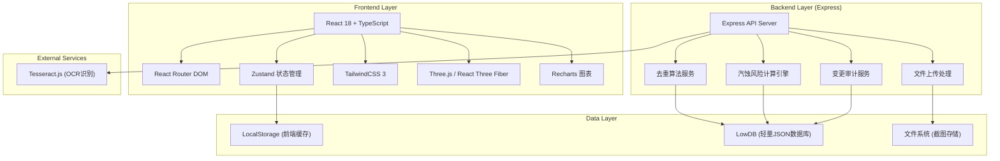
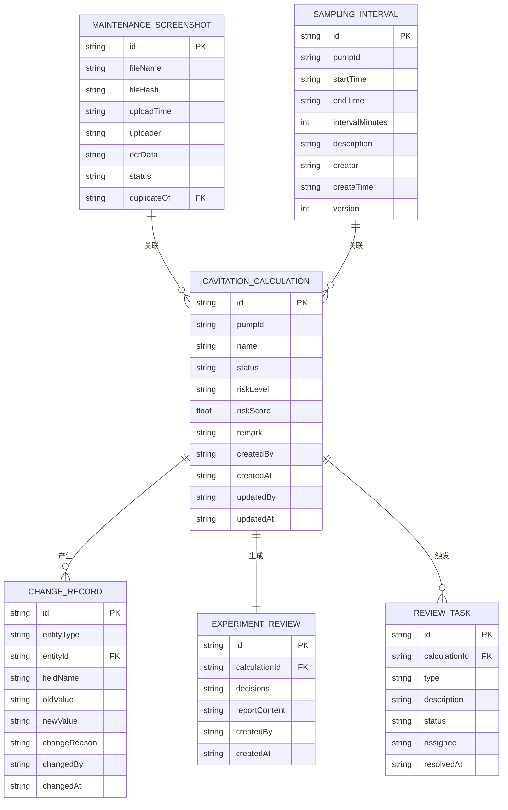

## 1. 架构设计



## 2. 技术描述

- **前端**：React@18 + TypeScript + Vite + TailwindCSS@3 + Zustand
- **3D引擎**：three + @react-three/fiber + @react-three/drei + @react-three/postprocessing
- **图表**：recharts
- **图标**：lucide-react
- **后端**：Express@4 + TypeScript
- **数据库**：LowDB (轻量级JSON文件数据库)
- **OCR**：tesseract.js (浏览器端识别)
- **初始化工具**：vite-init
- **包管理器**：pnpm (优先) / npm

## 3. 路由定义

| Route | Purpose |
|-------|---------|
| / | 首页仪表盘 |
| /import | 数据导入中心 |
| /calculations | 风险计算列表 |
| /calculations/:id | 风险计算详情（含3D/图表） |
| /audit | 变更审计中心 |
| /review | 质检员复核工作区 |
| /report/:id | 实验复盘报告 |

## 4. API 定义

```typescript
// 维修群截图
interface MaintenanceScreenshot {
  id: string;
  fileName: string;
  fileHash: string;
  uploadTime: string;
  uploader: string;
  ocrData?: string;
  extractedData?: {
    pumpId?: string;
    pressure?: number;
    flowRate?: number;
    sampleTime?: string;
  };
  status: 'pending' | 'processed' | 'duplicate';
  duplicateOf?: string;
}

// 采样间隔说明
interface SamplingInterval {
  id: string;
  pumpId: string;
  startTime: string;
  endTime: string;
  intervalMinutes: number;
  description: string;
  creator: string;
  createTime: string;
  version: number;
}

// 汽蚀风险计算
interface CavitationCalculation {
  id: string;
  pumpId: string;
  name: string;
  screenshotIds: string[];
  samplingIntervalIds: string[];
  status: 'draft' | 'pending_review' | 'reviewing' | 'completed';
  riskLevel: 'low' | 'medium' | 'high' | 'critical';
  riskScore: number;
  parameters: {
    pressure: number[];
    flowRate: number[];
    temperatures: number[];
    sampleTimes: string[];
    missingIntervals: { start: string; end: string; duration: number }[];
  };
  result: {
    npshAvailable: number;
    npshRequired: number;
    cavitationProbability: number;
    recommendations: string[];
  };
  remark: string;
  createdAt: string;
  createdBy: string;
  updatedAt: string;
  updatedBy: string;
}

// 变更记录
interface ChangeRecord {
  id: string;
  entityType: 'calculation' | 'screenshot' | 'sampling_interval';
  entityId: string;
  fieldName: string;
  oldValue: any;
  newValue: any;
  changeReason: string;
  changedBy: string;
  changedAt: string;
  affectedResults: string[];
}

// 实验复盘
interface ExperimentReview {
  id: string;
  calculationId: string;
  decisions: {
    dataPointId: string;
    keepReason: string;
    missingMaterials: string[];
    nextAction: 'inspector' | 'teacher' | 'none';
    assignee?: string;
  }[];
  reportContent: string;
  createdAt: string;
  createdBy: string;
}

// API Endpoints
// GET    /api/screenshots          获取截图列表
// POST   /api/screenshots          上传截图
// GET    /api/screenshots/:id      获取截图详情
// GET    /api/sampling-intervals   获取采样间隔列表
// POST   /api/sampling-intervals   创建采样间隔
// GET    /api/calculations         获取计算列表
// POST   /api/calculations         创建计算
// GET    /api/calculations/:id     获取计算详情
// PUT    /api/calculations/:id     更新计算
// GET    /api/calculations/:id/history  获取变更历史
// GET    /api/review/tasks         获取复核任务
// PUT    /api/review/tasks/:id     处理复核任务
// GET    /api/reports/:id          生成报告
```

## 5. 数据模型

### 6.1 数据模型定义



### 6.2 数据初始化

系统启动时自动初始化 Mock 数据，包含：
- 3 张维修群截图示例
- 2 条采样间隔说明
- 2 条已完成的汽蚀风险计算
- 1 条待质检员复核的计算任务
- 5 条变更历史记录
- 1 份实验复盘报告示例
