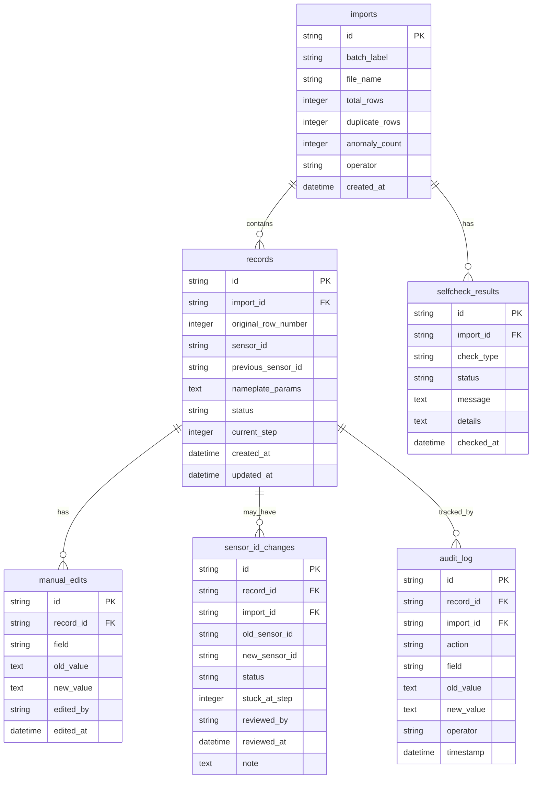

## 1. 架构设计

```mermaid
flowchart TB
    subgraph "前端 React"
        "页面: 数据导入" --> "Store: 导入状态"
        "页面: 复盘工作台" --> "Store: 复盘状态"
        "页面: 自检面板" --> "Store: 自检状态"
        "页面: 审计追踪" --> "Store: 审计状态"
        "页面: 导出" --> "Store: 导出状态"
    end
    subgraph "后端 Express"
        "API: /api/import" --> "Service: 导入服务"
        "API: /api/review" --> "Service: 复盘服务"
        "API: /api/selfcheck" --> "Service: 自检服务"
        "API: /api/audit" --> "Service: 审计服务"
        "API: /api/export" --> "Service: 导出服务"
    end
    subgraph "数据层 SQLite"
        "表: imports" 
        "表: records"
        "表: sensor_id_changes"
        "表: audit_log"
        "表: selfcheck_results"
    end
    "前端 React" --> "后端 Express"
    "Service: 导入服务" --> "表: imports"
    "Service: 导入服务" --> "表: records"
    "Service: 复盘服务" --> "表: records"
    "Service: 复盘服务" --> "表: sensor_id_changes"
    "Service: 自检服务" --> "表: selfcheck_results"
    "Service: 审计服务" --> "表: audit_log"
    "Service: 导出服务" --> "表: records"
```

## 2. 技术说明

- 前端：React@18 + Tailwind CSS@3 + Vite + Zustand
- 初始化工具：vite-init
- 后端：Express@4 + TypeScript (ESM)
- 数据库：SQLite (better-sqlite3)，无需外部数据库服务
- 文件解析：xlsx（Excel）、papaparse（CSV）

## 3. 路由定义

| 路由 | 用途 |
|------|------|
| / | 首页/仪表盘，显示待复核事项和自检概览 |
| /import | 数据导入页，上传铭牌参数文件 |
| /review | 复盘工作台，三步工作流 |
| /selfcheck | 自检面板，四项自检结果 |
| /audit | 审计追踪面板，变更时间线 |
| /export | 导出页，报告生成与一致性校验 |

## 4. API 定义

### 4.1 导入相关

```typescript
POST /api/import/upload
Request: FormData { file: File, batchLabel: string }
Response: { importId: string, totalRows: number, duplicateRows: number, anomalies: Anomaly[] }

GET /api/import/history
Response: ImportRecord[]
```

### 4.2 复盘相关

```typescript
GET /api/review/batch/:importId
Response: { batch: BatchInfo, records: ReviewRecord[], sensorChanges: SensorChange[] }

PUT /api/review/record/:recordId
Request: { status: RecordStatus, note?: string }
Response: ReviewRecord

PUT /api/review/sensor-change/:changeId/confirm
Request: { confirmed: boolean, note?: string, reviewerId: string }
Response: SensorChange
```

### 4.3 自检相关

```typescript
GET /api/selfcheck/run/:importId
Response: SelfCheckResult[]

GET /api/selfcheck/results/:importId
Response: SelfCheckResult[]
```

### 4.4 审计相关

```typescript
GET /api/audit/record/:recordId
Response: AuditEntry[]

GET /api/audit/batch/:importId
Response: AuditEntry[]
```

### 4.5 导出相关

```typescript
GET /api/export/:importId?format=csv|pdf&scope=all|anomaly|pending
Response: File download (with consistency hash in header X-Consistency-Hash)

GET /api/export/verify/:importId
Response: { pageHash: string, apiHash: string, exportHash: string, consistent: boolean }
```

### 4.6 类型定义

```typescript
interface Anomaly {
  type: 'duplicate' | 'sensor_id_changed' | 'value_out_of_range'
  rowNumber: number
  detail: string
}

interface ReviewRecord {
  id: string
  importId: string
  originalRowNumber: number
  sensorId: string
  previousSensorId?: string
  nameplateParams: Record<string, string | number>
  manualEdits: ManualEdit[]
  status: 'normal' | 'sensor_id_changed' | 'anomaly' | 'pending_review'
  currentStep: 1 | 2 | 3
  createdAt: string
  updatedAt: string
}

interface ManualEdit {
  field: string
  oldValue: string | number
  newValue: string | number
  editedBy: string
  editedAt: string
}

interface SensorChange {
  id: string
  recordId: string
  importId: string
  oldSensorId: string
  newSensorId: string
  status: 'pending_review' | 'confirmed' | 'rejected'
  stuckAtStep: 1 | 2 | 3
  reviewedBy?: string
  reviewedAt?: string
  note?: string
}

interface SelfCheckResult {
  type: 'duplicate_import' | 'sensor_id_changed' | 'recalc_after_supplement' | 'export_consistency'
  status: 'pass' | 'warning' | 'fail'
  message: string
  details: SelfCheckDetail[]
}

interface SelfCheckDetail {
  recordId?: string
  rowNumber?: number
  field?: string
  expected?: string
  actual?: string
}

interface AuditEntry {
  id: string
  recordId: string
  importId: string
  action: string
  field?: string
  oldValue?: string
  newValue?: string
  operator: string
  timestamp: string
}

interface ImportRecord {
  id: string
  batchLabel: string
  fileName: string
  totalRows: number
  duplicateRows: number
  anomalyCount: number
  operator: string
  createdAt: string
}
```

## 5. 服务器架构

```mermaid
flowchart LR
    "Controller" --> "Service"
    "Service" --> "Repository"
    "Repository" --> "SQLite"
```

## 6. 数据模型

### 6.1 数据模型定义



### 6.2 数据定义语言

```sql
CREATE TABLE imports (
    id TEXT PRIMARY KEY,
    batch_label TEXT NOT NULL,
    file_name TEXT NOT NULL,
    total_rows INTEGER NOT NULL DEFAULT 0,
    duplicate_rows INTEGER NOT NULL DEFAULT 0,
    anomaly_count INTEGER NOT NULL DEFAULT 0,
    operator TEXT NOT NULL,
    created_at TEXT NOT NULL DEFAULT (datetime('now'))
);

CREATE TABLE records (
    id TEXT PRIMARY KEY,
    import_id TEXT NOT NULL REFERENCES imports(id),
    original_row_number INTEGER NOT NULL,
    sensor_id TEXT NOT NULL,
    previous_sensor_id TEXT,
    nameplate_params TEXT NOT NULL DEFAULT '{}',
    status TEXT NOT NULL DEFAULT 'normal' CHECK(status IN ('normal','sensor_id_changed','anomaly','pending_review')),
    current_step INTEGER NOT NULL DEFAULT 1 CHECK(current_step BETWEEN 1 AND 3),
    created_at TEXT NOT NULL DEFAULT (datetime('now')),
    updated_at TEXT NOT NULL DEFAULT (datetime('now'))
);

CREATE TABLE manual_edits (
    id TEXT PRIMARY KEY,
    record_id TEXT NOT NULL REFERENCES records(id),
    field TEXT NOT NULL,
    old_value TEXT,
    new_value TEXT,
    edited_by TEXT NOT NULL,
    edited_at TEXT NOT NULL DEFAULT (datetime('now'))
);

CREATE TABLE sensor_id_changes (
    id TEXT PRIMARY KEY,
    record_id TEXT NOT NULL REFERENCES records(id),
    import_id TEXT NOT NULL REFERENCES imports(id),
    old_sensor_id TEXT NOT NULL,
    new_sensor_id TEXT NOT NULL,
    status TEXT NOT NULL DEFAULT 'pending_review' CHECK(status IN ('pending_review','confirmed','rejected')),
    stuck_at_step INTEGER NOT NULL DEFAULT 2 CHECK(stuck_at_step BETWEEN 1 AND 3),
    reviewed_by TEXT,
    reviewed_at TEXT,
    note TEXT
);

CREATE TABLE selfcheck_results (
    id TEXT PRIMARY KEY,
    import_id TEXT NOT NULL REFERENCES imports(id),
    check_type TEXT NOT NULL CHECK(check_type IN ('duplicate_import','sensor_id_changed','recalc_after_supplement','export_consistency')),
    status TEXT NOT NULL CHECK(status IN ('pass','warning','fail')),
    message TEXT NOT NULL,
    details TEXT NOT NULL DEFAULT '[]',
    checked_at TEXT NOT NULL DEFAULT (datetime('now'))
);

CREATE TABLE audit_log (
    id TEXT PRIMARY KEY,
    record_id TEXT NOT NULL REFERENCES records(id),
    import_id TEXT NOT NULL REFERENCES imports(id),
    action TEXT NOT NULL,
    field TEXT,
    old_value TEXT,
    new_value TEXT,
    operator TEXT NOT NULL,
    timestamp TEXT NOT NULL DEFAULT (datetime('now'))
);

CREATE INDEX idx_records_import_id ON records(import_id);
CREATE INDEX idx_records_status ON records(status);
CREATE INDEX idx_sensor_changes_status ON sensor_id_changes(status);
CREATE INDEX idx_sensor_changes_import_id ON sensor_id_changes(import_id);
CREATE INDEX idx_audit_record_id ON audit_log(record_id);
CREATE INDEX idx_audit_import_id ON audit_log(import_id);
CREATE INDEX idx_selfcheck_import_id ON selfcheck_results(import_id);
```
