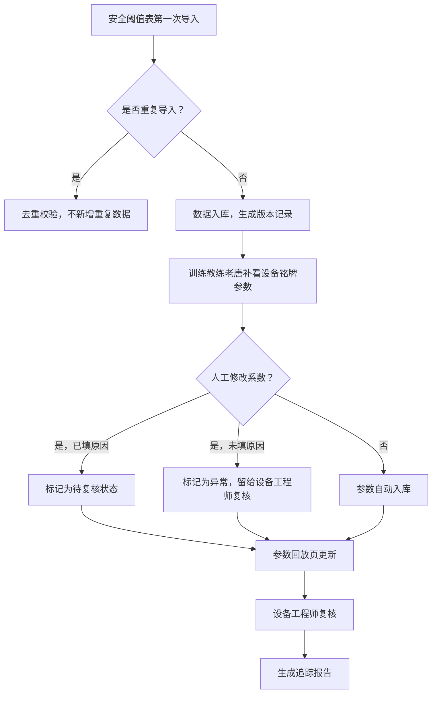

## 1. 产品概述

混凝土养护温度追踪系统是一款面向工程建设领域的专业温度监控管理平台，解决训练教练老唐在日常工作中安全阈值表与设备铭牌参数管理混乱、重复导入数据翻倍、历史变更追溯困难等核心痛点。系统提供专业的数据管理、可视化展示、智能分析和流程化复核能力，帮助工程团队高效管理混凝土养护过程。

## 2. 核心功能

### 2.1 用户角色

| 角色 | 说明 | 核心权限 |
|------|------|----------|
| 训练教练老唐 | 主要使用者，负责温度数据录入和初步审核 | 导入安全阈值表、查看设备铭牌参数、修改备注、标记异常 |
| 设备工程师 | 专业复核人员，负责技术参数审核 | 复核人工修改系数、填写修改原因、确认参数合理性 |
| 系统管理员 | 系统配置和数据管理 | 全功能权限、用户管理、系统配置 |

### 2.2 功能模块

1. **数据管理中心**：安全阈值表导入、设备铭牌参数管理、导入去重校验
2. **温度追踪看板**：实时温度监控、3D可视化展示、图表分析视图
3. **参数回放页**：历史版本对比、修改痕迹追溯、决策轨迹记录
4. **复核工作台**：待复核任务、人工修改审核、原因补全提醒
5. **智能报告中心**：人性化报告生成、参数说明、下一步行动建议

### 2.3 页面详情

| 页面名称 | 模块名称 | 功能描述 |
|-----------|-------------|---------------------|
| 首页仪表盘 | 数据概览 | 关键指标卡片、待办提醒、最近活动时间线 |
| 安全阈值表管理 | 表格管理 | Excel导入、去重校验、版本对比、历史记录 |
| 设备铭牌参数 | 参数管理 | 设备信息维护、参数溯源、关联阈值表 |
| 温度追踪看板 | 可视化 | 3D温度场展示、折线图/热力图、数据钻取回溯 |
| 参数回放页 | 历史追溯 | 修改前后对比、版本快照、参数取舍理由 |
| 复核工作台 | 任务处理 | 待复核列表、人工修改审核、原因填写 |
| 报告中心 | 报告生成 | 人性化报告、缺料提醒、责任方建议 |

## 3. 核心流程

### 3.1 标准三步工作流

### 3.2 数据追溯流程

1. 训练教练老唐导入安全阈值表 → 系统自动检测重复记录 → 仅新增差异数据
2. 老唐修改某条记录备注 → 系统自动保存修改前快照 → 参数回放页显示改前改后对比
3. 老唐人工调整温度系数但未填写原因 → 系统标记为黄色预警状态 → 推送至设备工程师复核工作台
4. 在3D/图表视图点击异常点 → 系统展示完整数据链路 → 可一键跳转至原始安全阈值表或设备铭牌参数

## 4. 用户界面设计

### 4.1 设计风格
- **主色调**：工业蓝（#1e3a5f）作为主色，代表专业和可靠
- **辅助色**：警告橙（#f59e0b）、异常红（#ef4444）、正常绿（#10b981）
- **按钮风格**：轻微圆角（6px），悬停有微妙阴影和颜色加深效果
- **字体**：标题使用思源黑体 Bold，正文使用思源黑体 Regular，数据展示使用等宽字体 JetBrains Mono
- **布局风格**：卡片式布局，清晰的功能分区，工业风简约设计
- **图标风格**：使用线性图标，保持统一的2px描边

### 4.2 页面设计概览

| 页面名称 | 模块名称 | UI 元素 |
|-----------|-------------|----------|
| 首页仪表盘 | 数据概览 | 渐变卡片、数字动效、时间线组件、状态标签 |
| 安全阈值表管理 | 表格管理 | 数据表格、行内编辑、版本对比抽屉、导入进度条 |
| 温度追踪看板 | 可视化 | 3D场景容器、图表切换Tab、数据钻取弹窗、溯源按钮 |
| 参数回放页 | 历史追溯 | 左右对比布局、版本时间轴、修改痕迹高亮、备注气泡 |
| 复核工作台 | 任务处理 | 任务卡片、待处理标记、原因输入框、一键通过/驳回 |
| 报告中心 | 报告生成 | 报告预览、人性化文案、责任方标签、导出按钮 |

### 4.3 响应式
- 桌面端优先设计，适配 1440px 及以上分辨率
- 平板端适配 1024px，侧边栏可折叠
- 移动端适配 375px，重点展示数据看板和复核任务

### 4.4 3D 场景指导
- **环境**：工业风室内场景，模拟混凝土养护室环境
- **光照**：柔和的顶部主光源 + 蓝色冷色调环境光，突出科技感
- **相机**：默认正交视角，支持旋转和缩放，聚焦于温度异常区域
- **交互**：点击构件显示详细温度数据，hover 显示温度tooltip
- **后处理**：轻微 bloom 效果突出异常高温区域，颜色编码温度梯度
