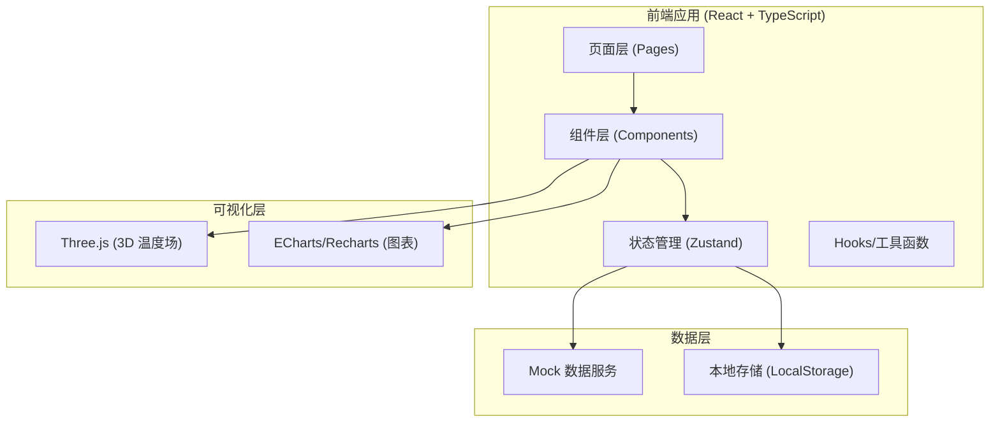
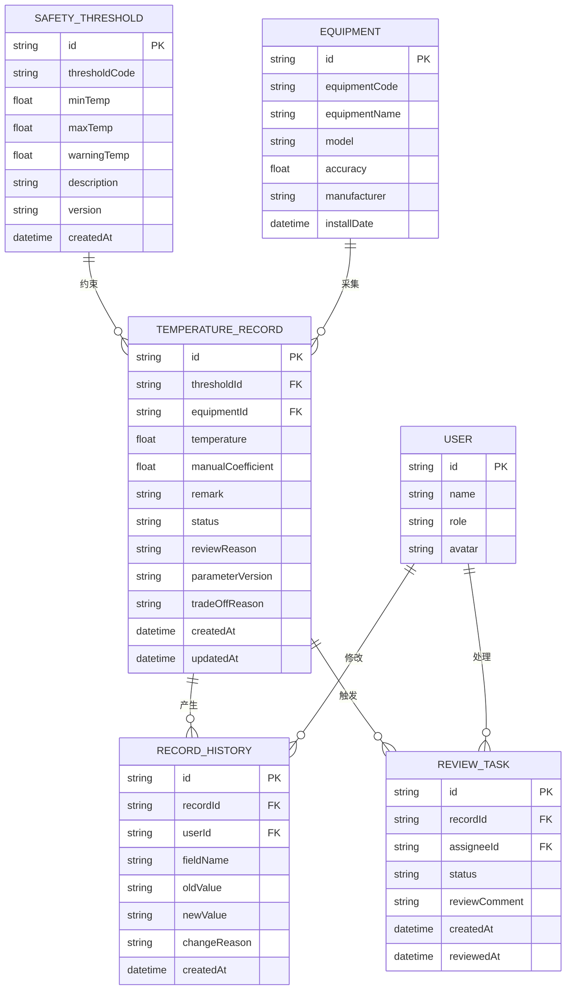

## 1. 架构设计



## 2. 技术描述

- **前端框架**：React@18 + TypeScript
- **构建工具**：Vite@5
- **样式方案**：Tailwind CSS@3
- **状态管理**：Zustand
- **路由管理**：React Router DOM@6
- **3D 可视化**：Three.js + @react-three/fiber + @react-three/drei
- **图表库**：Recharts
- **图标库**：Lucide React
- **数据持久化**：LocalStorage (模拟后端)

## 3. 路由定义

| 路由 | 页面名称 | 用途 |
|-------|---------|------|
| /dashboard | 首页仪表盘 | 关键指标展示、待办提醒、活动时间线 |
| /thresholds | 安全阈值表管理 | 阈值表导入、去重、版本管理 |
| /equipment | 设备铭牌参数 | 设备信息维护、参数溯源 |
| /tracking | 温度追踪看板 | 3D可视化、图表分析、数据钻取 |
| /playback | 参数回放页 | 历史版本对比、修改痕迹追溯 |
| /review | 复核工作台 | 待复核任务处理、原因补全 |
| /reports | 报告中心 | 人性化报告生成、导出 |

## 4. 数据模型

### 4.1 实体关系图



### 4.2 核心数据结构定义

```typescript
// 安全阈值表
interface SafetyThreshold {
  id: string;
  thresholdCode: string;
  minTemp: number;
  maxTemp: number;
  warningTemp: number;
  description: string;
  version: string;
  createdAt: string;
}

// 设备铭牌参数
interface Equipment {
  id: string;
  equipmentCode: string;
  equipmentName: string;
  model: string;
  accuracy: number;
  manufacturer: string;
  installDate: string;
}

// 温度记录
interface TemperatureRecord {
  id: string;
  thresholdId: string;
  equipmentId: string;
  temperature: number;
  manualCoefficient?: number;
  remark?: string;
  status: 'normal' | 'warning' | 'error' | 'pending_review';
  reviewReason?: string;
  parameterVersion?: string;
  tradeOffReason?: string;
  createdAt: string;
  updatedAt: string;
}

// 历史记录
interface RecordHistory {
  id: string;
  recordId: string;
  userId: string;
  fieldName: string;
  oldValue: string;
  newValue: string;
  changeReason?: string;
  createdAt: string;
}

// 复核任务
interface ReviewTask {
  id: string;
  recordId: string;
  assigneeId: string;
  status: 'pending' | 'approved' | 'rejected';
  reviewComment?: string;
  createdAt: string;
  reviewedAt?: string;
}
```

## 5. 核心算法与逻辑

### 5.1 导入去重算法
```
输入：待导入阈值列表 thresholdList
输出：去重后的新增列表 + 更新列表

1. 遍历每条待导入记录
2. 根据 thresholdCode + version 生成唯一键
3. 在已有数据中查找匹配键
4. 若存在且数据完全相同 → 跳过
5. 若存在但数据有差异 → 标记为更新，生成新版本
6. 若不存在 → 标记为新增
7. 返回 { newList, updateList, skippedCount }
```

### 5.2 状态判定逻辑
```
输入：温度记录 record
输出：状态 status

1. 若存在 manualCoefficient 且 reviewReason 为空 → pending_review
2. 否则若 temperature > maxTemp 或 temperature < minTemp → error
3. 否则若 temperature > warningTemp → warning
4. 否则 → normal
```

## 6. 项目目录结构

```
src/
├── components/          # 公共组件
│   ├── layout/         # 布局组件
│   ├── charts/         # 图表组件
│   ├── 3d/             # 3D 可视化组件
│   └── common/         # 通用UI组件
├── pages/              # 页面组件
│   ├── Dashboard.tsx
│   ├── Thresholds.tsx
│   ├── Equipment.tsx
│   ├── Tracking.tsx
│   ├── Playback.tsx
│   ├── Review.tsx
│   └── Reports.tsx
├── store/              # Zustand 状态管理
│   ├── useThresholdStore.ts
│   ├── useEquipmentStore.ts
│   ├── useRecordStore.ts
│   └── useReviewStore.ts
├── hooks/              # 自定义 Hooks
│   ├── useDeduplication.ts
│   ├── useHistory.ts
│   └── useStatusJudgment.ts
├── utils/              # 工具函数
│   ├── mockData.ts
│   ├── storage.ts
│   └── helpers.ts
├── types/              # TypeScript 类型定义
│   └── index.ts
├── App.tsx
└── main.tsx
```
