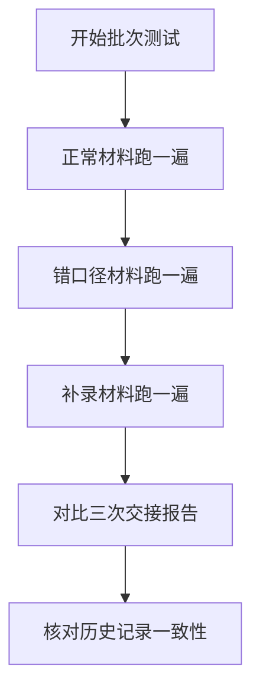

## 1. 产品概述

鱼池溶氧扩散处理系统，用于管理水产养殖中的溶氧数据采集、温度单位校验、巡检记录冲突处理和交接报告生成。解决训练教练10分钟会前快速审阅、维修师傅老岑高效处理摄氏度/开尔文混用、工况照片与手写巡检备注冲突证据链追溯等核心问题。

目标用户：训练教练、维修师傅老岑、数据录入人员
核心价值：证据链完整、流程可追溯、关键节点不自动拍板、自检覆盖高频错误点

## 2. 核心功能

### 2.1 用户角色

| 角色 | 核心权限 |
|------|----------|
| 数据录入人员 | 导入工况照片、录入基础数据 |
| 维修师傅老岑 | 补看手写巡检备注、确认/驳回冲突、更新交接报告 |
| 训练教练 | 复核摄氏度/开尔文混用情况、审阅交接报告 |

### 2.2 功能模块

1. **数据导入页面**：工况照片上传、基础溶氧数据录入、批次标识
2. **巡检备注页面**：手写巡检备注补录、温度单位检测、冲突识别
3. **冲突处理页面**：工况照片与备注冲突证据展示、老岑确认/驳回操作
4. **交接报告页面**：报告生成、历史记录比对、导出功能
5. **自检中心页面**：重复导入检测、温度单位混用检测、补录重算验证、导出一致性校验

### 2.3 页面详情

| 页面名称 | 模块名称 | 功能描述 |
|-----------|-------------|---------------------|
| 数据导入页 | 照片上传区 | 支持批量上传工况照片，自动提取EXIF时间戳，标记批次号 |
| 数据导入页 | 基础数据录入 | 溶氧值、水温（摄氏度/开尔文可选）、录入时间、设备编号 |
| 数据导入页 | 批次管理 | 正常材料/错口径材料/补录材料三种批次类型切换 |
| 巡检备注页 | 手写备注录入 | 支持文本录入和图片上传，记录巡检人、巡检时间 |
| 巡检备注页 | 温度单位检测 | 自动识别数据中摄氏度和开尔文混用情况，高亮标记待复核 |
| 冲突处理页 | 冲突证据展示 | 左右对比展示工况照片数据和手写备注，逐条列出冲突点 |
| 冲突处理页 | 确认/驳回操作 | 老岑对每条冲突选择确认或驳回，记录操作人和时间 |
| 交接报告页 | 报告生成 | 自动汇总处理结果，生成结构化交接报告 |
| 交接报告页 | 历史比对 | 与历史记录逐条比对，标记差异项 |
| 自检中心页 | 重复导入检测 | 检测相同设备+时间段的重复导入记录 |
| 自检中心页 | 温度单位检测 | 全量扫描摄氏度/开尔文混用情况 |
| 自检中心页 | 补录重算验证 | 验证补录数据后溶氧扩散计算结果一致性 |
| 自检中心页 | 导出一致性校验 | 校验导出数据与系统内数据是否一致 |

## 3. 核心流程

### 三步主工作流

### 批次测试流程

## 4. 用户界面设计

### 4.1 设计风格
- **主色调**：深海蓝 (#0F4C81) - 代表水、专业、可信赖
- **辅助色**：警示橙 (#FF6B35) - 标记冲突、待复核项；通过绿 (#2ECC71) - 确认通过
- **按钮风格**：直角矩形，轻微阴影，点击有下沉效果
- **字体**：思源黑体 - 清晰易读，适合工业场景
- **布局风格**：左右分栏对比布局为主，卡片式信息分组
- **图标风格**：线性图标，简洁明了，避免装饰性元素

### 4.2 页面设计概述

| 页面名称 | 模块名称 | UI元素 |
|-----------|-------------|-------------|
| 数据导入页 | 照片上传区 | 拖拽上传框、缩略图网格、批次标签 |
| 冲突处理页 | 证据对比区 | 左右分栏、差异高亮、操作按钮组 |
| 自检中心页 | 检测结果区 | 进度条、通过/失败徽章、详情展开面板 |
| 交接报告页 | 报告预览区 | 结构化表格、历史对比高亮、导出按钮 |

### 4.3 响应式
- Desktop-first 设计，主工作区宽度 1200px+
- 冲突对比页面保持左右分栏，平板端改为上下堆叠
- 触控操作区域最小 44px

### 4.4 交互细节
- 冲突证据逐条加载，有微妙的进入动画
- 温度单位混用项用橙色边框持续呼吸闪烁
- 老岑操作后即时反馈，状态变更有过渡动画
- 自检进度条实时更新，完成后弹出结果摘要
