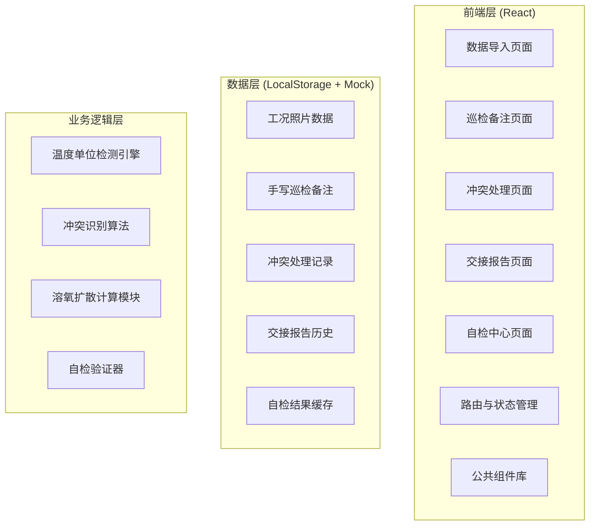
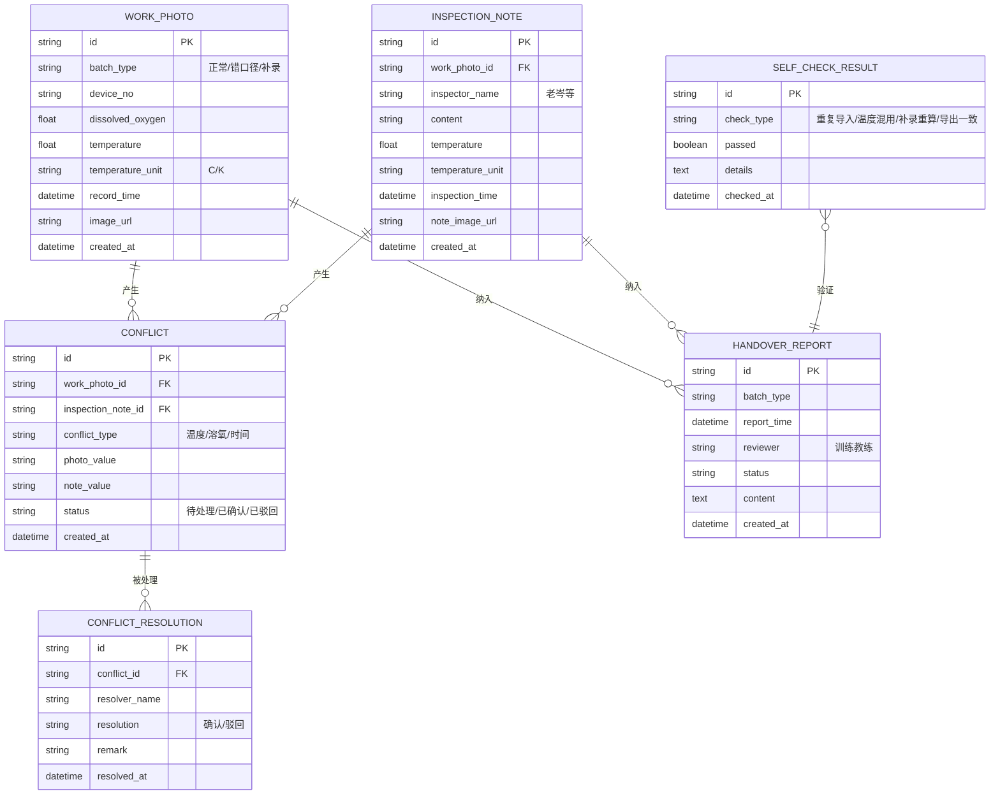

## 1. 架构设计



## 2. 技术描述

- **前端框架**：React@18 + TypeScript
- **构建工具**：Vite@5
- **样式方案**：TailwindCSS@3
- **路由管理**：React Router@6
- **状态管理**：React Context + useReducer
- **数据持久化**：LocalStorage（模拟后端）
- **图表展示**：Recharts（溶氧扩散趋势图）
- **文件处理**：原生 File API（照片上传预览）

## 3. 路由定义

| 路由 | 页面名称 | 用途 |
|-------|---------|------|
| / | 首页/流程导航 | 展示三步工作流进度，快速进入各环节 |
| /import | 数据导入页 | 工况照片上传、基础数据录入、批次选择 |
| /inspection | 巡检备注页 | 手写巡检备注补录、温度单位检测 |
| /conflict | 冲突处理页 | 证据对比展示、老岑确认/驳回操作 |
| /report | 交接报告页 | 报告生成、历史比对、导出 |
| /self-check | 自检中心页 | 四项自检功能执行与结果展示 |

## 4. 数据模型

### 4.1 数据模型定义



### 4.2 TypeScript 类型定义

```typescript
// 批次类型
type BatchType = 'normal' | 'wrong_caliber' | 'supplementary';

// 温度单位
type TemperatureUnit = 'C' | 'K';

// 工况照片数据
interface WorkPhoto {
  id: string;
  batchType: BatchType;
  deviceNo: string;
  dissolvedOxygen: number;
  temperature: number;
  temperatureUnit: TemperatureUnit;
  recordTime: string;
  imageUrl?: string;
  createdAt: string;
}

// 巡检备注
interface InspectionNote {
  id: string;
  workPhotoId: string;
  inspectorName: string;
  content: string;
  temperature?: number;
  temperatureUnit?: TemperatureUnit;
  inspectionTime: string;
  noteImageUrl?: string;
  createdAt: string;
}

// 冲突记录
type ConflictType = 'temperature' | 'dissolved_oxygen' | 'time';
type ConflictStatus = 'pending' | 'confirmed' | 'rejected';

interface Conflict {
  id: string;
  workPhotoId: string;
  inspectionNoteId: string;
  conflictType: ConflictType;
  photoValue: string;
  noteValue: string;
  status: ConflictStatus;
  createdAt: string;
}

// 交接报告
interface HandoverReport {
  id: string;
  batchType: BatchType;
  reportTime: string;
  reviewer?: string;
  status: 'draft' | 'final';
  items: ReportItem[];
  temperatureMixed: boolean;
  conflictCount: number;
  resolvedCount: number;
  createdAt: string;
}

// 自检结果
type CheckType = 'duplicate_import' | 'temperature_mixed' | 'recalculation' | 'export_consistency';

interface SelfCheckResult {
  id: string;
  checkType: CheckType;
  passed: boolean;
  details: string;
  checkedAt: string;
}
```

## 5. 核心算法模块

### 5.1 温度单位混用检测
- 输入：WorkPhoto[] + InspectionNote[]
- 逻辑：检查同一设备同一时间段内温度单位是否一致
- 输出：标记所有混用记录，不自动转换

### 5.2 冲突识别算法
- 输入：WorkPhoto + InspectionNote 配对
- 比对维度：温度值（考虑单位差异后）、溶氧值、记录时间
- 阈值：温度差异 > 2℃（转换后）、溶氧差异 > 0.5mg/L、时间差异 > 30分钟
- 输出：Conflict 数组

### 5.3 溶氧扩散计算
- 基于水温、溶氧值、时间间隔计算扩散速率
- 补录数据触发重算，记录重算前后差异

### 5.4 自检验证器
- 重复导入：相同 deviceNo + recordTime 窗口内去重检测
- 温度混用：全量扫描单位不一致记录
- 补录重算：补录前后计算结果哈希比对
- 导出一致：导出数据与系统数据逐字段校验
