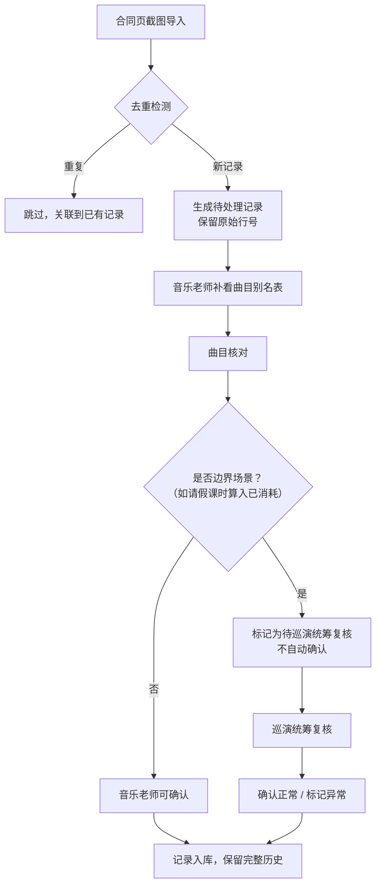

## 1. 产品概述
黑胶预售缺货提醒系统，用于管理音乐演出合同页截图的导入、核对与追踪。核心解决合同数据证据链完整、人工复核留痕、边界规则明确的问题，确保巡演统筹追问时能回到原始证据。

- 核心目标：合同页截图证据链完整，每一步改动可追溯，边界规则代码化
- 目标用户：音乐老师（许老师）、巡演统筹、运营人员

## 2. 核心 Features

### 2.1 用户角色
| 角色 | 核心权限 |
|------|----------|
| 音乐老师（许老师） | 导入合同页截图、补看曲目别名表、修改备注、确认记录 |
| 巡演统筹 | 复核待处理记录、查看完整历史证据链 |
| 运营人员 | 查看缺货提醒汇总、导出数据 |

### 2.2 Feature Module
1. **合同页截图导入模块**：批量导入、原始行号保留、去重检测
2. **缺货提醒列表**：按状态分类展示、证据链展开、人工改动记录
3. **曲目别名表管理**：别名映射、批量补充、版本历史
4. **处理历史追踪**：每条记录的完整变更日志、改前改后对比
5. **边界规则说明**：内置规则展示、判定逻辑说明、回滚指引

### 2.3 Page Details
| 页面名称 | 模块名称 | Feature 描述 |
|---------|---------|-------------|
| 首页 / 缺货提醒列表 | 状态筛选栏 | 按待处理/已确认/已复核/异常 筛选 |
| 首页 / 缺货提醒列表 | 提醒记录卡片 | 显示原始行号、曲目名、缺货数量、当前状态、操作人 |
| 首页 / 缺货提醒列表 | 证据链展开面板 | 展示原始截图数据、人工改动记录、处理时间线 |
| 合同导入页 | 文件上传区 | 支持批量上传合同页截图文件 |
| 合同导入页 | 导入预览 | 显示识别出的行号、原始内容、去重检测结果 |
| 曲目别名表页 | 别名列表 | 曲目标准名与别名的映射关系 |
| 曲目别名表页 | 批量补充 | 支持批量导入别名表 |
| 记录详情页 | 完整时间线 | 从导入到最终确认的完整操作历史 |
| 记录详情页 | 改前改后对比 | 高亮显示每次修改的差异 |
| 边界规则页 | 规则列表 | 展示所有内置边界规则及判定逻辑 |
| 边界规则页 | 场景示例 | 请假课时被算进已消耗等典型场景的处理方式 |

## 3. Core Process

### 核心三步流程
1. **合同页截图第一次导入**：系统识别原始行号与内容，去重检测后生成待处理记录
2. **音乐老师许老师补看曲目别名表**：将合同中的曲目名与标准曲目名进行映射匹配
3. **曲目核对表更新**：核对完成后，异常记录（如请假课时被算进已消耗）标记为"待巡演统筹复核"，正常记录可确认

### 特殊边界处理
- 请假课时被算进已消耗：不自动归为正常，停留在"待处理"状态，等待巡演统筹人工复核
- 重复导入同一批截图：通过文件哈希+内容指纹去重，不重复生成提醒记录
- 单条备注修改：保留修改历史，可查看改前改后的完整差异

## 4. User Interface Design

### 4.1 Design Style
- **主色调**：深炭灰（#1a1a1a）+ 暖琥珀色（#d97706），体现黑胶唱片的质感与专业感
- **辅助色**：朱砂红（#dc2626）标记异常，翡翠绿（#059669）标记已确认
- **设计风格**：极简工业风，强调数据可读性，证据链清晰可追溯
- **字体**：标题用 Source Serif Pro（衬线，复古质感），正文用 JetBrains Mono（等宽，方便对齐原始行号）
- **布局**：卡片式列表，支持展开查看详细证据链

### 4.2 Page Design Overview
| 页面名称 | 模块名称 | UI Elements |
|---------|---------|-------------|
| 缺货提醒列表 | 顶部导航 | 深灰背景，琥珀色logo，左侧导航 |
| 缺货提醒列表 | 状态标签 | 圆角标签，不同状态不同颜色 |
| 缺货提醒列表 | 记录卡片 | 白底浅灰边框，hover时琥珀色描边 |
| 证据链面板 | 时间线 | 左侧竖线时间轴，节点用圆点标记 |
| 证据链面板 | 差异对比 | 修改处用背景色高亮，删除用删除线 |
| 合同导入页 | 上传区 | 虚线边框拖放区，琥珀色强调 |
| 边界规则页 | 规则卡片 | 左侧图标，右侧标题+描述，底部示例代码 |

### 4.3 Responsiveness
- Desktop-first 设计，主内容区最大宽度 1200px
- 平板端：侧边栏收起为图标，列表单列展示
- 移动端：顶部导航折叠，卡片垂直堆叠

### 4.4 动效设计
- 卡片展开/收起：平滑高度过渡，150ms ease
- 状态变更：颜色渐变过渡，200ms
- 时间线加载：节点依次出现，stagger 50ms
