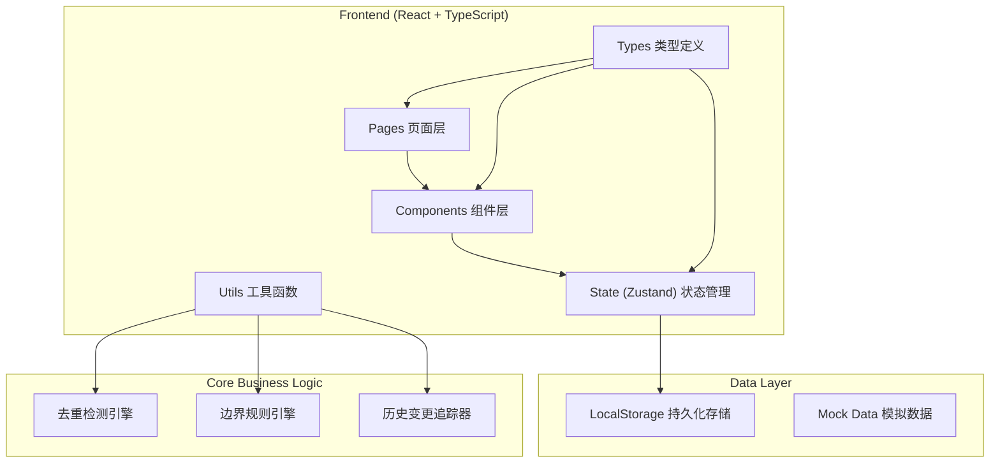
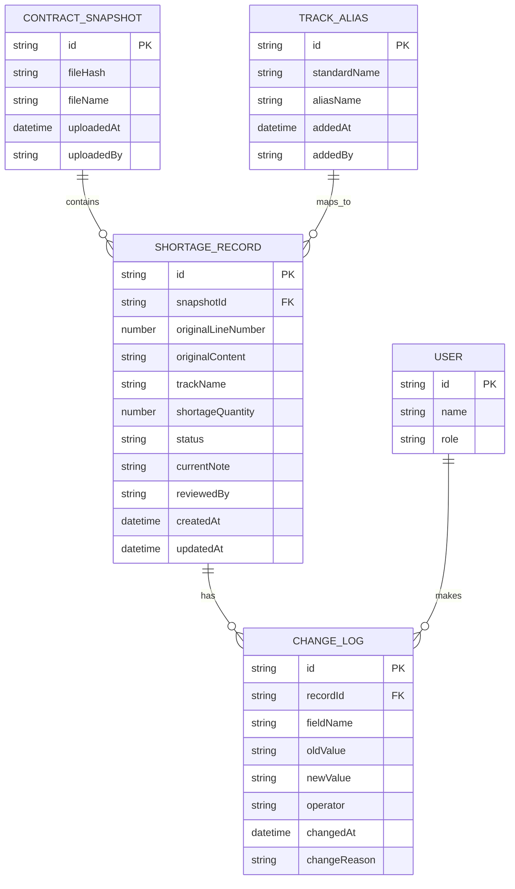

## 1. Architecture Design



## 2. Technology Description
- **Frontend**: React@18 + TypeScript + Vite
- **State Management**: Zustand
- **Styling**: TailwindCSS@3
- **Routing**: React Router DOM
- **Icons**: Lucide React
- **Data Persistence**: LocalStorage (纯前端，无后端)
- **Initialization Tool**: vite-init

## 3. Route Definitions
| Route | 页面用途 |
|-------|---------|
| / | 缺货提醒列表首页 |
| /import | 合同页截图导入页 |
| /aliases | 曲目别名表管理页 |
| /record/:id | 单条记录详情页 |
| /rules | 边界规则说明页 |

## 4. Data Model

### 4.1 ER Diagram



### 4.2 TypeScript Type Definitions

```typescript
// 缺货提醒记录状态
type RecordStatus = 
  | 'pending'      // 待处理（刚导入）
  | 'alias_mapped' // 已匹配曲目别名
  | 'review_needed' // 待巡演统筹复核（边界场景）
  | 'confirmed'    // 已确认（音乐老师）
  | 'reviewed'     // 已复核（巡演统筹）
  | 'rejected';    // 已驳回

// 合同页截图
interface ContractSnapshot {
  id: string;
  fileHash: string;           // 文件哈希，用于去重
  fileName: string;
  uploadedAt: string;
  uploadedBy: string;
  contentFingerprint: string; // 内容指纹，用于去重
}

// 缺货提醒记录
interface ShortageRecord {
  id: string;
  snapshotId: string;
  originalLineNumber: number; // 原始行号，必须保留
  originalContent: string;    // 原始内容，不可修改
  trackName: string;          // 曲目名（可能是别名）
  standardTrackName?: string; // 标准曲目名（别名映射后）
  shortageQuantity: number;
  status: RecordStatus;
  currentNote: string;        // 当前备注
  isBoundaryCase: boolean;    // 是否边界场景（如请假课时算入已消耗）
  boundaryType?: string;      // 边界场景类型
  confirmedBy?: string;
  reviewedBy?: string;
  createdAt: string;
  updatedAt: string;
}

// 变更日志
interface ChangeLog {
  id: string;
  recordId: string;
  fieldName: string;
  oldValue: string;
  newValue: string;
  operator: string;
  changedAt: string;
  changeReason: string;
}

// 曲目别名
interface TrackAlias {
  id: string;
  standardName: string;
  aliasName: string;
  addedAt: string;
  addedBy: string;
}

// 边界规则
interface BoundaryRule {
  id: string;
  name: string;
  description: string;
  detectionLogic: string;    // 检测逻辑描述
  handlingGuide: string;     // 处理指引
  rollbackGuide: string;     // 回滚指引
  example: string;           // 场景示例
}
```

## 5. Core Algorithms

### 5.1 去重检测算法
```
输入: 新导入的合同页截图文件
输出: 是否重复，关联的已有记录ID

步骤:
1. 计算文件 SHA256 哈希值
2. 解析内容，计算内容指纹（关键行内容+行号的哈希）
3. 查询已有记录，匹配 fileHash 或 contentFingerprint
4. 匹配成功则返回关联记录ID，不生成新记录
5. 匹配失败则生成新记录
```

### 5.2 边界场景检测规则
```
检测条件 (满足任一即标记为边界场景):
1. 备注中包含 "请假"、"缺勤"、"补课"、"已消耗" 等关键词
2. 缺货数量与已售数量逻辑矛盾
3. 曲目名在别名表中不存在，且无法模糊匹配
4. 同一场演出同一曲目出现多条冲突记录

处理方式:
- 不自动确认
- 标记 status = 'review_needed'
- 在列表中高亮显示
- 只能由巡演统筹操作确认/驳回
```

### 5.3 历史变更追踪
```
每次修改记录时:
1. 对比修改前后的所有字段
2. 对每个变更字段生成一条 ChangeLog
3. 记录操作人、时间、修改原因
4. 保留原始值，支持回滚
```

## 6. Project Structure

```
src/
├── components/          # 可复用组件
│   ├── RecordCard.tsx   # 缺货记录卡片
│   ├── EvidencePanel.tsx # 证据链面板
│   ├── ChangeTimeline.tsx # 变更时间线
│   ├── DiffViewer.tsx   # 差异对比组件
│   ├── StatusBadge.tsx  # 状态标签
│   └── FileUpload.tsx   # 文件上传组件
├── pages/               # 页面
│   ├── RecordList.tsx   # 缺货提醒列表
│   ├── ImportPage.tsx   # 合同导入页
│   ├── AliasPage.tsx    # 曲目别名表
│   ├── RecordDetail.tsx # 记录详情
│   └── RulesPage.tsx    # 边界规则页
├── store/               # 状态管理
│   └── useStore.ts      # Zustand store
├── types/               # 类型定义
│   └── index.ts
├── utils/               # 工具函数
│   ├── deduplication.ts # 去重检测
│   ├── boundaryRules.ts # 边界规则引擎
│   ├── changeTracker.ts # 变更追踪
│   └── hash.ts          # 哈希计算
├── data/                # Mock数据
│   ├── mockRecords.ts
│   ├── mockAliases.ts
│   └── mockRules.ts
├── App.tsx
├── main.tsx
└── index.css
```
