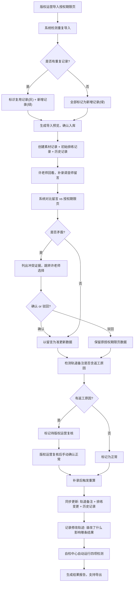

## 1. 产品概述

影视配乐素材入库系统，用于音乐制作团队管理影视配乐素材的授权入库流程。解决调音师留言补录滞后、授权期限口径矛盾、排练变更记录不同步、返工原因追溯困难等业务痛点。目标用户为音乐老师许老师、版权运营专员、调音师。

### 1.1 业务目标
- 确保授权期限页导入时自动识别重复记录，区分复用与新增
- 调音师留言与授权期限页冲突时自动举证，由音乐老师确认而非系统自动处理
- 轨道备注含返工原因时留待版权运营复核，不直接归为正常
- 排练变更记录、历史记录、轨道备注三者联动更新，保持数据一致性
- 完整记录所有修改轨迹，可追溯谁改了什么、影响了哪条结果
- 自检覆盖重复导入、返工原因、补录重算、导出一致四个高风险点

## 2. 核心功能

### 2.1 用户角色

| 角色 | 说明 | 核心权限 |
|------|------|----------|
| 音乐老师（许老师） | 业务负责人，最终审核人 | 查看冲突证据、确认/驳回矛盾、审核结果 |
| 版权运营 | 素材入库经办人 | 导入授权期限页、补录调音师留言、复核返工原因、导出报告 |
| 调音师 | 原始数据提供者 | 提供留言备注（通过运营补录） |
| 系统 | 自动处理逻辑 | 重复检测、冲突识别、自检、数据联动 |

### 2.2 功能模块

1. **授权期限页导入页**：Excel/CSV导入、重复检测、复用/新增标识、预览确认
2. **调音师留言补录页**：留言录入、关联素材、冲突检测、冲突证据展示
3. **素材列表页**：素材概览、轨道备注、返工原因标记、状态流转
4. **排练变更记录页**：变更日志、历史版本对比、关联备注同步
5. **自检中心页**：四项自检（重复导入、返工原因、补录重算、导出一致）、问题清单
6. **结果报告页**：入库汇总、变更轨迹、导出PDF/Excel

### 2.3 页面详情

| 页面名称 | 模块名称 | 功能描述 |
|----------|----------|----------|
| 授权期限页导入页 | 文件上传 | 支持拖拽上传Excel/CSV，解析授权期限数据 |
| 授权期限页导入页 | 重复检测 | 对比数据库，标识复用记录（灰色）、新增记录（绿色）、疑似冲突（橙色） |
| 授权期限页导入页 | 导入预览 | 展示导入前后对比，支持确认或取消 |
| 调音师留言补录页 | 留言录入 | 按素材关联录入调音师留言内容和时间 |
| 调音师留言补录页 | 冲突检测 | 自动对比留言与授权期限页，不一致时列出冲突证据 |
| 调音师留言补录页 | 冲突处理 | 跳转许老师确认/驳回流程，不自动处理 |
| 素材列表页 | 轨道备注 | 展示轨道名称、版本、备注，含返工原因时高亮 |
| 素材列表页 | 返工复核 | 备注含返工原因时标记待复核，由版权运营手动确认 |
| 素材列表页 | 补录重算 | 补录后自动触发重算，更新关联数据 |
| 排练变更记录页 | 变更日志 | 按时间线展示所有变更，含操作人、字段、前后值 |
| 排练变更记录页 | 历史对比 | 支持任意两版本对比，高亮差异 |
| 排练变更记录页 | 联动同步 | 备注更新时自动同步到变更记录和历史记录 |
| 自检中心页 | 重复导入检测 | 检查同一批授权期限页多次导入的一致性 |
| 自检中心页 | 返工原因检测 | 扫描所有轨道备注，列出含返工原因的待复核项 |
| 自检中心页 | 补录重算检测 | 验证补录后所有关联数据是否正确重算 |
| 自检中心页 | 导出一致性检测 | 校验导出数据与系统数据是否一致 |
| 结果报告页 | 入库汇总 | 统计新增、复用、冲突、返工数量 |
| 结果报告页 | 变更轨迹 | 展示完整操作链，谁改了什么、影响了哪条结果 |
| 结果报告页 | 导出功能 | 导出PDF报告和Excel明细 |

## 3. 核心流程

### 3.1 主流程描述

**三步核心流程**：
1. 版权运营导入授权期限页（第一次），系统检测重复，区分复用/新增，生成入库记录
2. 音乐老师许老师回看时补录调音师留言，系统检测与授权期限页是否矛盾
3. 矛盾时列出冲突证据供许老师选择确认或驳回；不矛盾则更新排练变更记录和历史记录

**返工原因特殊处理**：
- 轨道备注中检测到"返工"、"重录"、"修改"等关键词时，自动标记为"待版权运营复核"
- 补录后触发重算，同步更新轨道备注、排练变更记录、历史记录三处数据
- 所有修改操作记录操作人、修改时间、修改字段、前后值、影响的结果ID

### 3.2 流程图

## 4. 用户界面设计

### 4.1 设计风格

**专业工作室风格**（音乐制作场景适配）：
- **主色调**：深邃黑（#121212）+ 录音棚红（#E63946）+ 专业金（#D4AF37）
- **辅助色**：复用灰（#6B7280）、新增绿（#10B981）、冲突橙（#F59E0B）、返工紫（#8B5CF6）
- **字体**：显示字体用"Playfair Display"（音乐艺术感），正文字体用"JetBrains Mono"（专业精准）
- **按钮风格**：方形带切角，微立体阴影，hover时有录音电平指示器动画
- **布局**：双栏主布局（左侧导航+右侧内容），内容区卡片式，数据密集区用精密表格
- **装饰元素**：音频波形分隔线、录音电平指示灯、黑胶唱片纹理背景、金色进度条

### 4.2 页面设计概述

| 页面名称 | 模块名称 | UI 元素 |
|----------|----------|---------|
| 授权期限页导入页 | 文件上传 | 拖拽区域含波形动画、上传按钮金色描边、文件列表带电平指示器 |
| 授权期限页导入页 | 重复检测结果 | 三色行（灰/绿/橙）、复用标记徽章、新增数量统计、冲突警示图标 |
| 调音师留言补录页 | 冲突证据 | 左右对比布局（授权页vs留言）、差异处红色高亮、证据编号列表 |
| 素材列表页 | 轨道备注 | 返工原因紫色标签、待复核闪烁指示灯、操作人时间戳小字 |
| 排练变更记录页 | 变更时间线 | 左侧金色时间轴、右侧变更卡片、前后值对比diff样式 |
| 自检中心页 | 四项自检 | 四个大卡片各带仪表盘、通过/失败状态灯、问题清单可展开 |
| 结果报告页 | 变更轨迹 | 完整链路图，节点可点击展开详情、箭头指示影响流向 |

### 4.3 响应式

- 桌面端优先（1280px+），双栏布局
- 平板端（768-1279px）：单栏折叠导航
- 移动端（<768px）：单列布局，表格转卡片列表
- 触摸优化：按钮最小44px，滑动切换标签

## 5. 数据校验规则

### 5.1 重复导入判定
- 匹配维度：素材名称 + ISRC编码 + 授权起始日期
- 三项完全一致判定为复用记录
- 两项一致判定为疑似冲突，需人工确认

### 5.2 返工原因识别关键词
- 返工、重录、修改、调整、补录、重混、重编、修正、改版、V2、V3

### 5.3 冲突检测维度
- 授权期限：起始日期、结束日期、授权地域
- 使用范围：影视剧名称、集数、使用时长
- 费用条款：保底金额、分成比例

### 5.4 修改轨迹记录字段
- 操作人、操作时间、修改字段、原值、新值、影响记录ID、变更原因
