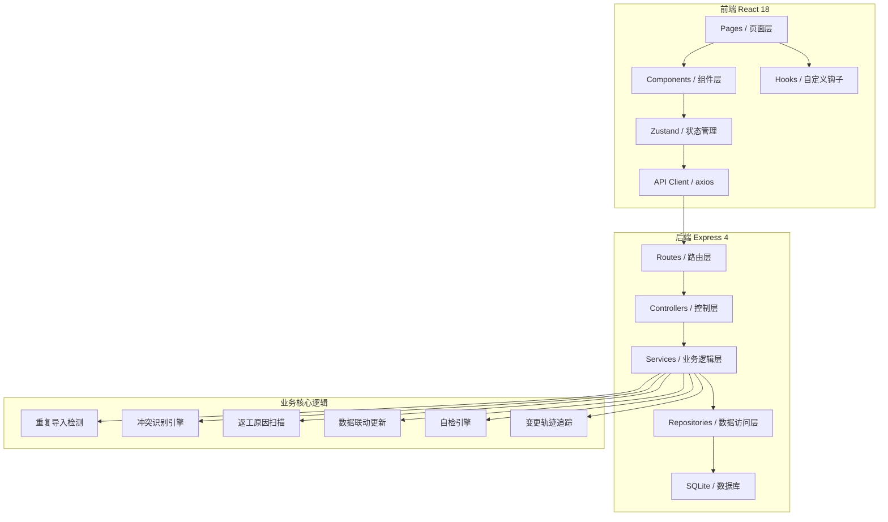
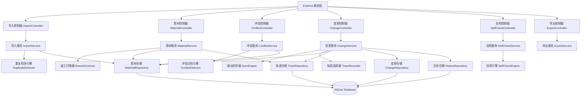
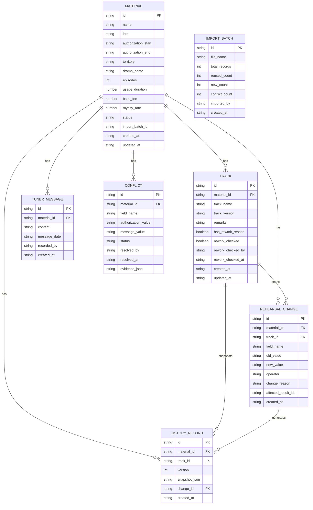

## 1. 架构设计



## 2. 技术描述

- **前端**：React 18 + TypeScript + Vite + React Router DOM + TailwindCSS 3 + Zustand + lucide-react
- **后端**：Express 4 + TypeScript + CORS
- **数据库**：SQLite 3 + better-sqlite3（文件型数据库，零配置，便于单机体验）
- **数据解析**：xlsx（Excel解析）、papaparse（CSV解析）
- **导出功能**：xlsx（Excel导出）、jspdf（PDF导出）
- **初始化工具**：vite-init react-express-ts 模板

## 3. 目录结构

```
/
├── src/                          # 前端代码
│   ├── pages/                    # 页面组件
│   │   ├── ImportPage.tsx       # 授权期限页导入
│   │   ├── MessageSupplement.tsx # 调音师留言补录
│   │   ├── MaterialList.tsx     # 素材列表
│   │   ├── RehearsalChanges.tsx # 排练变更记录
│   │   ├── SelfCheck.tsx        # 自检中心
│   │   └── Report.tsx           # 结果报告
│   ├── components/               # 可复用组件
│   │   ├── Layout.tsx           # 布局组件
│   │   ├── FileUpload.tsx       # 文件上传
│   │   ├── ConflictEvidence.tsx # 冲突证据展示
│   │   ├── TrackRemark.tsx      # 轨道备注
│   │   ├── ChangeTimeline.tsx   # 变更时间线
│   │   └── SelfCheckCard.tsx    # 自检卡片
│   ├── hooks/                    # 自定义hooks
│   │   ├── useImport.ts         # 导入逻辑
│   │   ├── useConflict.ts       # 冲突处理
│   │   └── useSelfCheck.ts      # 自检逻辑
│   ├── store/                    # Zustand状态
│   │   └── useStore.ts
│   ├── utils/                    # 工具函数
│   │   ├── detector.ts          # 重复/冲突/返工检测
│   │   ├── sync.ts              # 数据联动同步
│   │   ├── excel.ts             # Excel处理
│   │   └── trace.ts             # 变更轨迹
│   ├── types/                    # 类型定义
│   │   └── index.ts
│   ├── App.tsx
│   └── main.tsx
├── api/                          # 后端代码
│   ├── routes/                   # 路由
│   │   ├── materials.ts         # 素材CRUD
│   │   ├── import.ts            # 导入接口
│   │   ├── messages.ts          # 留言接口
│   │   ├── changes.ts           # 变更记录
│   │   ├── selfcheck.ts         # 自检接口
│   │   └── export.ts            # 导出接口
│   ├── controllers/              # 控制器
│   ├── services/                 # 业务逻辑
│   │   ├── ImportService.ts
│   │   ├── ConflictService.ts
│   │   ├── SyncService.ts
│   │   └── SelfCheckService.ts
│   ├── repositories/             # 数据访问
│   │   ├── MaterialRepository.ts
│   │   ├── TrackRepository.ts
│   │   ├── ChangeRepository.ts
│   │   └── HistoryRepository.ts
│   ├── db/                       # 数据库
│   │   ├── init.ts              # 初始化建表
│   │   ├── schema.sql           # DDL
│   │   └── seed.ts              # 示例数据
│   └── index.ts                 # 服务入口
├── shared/                       # 前后端共享类型
│   └── types.ts
├── migrations/                   # 数据库迁移
│   └── 001_initial_schema.sql
├── vite.config.ts
├── tailwind.config.js
├── tsconfig.json
└── package.json
```

## 4. 路由定义

| 前端路由 | 后端API路由 | 页面/接口用途 |
|----------|-------------|--------------|
| /import | POST /api/import/upload | 上传授权期限页文件 |
| /import | POST /api/import/preview | 预览导入结果（含重复检测） |
| /import | POST /api/import/confirm | 确认导入 |
| /messages | GET /api/materials/:id/messages | 获取素材留言列表 |
| /messages | POST /api/materials/:id/messages | 补录调音师留言 |
| /messages | POST /api/conflicts/:id/resolve | 处理冲突（确认/驳回） |
| /materials | GET /api/materials | 获取素材列表 |
| /materials | GET /api/materials/:id | 获取素材详情 |
| /materials | PUT /api/materials/:id/remarks | 更新轨道备注 |
| /materials | POST /api/materials/:id/recheck | 返工复核确认 |
| /materials | POST /api/materials/recalculate | 补录后重算 |
| /changes | GET /api/changes | 获取排练变更记录 |
| /changes | GET /api/history/:materialId | 获取历史版本 |
| /selfcheck | GET /api/selfcheck/duplicate | 重复导入自检 |
| /selfcheck | GET /api/selfcheck/rework | 返工原因自检 |
| /selfcheck | GET /api/selfcheck/recalculate | 补录重算自检 |
| /selfcheck | GET /api/selfcheck/export | 导出一致性自检 |
| /selfcheck | GET /api/selfcheck/run-all | 运行全部四项自检 |
| /report | GET /api/report/summary | 获取报告汇总 |
| /report | GET /api/report/trace/:materialId | 获取变更轨迹 |
| /report | GET /api/export/excel | 导出Excel |
| /report | GET /api/export/pdf | 导出PDF |

## 5. API 类型定义

```typescript
// shared/types.ts

export interface Material {
  id: string;
  name: string;
  isrc: string;
  authorizationStart: string;
  authorizationEnd: string;
  territory: string;
  dramaName: string;
  episodes: number;
  usageDuration: number;
  baseFee: number;
  royaltyRate: number;
  status: 'pending' | 'normal' | 'conflict' | 'rework_pending' | 'completed';
  importBatchId: string;
  createdAt: string;
  updatedAt: string;
}

export interface Track {
  id: string;
  materialId: string;
  trackName: string;
  trackVersion: string;
  remarks: string;
  hasReworkReason: boolean;
  reworkChecked: boolean;
  reworkCheckedBy: string;
  reworkCheckedAt: string;
  createdAt: string;
  updatedAt: string;
}

export interface TunerMessage {
  id: string;
  materialId: string;
  content: string;
  messageDate: string;
  recordedBy: string;
  createdAt: string;
}

export interface Conflict {
  id: string;
  materialId: string;
  fieldName: string;
  authorizationValue: string;
  messageValue: string;
  status: 'pending' | 'confirmed' | 'rejected';
  resolvedBy: string;
  resolvedAt: string;
  evidence: string[];
}

export interface RehearsalChange {
  id: string;
  materialId: string;
  trackId: string;
  fieldName: string;
  oldValue: string;
  newValue: string;
  operator: string;
  changeReason: string;
  affectedResultIds: string[];
  createdAt: string;
}

export interface HistoryRecord {
  id: string;
  materialId: string;
  trackId: string;
  version: number;
  snapshot: JSON;
  changeId: string;
  createdAt: string;
}

export interface ImportPreviewResult {
  reused: Material[];
  newItems: Material[];
  conflicts: Material[];
  importBatchId: string;
}

export interface SelfCheckResult {
  type: 'duplicate' | 'rework' | 'recalculate' | 'export';
  passed: boolean;
  issues: SelfCheckIssue[];
  checkedAt: string;
}

export interface SelfCheckIssue {
  id: string;
  severity: 'error' | 'warning';
  description: string;
  materialId: string;
  location: string;
}

export interface ReportSummary {
  totalMaterials: number;
  newCount: number;
  reusedCount: number;
  conflictCount: number;
  reworkPendingCount: number;
  completedCount: number;
  changesCount: number;
  selfCheckPassed: boolean;
}

export interface ChangeTraceNode {
  id: string;
  operator: string;
  action: string;
  fieldName: string;
  oldValue: string;
  newValue: string;
  timestamp: string;
  affectedIds: string[];
}
```

## 6. 服务器架构



## 7. 数据模型

### 7.1 ER 图



### 7.2 DDL 语句

```sql
-- migrations/001_initial_schema.sql

CREATE TABLE IF NOT EXISTS import_batch (
  id TEXT PRIMARY KEY,
  file_name TEXT NOT NULL,
  total_records INTEGER NOT NULL DEFAULT 0,
  reused_count INTEGER NOT NULL DEFAULT 0,
  new_count INTEGER NOT NULL DEFAULT 0,
  conflict_count INTEGER NOT NULL DEFAULT 0,
  imported_by TEXT NOT NULL,
  created_at TEXT NOT NULL DEFAULT CURRENT_TIMESTAMP
);

CREATE TABLE IF NOT EXISTS material (
  id TEXT PRIMARY KEY,
  name TEXT NOT NULL,
  isrc TEXT NOT NULL,
  authorization_start TEXT NOT NULL,
  authorization_end TEXT NOT NULL,
  territory TEXT NOT NULL,
  drama_name TEXT NOT NULL,
  episodes INTEGER NOT NULL,
  usage_duration REAL NOT NULL,
  base_fee REAL NOT NULL,
  royalty_rate REAL NOT NULL,
  status TEXT NOT NULL DEFAULT 'pending',
  import_batch_id TEXT NOT NULL REFERENCES import_batch(id),
  created_at TEXT NOT NULL DEFAULT CURRENT_TIMESTAMP,
  updated_at TEXT NOT NULL DEFAULT CURRENT_TIMESTAMP
);

CREATE INDEX IF NOT EXISTS idx_material_isrc ON material(isrc);
CREATE INDEX IF NOT EXISTS idx_material_name_isrc_date ON material(name, isrc, authorization_start);
CREATE INDEX IF NOT EXISTS idx_material_status ON material(status);

CREATE TABLE IF NOT EXISTS track (
  id TEXT PRIMARY KEY,
  material_id TEXT NOT NULL REFERENCES material(id),
  track_name TEXT NOT NULL,
  track_version TEXT NOT NULL DEFAULT 'V1',
  remarks TEXT,
  has_rework_reason INTEGER NOT NULL DEFAULT 0,
  rework_checked INTEGER NOT NULL DEFAULT 0,
  rework_checked_by TEXT,
  rework_checked_at TEXT,
  created_at TEXT NOT NULL DEFAULT CURRENT_TIMESTAMP,
  updated_at TEXT NOT NULL DEFAULT CURRENT_TIMESTAMP
);

CREATE INDEX IF NOT EXISTS idx_track_material_id ON track(material_id);
CREATE INDEX IF NOT EXISTS idx_track_rework ON track(has_rework_reason, rework_checked);

CREATE TABLE IF NOT EXISTS tuner_message (
  id TEXT PRIMARY KEY,
  material_id TEXT NOT NULL REFERENCES material(id),
  content TEXT NOT NULL,
  message_date TEXT NOT NULL,
  recorded_by TEXT NOT NULL,
  created_at TEXT NOT NULL DEFAULT CURRENT_TIMESTAMP
);

CREATE INDEX IF NOT EXISTS idx_tuner_message_material_id ON tuner_message(material_id);

CREATE TABLE IF NOT EXISTS conflict (
  id TEXT PRIMARY KEY,
  material_id TEXT NOT NULL REFERENCES material(id),
  field_name TEXT NOT NULL,
  authorization_value TEXT NOT NULL,
  message_value TEXT NOT NULL,
  status TEXT NOT NULL DEFAULT 'pending',
  resolved_by TEXT,
  resolved_at TEXT,
  evidence_json TEXT NOT NULL,
  created_at TEXT NOT NULL DEFAULT CURRENT_TIMESTAMP
);

CREATE INDEX IF NOT EXISTS idx_conflict_material_id ON conflict(material_id);
CREATE INDEX IF NOT EXISTS idx_conflict_status ON conflict(status);

CREATE TABLE IF NOT EXISTS rehearsal_change (
  id TEXT PRIMARY KEY,
  material_id TEXT NOT NULL REFERENCES material(id),
  track_id TEXT REFERENCES track(id),
  field_name TEXT NOT NULL,
  old_value TEXT NOT NULL,
  new_value TEXT NOT NULL,
  operator TEXT NOT NULL,
  change_reason TEXT NOT NULL,
  affected_result_ids TEXT NOT NULL,
  created_at TEXT NOT NULL DEFAULT CURRENT_TIMESTAMP
);

CREATE INDEX IF NOT EXISTS idx_change_material_id ON rehearsal_change(material_id);
CREATE INDEX IF NOT EXISTS idx_change_track_id ON rehearsal_change(track_id);

CREATE TABLE IF NOT EXISTS history_record (
  id TEXT PRIMARY KEY,
  material_id TEXT NOT NULL REFERENCES material(id),
  track_id TEXT REFERENCES track(id),
  version INTEGER NOT NULL,
  snapshot_json TEXT NOT NULL,
  change_id TEXT NOT NULL REFERENCES rehearsal_change(id),
  created_at TEXT NOT NULL DEFAULT CURRENT_TIMESTAMP
);

CREATE INDEX IF NOT EXISTS idx_history_material_id ON history_record(material_id);
CREATE INDEX IF NOT EXISTS idx_history_version ON history_record(material_id, version);
```

### 7.3 示例数据初始化

```typescript
// api/db/seed.ts

// 第一批：正常材料（3条）
// 第二批：错口径材料（2条，含与第一批冲突的数据）
// 第三批：补录材料（2条，含返工原因备注）
// 调音师留言若干条（部分与授权期限页矛盾）
```
