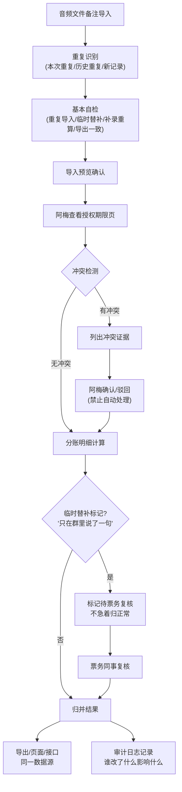

## 1. 产品概述

音乐治疗课反馈归并系统，用于处理巡演音频文件备注的导入、校验、冲突处理与分账明细归并。解决人工核对效率低、数据不一致、临时替补记录遗漏等问题，服务巡演统筹、票务、财务等角色的复核与审计需求。

## 2. 核心功能

### 2.1 用户角色

| 角色 | 注册方式 | 核心权限 |
|------|----------|----------|
| 巡演统筹（阿梅） | 系统内置 | 导入音频备注、查看授权期限、处理冲突、补录信息 |
| 票务同事 | 系统内置 | 复核临时替补记录、确认异常数据 |
| 财务同事 | 系统内置 | 查看分账明细、导出报表 |
| 系统管理员 | 系统内置 | 查看审计日志、管理用户 |

### 2.2 功能模块

1. **导入页**：音频文件备注批量导入、重复识别（本次重复/历史重复/新记录）、导入预览
2. **冲突处理页**：音频备注与授权期限冲突列表、证据展示、确认/驳回操作
3. **结果展示页**：归并后明细、临时替补标识、分账计算结果
4. **审计追踪页**：操作历史、变更对比、影响范围追溯
5. **自检报告页**：重复导入检测、临时替补检测、补录重算检测、导出一致性检测
6. **补录页**：人工补录缺失信息、误差说明、备注编辑

### 2.3 页面详情

| 页面名称 | 模块名称 | 功能描述 |
|----------|----------|-------------|
| 导入页 | 文件上传 | 支持拖拽上传 CSV/Excel，解析音频备注记录 |
| 导入页 | 重复识别 | 自动标记本次重复、历史重复、新记录，按类别分组展示 |
| 导入页 | 导入预览 | 展示待导入记录统计、异常预警、确认导入 |
| 冲突处理页 | 冲突列表 | 列出音频备注与授权期限不一致的记录 |
| 冲突处理页 | 证据展示 | 并排展示矛盾双方字段值、来源、时间戳 |
| 冲突处理页 | 确认/驳回 | 二选一操作，需填写理由，不提供自动处理 |
| 结果展示页 | 明细列表 | 展示归并后所有记录，含临时替补标识 |
| 结果展示页 | 分账明细 | 展示每条记录的分账计算结果 |
| 结果展示页 | 数据导出 | 导出 CSV/Excel，与页面、接口读取同一数据源 |
| 审计追踪页 | 操作日志 | 谁在何时改了什么字段、原值新值、修改理由 |
| 审计追踪页 | 影响追溯 | 展示修改影响的下游结果记录 |
| 自检报告页 | 四项检测 | 重复导入、临时替补、补录重算、导出一致性 |
| 自检报告页 | 检测详情 | 每项检测的通过/失败记录、异常说明 |
| 补录页 | 信息补录 | 编辑缺失字段、误差说明、备注 |
| 补录页 | 联动更新 | 保存后同步更新明细、历史、后续结果 |

## 3. 核心流程

### 三步主流程
1. 音频文件备注第一次导入 → 系统自动重复识别与自检 → 生成导入预览
2. 巡演统筹阿梅补看授权期限页 → 系统自动检测冲突 → 列出矛盾证据供人工确认/驳回
3. 分账明细更新 → 临时替补记录标记待票务复核 → 生成最终归并结果

## 4. 用户界面设计

### 4.1 设计风格
- **主色调**：深靛蓝 #1e3a8a（专业、可信），搭配琥珀色 #f59e0b（警告、待处理），玫红 #ec4899（冲突、异常）
- **按钮风格**：圆角 6px，悬浮阴影，确认按钮深靛蓝，驳回按钮浅灰，冲突按钮玫红
- **字体**：标题用 "Noto Serif SC"（衬线，稳重），正文用 "Noto Sans SC"（无衬线，清晰）
- **布局**：左侧导航 + 右侧内容区，卡片式分组，表格固定表头可滚动
- **图标**：使用 lucide-react，冲突用 alert-triangle，临时替补用 user-plus，审计用 history

### 4.2 页面设计概述

| 页面名称 | 模块名称 | UI Elements |
|----------|----------|-------------|
| 导入页 | 上传区 | 虚线边框拖拽区，渐变色背景，hover 放大动画 |
| 导入页 | 识别结果 | 三色标签卡片组：绿色=新记录，橙色=历史重复，灰色=本次重复 |
| 冲突处理页 | 冲突卡片 | 左右对比布局，红色边框强调，时间线式证据链 |
| 结果展示页 | 数据表格 | 斑马纹行，临时替补行用琥珀色左边框标记 |
| 审计追踪页 | 变更记录 | 时间轴布局，字段变更 diff 高亮显示 |
| 自检报告页 | 检测卡片 | 四象限布局，每项检测带进度圈和通过/失败状态 |

### 4.3 响应性
- 桌面端（≥1280px）：完整布局，表格多列展示
- 平板（768-1279px）：导航折叠，表格减少列
- 移动端（<768px）：卡片化列表，横向滚动表格

### 4.4 关键业务约束
- 冲突处理必须人工二选一，禁止提供"自动处理"或"全部确认"按钮
- 临时替补记录（含"只在群里说了一句"标识）不得自动归为正常，必须经过票务复核
- 所有修改操作必须记录审计日志，包含修改人、时间、字段变更、理由、影响范围
- 导出明细、页面展示、API 返回必须读取同一数据源，确保三处数据完全一致
- 导入必须区分本次重复、历史重复、新记录，不得仅显示总数
