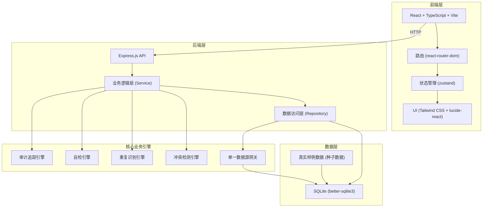
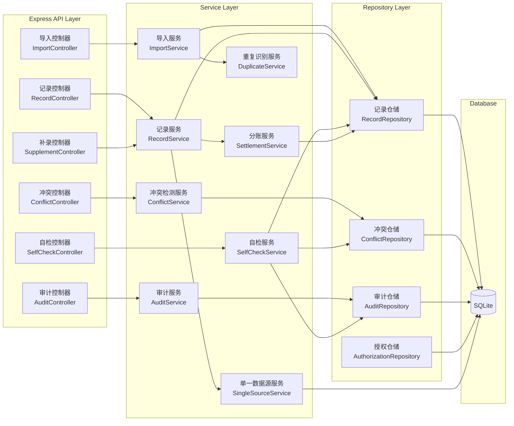
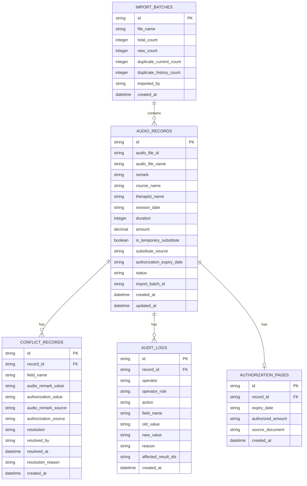

## 1. 架构设计



## 2. 技术描述

- **前端**：React 18 + TypeScript + Vite + Tailwind CSS 3 + react-router-dom + zustand + lucide-react + papaparse (CSV解析)
- **初始化工具**：vite-init (react-express-ts 模板)
- **后端**：Express 4 + TypeScript + better-sqlite3
- **数据库**：SQLite (文件型，无需额外安装，便于演示)
- **包管理器**：npm (macOS 环境)

## 3. 路由定义

| 路由 (前端) | 页面 | 用途 |
|-------------|------|------|
| / | 导入页 | 音频文件备注导入、重复识别、预览 |
| /conflicts | 冲突处理页 | 音频备注与授权期限冲突处理 |
| /results | 结果展示页 | 归并明细、分账结果、导出 |
| /audit | 审计追踪页 | 操作历史、变更对比、影响追溯 |
| /self-check | 自检报告页 | 四项核心自检 |
| /supplement/:id | 补录页 | 单条记录信息补录 |

| 路由 (后端 API) | 方法 | 用途 |
|-----------------|------|------|
| /api/import | POST | 导入音频备注，返回重复识别结果 |
| /api/import/confirm | POST | 确认导入，写入数据库 |
| /api/conflicts | GET | 获取冲突列表 |
| /api/conflicts/:id/resolve | POST | 确认或驳回冲突 |
| /api/records | GET | 获取归并后明细列表（单一数据源） |
| /api/records/:id | GET | 获取单条记录详情 |
| /api/records/:id | PUT | 更新记录（补录），触发联动更新 |
| /api/records/export | GET | 导出 CSV（读取同一数据源） |
| /api/audit | GET | 获取审计日志 |
| /api/self-check | GET | 执行四项自检，返回报告 |
| /api/temp-substitute/review | POST | 票务复核临时替补记录 |
| /api/authorization | GET | 获取授权期限页数据 |

## 4. API 定义

### 核心类型定义

```typescript
// 共享类型定义 (shared/types.ts)

export type RecordStatus = 'new' | 'duplicate_current' | 'duplicate_history' | 'pending_review' | 'normal' | 'conflict';
export type ConflictResolution = 'confirm' | 'reject' | null;
export type SubstituteSource = 'audio_remark' | 'group_message' | 'formal';

// 音频文件备注记录
export interface AudioRecord {
  id: string;
  audioFileId: string;
  audioFileName: string;
  remark: string;
  courseName: string;
  therapistName: string;
  sessionDate: string;
  duration: number;
  amount: number;
  isTemporarySubstitute: boolean;
  substituteSource: SubstituteSource;
  authorizationExpiryDate: string;
  status: RecordStatus;
  createdAt: string;
  updatedAt: string;
  importBatchId: string;
}

// 冲突记录
export interface ConflictRecord {
  id: string;
  recordId: string;
  fieldName: string;
  audioRemarkValue: string;
  authorizationValue: string;
  audioRemarkSource: string;
  authorizationSource: string;
  resolution: ConflictResolution;
  resolvedBy: string | null;
  resolvedAt: string | null;
  resolutionReason: string | null;
  createdAt: string;
}

// 审计日志
export interface AuditLog {
  id: string;
  recordId: string;
  operator: string;
  operatorRole: string;
  action: string;
  fieldName: string | null;
  oldValue: string | null;
  newValue: string | null;
  reason: string;
  affectedResultIds: string[];
  createdAt: string;
}

// 自检报告
export interface SelfCheckReport {
  checkDuplicateImport: {
    passed: boolean;
    details: { batchId: string; duplicateCount: number; message: string }[];
  };
  checkTemporarySubstitute: {
    passed: boolean;
    details: { recordId: string; status: string; message: string }[];
  };
  checkRecalculationAfterSupplement: {
    passed: boolean;
    details: { recordId: string; recalculated: boolean; message: string }[];
  };
  checkExportConsistency: {
    passed: boolean;
    details: { exportHash: string; pageHash: string; apiHash: string; consistent: boolean }[];
  };
  overallPassed: boolean;
  checkedAt: string;
}

// 导入预览结果
export interface ImportPreviewResult {
  newRecords: AudioRecord[];
  duplicateCurrent: AudioRecord[];
  duplicateHistory: AudioRecord[];
  temporarySubstituteCount: number;
  potentialConflicts: number;
  importBatchId: string;
}
```

## 5. 服务器架构图



## 6. 数据模型

### 6.1 数据模型定义



### 6.2 数据定义语言 (DDL)

```sql
-- 导入批次表
CREATE TABLE import_batches (
  id TEXT PRIMARY KEY,
  file_name TEXT NOT NULL,
  total_count INTEGER NOT NULL DEFAULT 0,
  new_count INTEGER NOT NULL DEFAULT 0,
  duplicate_current_count INTEGER NOT NULL DEFAULT 0,
  duplicate_history_count INTEGER NOT NULL DEFAULT 0,
  imported_by TEXT NOT NULL,
  created_at DATETIME DEFAULT CURRENT_TIMESTAMP
);

-- 音频记录表（单一数据源核心表）
CREATE TABLE audio_records (
  id TEXT PRIMARY KEY,
  audio_file_id TEXT NOT NULL,
  audio_file_name TEXT NOT NULL,
  remark TEXT,
  course_name TEXT NOT NULL,
  therapist_name TEXT NOT NULL,
  session_date TEXT NOT NULL,
  duration INTEGER NOT NULL,
  amount DECIMAL(10,2) NOT NULL,
  is_temporary_substitute BOOLEAN NOT NULL DEFAULT 0,
  substitute_source TEXT NOT NULL DEFAULT 'audio_remark',
  authorization_expiry_date TEXT,
  status TEXT NOT NULL DEFAULT 'new',
  import_batch_id TEXT NOT NULL,
  created_at DATETIME DEFAULT CURRENT_TIMESTAMP,
  updated_at DATETIME DEFAULT CURRENT_TIMESTAMP,
  FOREIGN KEY (import_batch_id) REFERENCES import_batches(id)
);

CREATE INDEX idx_audio_records_file_id ON audio_records(audio_file_id);
CREATE INDEX idx_audio_records_status ON audio_records(status);
CREATE INDEX idx_audio_records_substitute ON audio_records(is_temporary_substitute);
CREATE INDEX idx_audio_records_batch ON audio_records(import_batch_id);

-- 授权期限页表
CREATE TABLE authorization_pages (
  id TEXT PRIMARY KEY,
  record_id TEXT NOT NULL,
  expiry_date TEXT NOT NULL,
  authorized_amount DECIMAL(10,2) NOT NULL,
  source_document TEXT NOT NULL,
  created_at DATETIME DEFAULT CURRENT_TIMESTAMP,
  FOREIGN KEY (record_id) REFERENCES audio_records(id)
);

-- 冲突记录表
CREATE TABLE conflict_records (
  id TEXT PRIMARY KEY,
  record_id TEXT NOT NULL,
  field_name TEXT NOT NULL,
  audio_remark_value TEXT NOT NULL,
  authorization_value TEXT NOT NULL,
  audio_remark_source TEXT NOT NULL,
  authorization_source TEXT NOT NULL,
  resolution TEXT,
  resolved_by TEXT,
  resolved_at DATETIME,
  resolution_reason TEXT,
  created_at DATETIME DEFAULT CURRENT_TIMESTAMP,
  FOREIGN KEY (record_id) REFERENCES audio_records(id)
);

CREATE INDEX idx_conflicts_record ON conflict_records(record_id);
CREATE INDEX idx_conflicts_unresolved ON conflict_records(resolution) WHERE resolution IS NULL;

-- 审计日志表
CREATE TABLE audit_logs (
  id TEXT PRIMARY KEY,
  record_id TEXT NOT NULL,
  operator TEXT NOT NULL,
  operator_role TEXT NOT NULL,
  action TEXT NOT NULL,
  field_name TEXT,
  old_value TEXT,
  new_value TEXT,
  reason TEXT NOT NULL,
  affected_result_ids TEXT NOT NULL DEFAULT '[]',
  created_at DATETIME DEFAULT CURRENT_TIMESTAMP,
  FOREIGN KEY (record_id) REFERENCES audio_records(id)
);

CREATE INDEX idx_audit_record ON audit_logs(record_id);
CREATE INDEX idx_audit_operator ON audit_logs(operator);
CREATE INDEX idx_audit_created ON audit_logs(created_at);
```

### 6.3 种子数据（真实样例）

```sql
-- 初始导入批次
INSERT INTO import_batches (id, file_name, total_count, new_count, duplicate_current_count, duplicate_history_count, imported_by)
VALUES 
('batch_001', 'audio_remarks_2026_06_01.csv', 8, 5, 2, 1, '阿梅');

-- 音频记录样例（包含各种场景）
INSERT INTO audio_records (id, audio_file_id, audio_file_name, remark, course_name, therapist_name, session_date, duration, amount, is_temporary_substitute, substitute_source, authorization_expiry_date, status, import_batch_id)
VALUES
-- 正常新记录
('rec_001', 'AUD001', '20260601_上午场_音乐放松.wav', '患者反馈良好，节奏稳定', '音乐放松治疗', '李医生', '2026-06-01', 60, 300.00, 0, 'audio_remark', '2026-12-31', 'normal', 'batch_001'),

-- 临时替补 - 只在群里说了一句（关键测试场景）
('rec_002', 'AUD002', '20260601_下午场_认知训练.wav', '临时替补王医生，只在群里说了一句', '认知训练治疗', '王医生(替补)', '2026-06-01', 45, 225.00, 1, 'group_message', '2026-12-31', 'pending_review', 'batch_001'),

-- 冲突记录 - 授权期限不一致
('rec_003', 'AUD003', '20260601_上午场_情绪疏导.wav', '授权到2026-06-30', '情绪疏导治疗', '张医生', '2026-06-01', 60, 300.00, 0, 'audio_remark', '2026-06-30', 'conflict', 'batch_001'),

-- 历史重复记录
('rec_004', 'AUD001', '20260601_上午场_音乐放松.wav', '历史导入重复', '音乐放松治疗', '李医生', '2026-06-01', 60, 300.00, 0, 'audio_remark', '2026-12-31', 'duplicate_history', 'batch_001'),

-- 本次重复记录
('rec_005', 'AUD004', '20260601_下午场_团体治疗.wav', '本次导入重复', '团体音乐治疗', '赵医生', '2026-06-01', 90, 450.00, 0, 'audio_remark', '2026-12-31', 'duplicate_current', 'batch_001'),

-- 新记录
('rec_006', 'AUD005', '20260602_上午场_睡眠改善.wav', '患者入睡时间缩短', '睡眠改善治疗', '刘医生', '2026-06-02', 60, 300.00, 0, 'audio_remark', '2026-12-31', 'normal', 'batch_001'),

-- 另一个临时替补
('rec_007', 'AUD006', '20260602_下午场_焦虑缓解.wav', '临时替补陈医生，只在群里说了一句', '焦虑缓解治疗', '陈医生(替补)', '2026-06-02', 60, 300.00, 1, 'group_message', '2026-12-31', 'pending_review', 'batch_001'),

-- 正常记录
('rec_008', 'AUD007', '20260603_上午场_记忆训练.wav', '记忆提取训练效果明显', '记忆训练治疗', '孙医生', '2026-06-03', 45, 225.00, 0, 'audio_remark', '2026-12-31', 'normal', 'batch_001');

-- 授权期限页数据（用于冲突检测）
INSERT INTO authorization_pages (id, record_id, expiry_date, authorized_amount, source_document)
VALUES
('auth_001', 'rec_001', '2026-12-31', 300.00, '授权协议_2026.pdf'),
('auth_002', 'rec_002', '2026-12-31', 225.00, '授权协议_2026.pdf'),
-- 与音频备注冲突：音频说6月30日，授权页说12月31日
('auth_003', 'rec_003', '2026-12-31', 300.00, '授权协议_2026.pdf'),
('auth_004', 'rec_004', '2026-12-31', 300.00, '授权协议_2026.pdf'),
('auth_005', 'rec_005', '2026-12-31', 450.00, '授权协议_2026.pdf'),
('auth_006', 'rec_006', '2026-12-31', 300.00, '授权协议_2026.pdf'),
('auth_007', 'rec_007', '2026-12-31', 300.00, '授权协议_2026.pdf'),
('auth_008', 'rec_008', '2026-12-31', 225.00, '授权协议_2026.pdf');

-- 冲突记录（自动检测生成）
INSERT INTO conflict_records (id, record_id, field_name, audio_remark_value, authorization_value, audio_remark_source, authorization_source)
VALUES
('conf_001', 'rec_003', 'authorization_expiry_date', '2026-06-30', '2026-12-31', 'audio_remark:AUD003', 'authorization_pages:auth_003');

-- 历史审计日志样例
INSERT INTO audit_logs (id, record_id, operator, operator_role, action, field_name, old_value, new_value, reason, affected_result_ids)
VALUES
('audit_001', 'rec_003', '系统', 'system', '冲突检测', 'authorization_expiry_date', '2026-06-30', '2026-12-31', '音频备注与授权期限页不一致，待人工处理', '["result_003"]');
```
