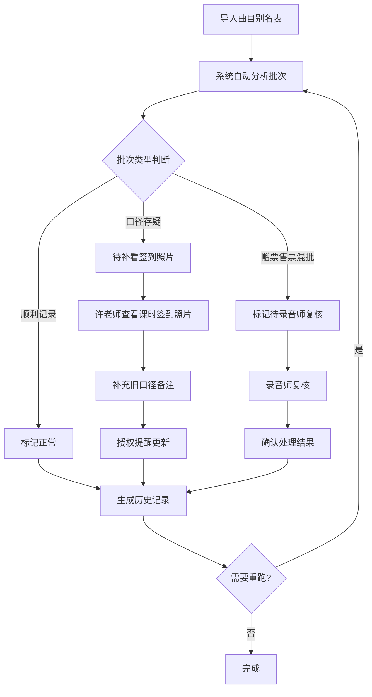

## 1. 产品概述

KTV曲库下架复核系统，解决音乐老师许老师从曲目别名表和课时签到照片中临时拼接数据的痛点，提供标准化的下架复核流程，包含演示数据用于新人培训。

- 目标用户：音乐老师（许老师）、录音师、新人培训
- 核心价值：将临时拼接的复核流程系统化，保留可追溯的历史记录和授权提醒

## 2. 核心特性

### 2.1 用户角色

| 角色 | 核心权限 |
|------|----------|
| 音乐老师（许老师） | 导入曲目别名表、查看课时签到照片、人工修正、触发重跑 |
| 录音师 | 复核赠票售票混批记录 |
| 新人 | 查看演示流程、学习三种场景处理 |

### 2.2 功能模块

1. **主面板**：批次列表、状态概览、快捷操作
2. **曲目别名导入**：文件上传、数据预览、首次导入
3. **签到照片查看**：照片列表、备注提取、旧口径补录
4. **复核处理**：记录详情、人工修正、授权提醒更新
5. **历史记录**：操作日志、重跑轨迹、口径变更追溯

### 2.3 页面详情

| 页面名称 | 模块名称 | 功能描述 |
|-----------|-------------|---------------------|
| 主面板 | 批次概览 | 展示所有复核批次，区分三种场景状态 |
| 主面板 | 快捷操作区 | 一键导入、重跑、查看历史入口 |
| 批次详情 | 曲目列表 | 展示该批次所有曲目及处理状态 |
| 批次详情 | 签到照片 | 关联的课时签到照片及备注信息 |
| 批次详情 | 人工修正 | 修正曲目口径、更新授权状态 |
| 历史记录 | 操作日志 | 记录每次操作、修改前后对比 |

## 3. 核心流程

标准复核流程：导入曲目别名表 → 系统自动处理 → 许老师补看课时签到照片 → 人工修正/补充旧口径 → 授权提醒更新 → 完成/重跑

## 4. 用户界面设计

### 4.1 设计风格

- 主色调：深邃酒红色 #8B0000（KTV主题）+ 暖金色 #D4AF37（授权标记）
- 辅助色：墨绿 #2E8B57（正常）、橙红 #FF6347（待复核）、深灰 #4A4A4A（旧口径）
- 按钮风格：微圆角、轻微悬浮阴影、点击反馈
- 字体：标题用 Playfair Display（优雅复古），正文用 Source Sans Pro（清晰易读）
- 布局：卡片式布局，左侧导航 + 右侧内容区
- 视觉细节：暗纹理背景、金色细边框、轻微毛玻璃效果

### 4.2 页面设计概览

| 页面名称 | 模块名称 | UI 元素 |
|-----------|-------------|----------|
| 主面板 | 批次概览卡片 | 三色状态标签、批次号、处理时间、场景标记 |
| 主面板 | 统计卡片 | 正常/待复核/补录 数量统计，数字动画 |
| 批次详情 | 曲目行 | 曲目名、别名、口径标签、操作按钮、状态色条 |
| 批次详情 | 照片区 | 缩略图网格、点击放大、备注高亮显示 |
| 历史记录 | 时间线 | 操作时间、操作人、变更前后对比 |

### 4.3 响应式

- Desktop-first 设计，主内容区最小宽度 1024px
- 平板端自适应折叠侧边栏
- 错误提示使用人类语言，不显示内部字段名

### 4.4 三种演示场景设计

**场景一：顺利记录**
- 曲目：《夜曲》
- 别名：《Yeq》
- 处理结果：正常通过，授权有效
- 状态色：绿色

**场景二：赠票售票混批**
- 曲目：《稻香》+《晴天》
- 备注：同一批次包含赠票和售票记录
- 处理结果：标记为"待录音师复核"，不自动归为正常
- 状态色：橙红色，带录音师图标

**场景三：旧口径补录**
- 曲目：《七里香》
- 初始：系统判断为下架
- 补录：从课时签到照片发现旧口径备注，人工修正为保留
- 状态色：深灰色带"补录"标记，历史记录显示变更轨迹
