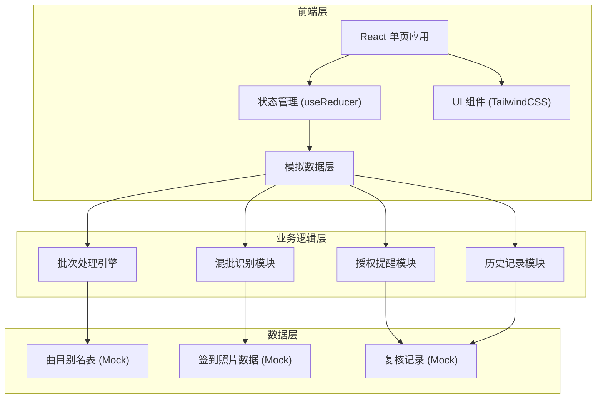
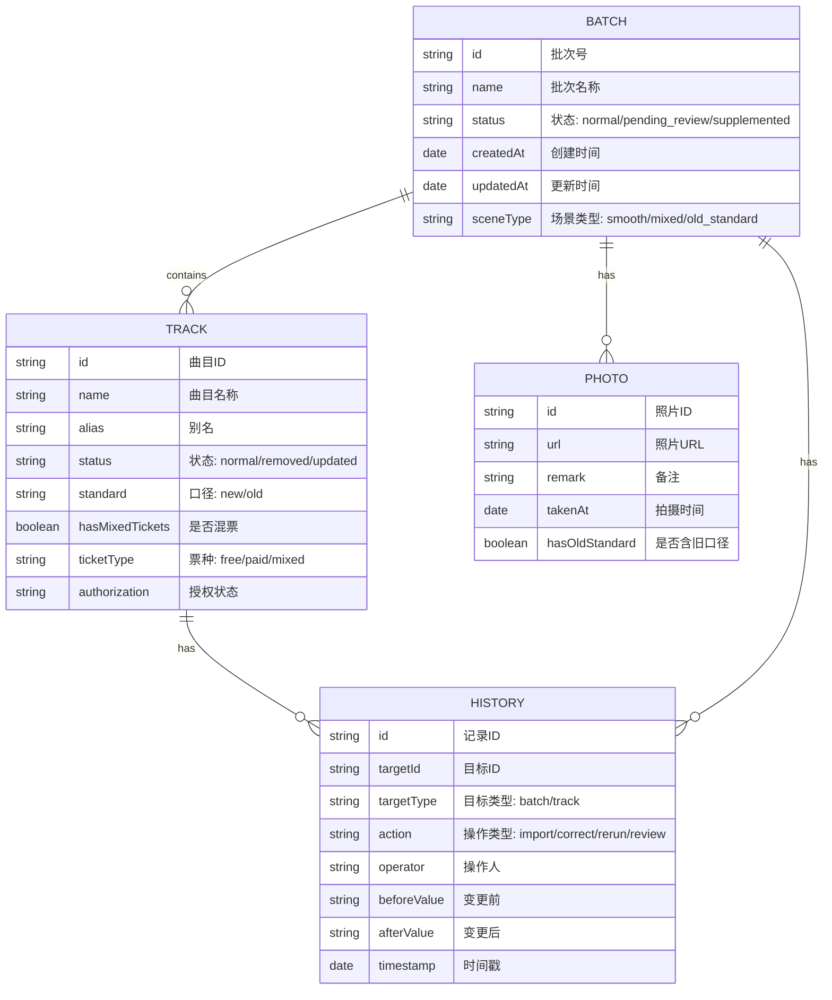

## 1. 架构设计



## 2. 技术描述

- 前端：React@18 + TypeScript + TailwindCSS@3 + Vite
- 初始化工具：npm create vite@latest
- 后端：无（纯前端应用，使用 Mock 数据）
- 状态管理：React useReducer + Context
- 图标：Lucide React
- 动画：CSS Transitions + Framer Motion（可选）

## 3. 路由定义

| 路由 | 页面名称 | 用途 |
|-------|---------|------|
| / | 主面板 | 批次列表、统计概览、快捷操作 |
| /batch/:id | 批次详情 | 曲目列表、签到照片、人工修正 |
| /history | 历史记录 | 操作日志、重跑轨迹、变更追溯 |

## 4. 数据模型

### 4.1 数据模型定义



### 4.2 核心类型定义

```typescript
// 曲目状态
type TrackStatus = 'normal' | 'removed' | 'updated' | 'pending_review';

// 批次状态
type BatchStatus = 'processing' | 'normal' | 'pending_review' | 'supplemented' | 'completed';

// 场景类型
type SceneType = 'smooth' | 'mixed_tickets' | 'old_standard';

interface Track {
  id: string;
  name: string;
  alias: string;
  status: TrackStatus;
  standard: 'new' | 'old';
  hasMixedTickets: boolean;
  ticketType: 'free' | 'paid' | 'mixed';
  authorization: 'valid' | 'expired' | 'pending';
  remark?: string;
}

interface Batch {
  id: string;
  name: string;
  status: BatchStatus;
  sceneType: SceneType;
  tracks: Track[];
  photos: Photo[];
  createdAt: string;
  updatedAt: string;
  operator?: string;
}

interface Photo {
  id: string;
  url: string;
  remark: string;
  takenAt: string;
  hasOldStandard: boolean;
}

interface HistoryRecord {
  id: string;
  targetId: string;
  targetType: 'batch' | 'track';
  action: 'import' | 'correct' | 'rerun' | 'review' | 'supplement';
  operator: string;
  beforeValue: string;
  afterValue: string;
  timestamp: string;
}
```

## 5. 核心业务逻辑

### 5.1 批次处理引擎
- 导入曲目别名表，自动解析曲目和别名
- 识别票种类型（赠票/售票/混票）
- 混批自动标记为"待录音师复核"，不自动归为正常

### 5.2 混批识别规则
- 同批次内同时存在赠票和售票记录 → 触发混批标记
- 混批记录状态锁定为"待录音师复核"
- 录音师确认后才能变更状态

### 5.3 旧口径补录流程
- 从课时签到照片备注中提取旧口径信息
- 人工修正后生成历史记录，保留变更轨迹
- 授权提醒同步更新

### 5.4 重跑机制
- 保留原始数据，创建新的处理版本
- 历史记录可追溯每次重跑的差异

## 6. 错误提示规范

| 场景 | 提示文案 |
|------|----------|
| 导入格式错误 | "这个文件格式不对哦，请上传包含曲目名称和别名的表格文件" |
| 混批无法自动通过 | "这批里有赠票也有售票，得麻烦录音师看过才行" |
| 授权过期 | "这首曲子的授权快到期了，记得提醒商务续一下" |
| 重跑确认 | "确定要重新跑一遍吗？之前的修改记录会保留下来" |
