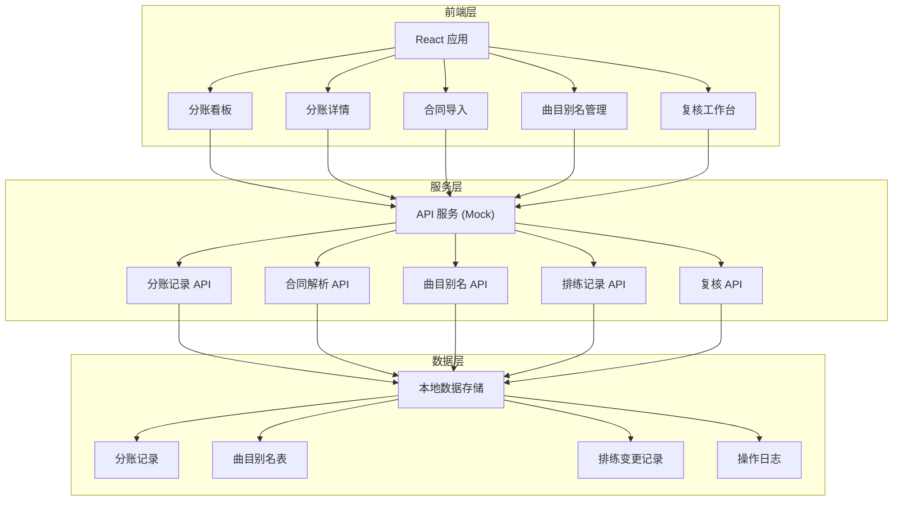
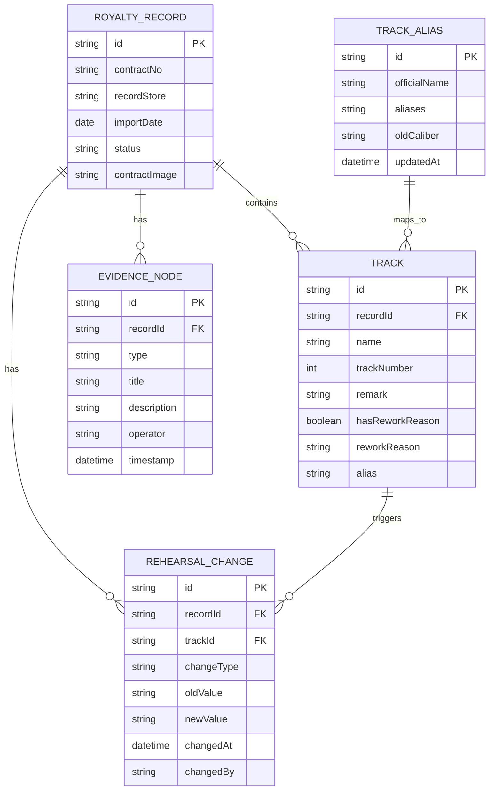

## 1. 架构设计



## 2. 技术描述

- **前端**：React@18 + TypeScript + TailwindCSS@3 + React Router@6
- **初始化工具**：Vite
- **后端**：无独立后端，使用 Mock API + localStorage 持久化
- **数据存储**：localStorage + 内置演示数据
- **UI 组件**：Lucide React 图标库
- **状态管理**：React Context + useReducer

## 3. 路由定义

| 路由 | 页面 | 用途 |
|------|------|------|
| / | 分账看板 | 展示所有分账记录概览 |
| /record/:id | 分账详情 | 查看单条分账记录的完整信息和证据链 |
| /import | 合同导入 | 上传合同截图并解析 |
| /aliases | 曲目别名管理 | 管理曲目别名映射表 |
| /review | 复核工作台 | 版权运营复核待处理记录 |

## 4. API 定义（Mock）

### 4.1 TypeScript 类型定义

```typescript
// 分账记录状态
type RecordStatus = 'pending' | 'normal' | 'review' | 'completed';

// 轨道信息
interface Track {
  id: string;
  name: string;
  trackNumber: number;
  remark: string;
  hasReworkReason: boolean;
  reworkReason?: string;
  alias?: string;
  oldAlias?: string;
}

// 排练变更记录
interface RehearsalChange {
  id: string;
  trackId: string;
  changeType: 'name' | 'alias' | 'other';
  oldValue: string;
  newValue: string;
  changedAt: string;
  changedBy: string;
}

// 证据链节点
interface EvidenceNode {
  id: string;
  type: 'import' | 'parse' | 'alias_update' | 'rehearsal_update' | 'review' | 'complete';
  title: string;
  description: string;
  operator: string;
  timestamp: string;
  metadata?: Record<string, any>;
}

// 分账记录
interface RoyaltyRecord {
  id: string;
  contractNo: string;
  recordStore: string;
  importDate: string;
  status: RecordStatus;
  contractImage: string;
  tracks: Track[];
  evidenceChain: EvidenceNode[];
  rehearsalChanges: RehearsalChange[];
  reviewNote?: string;
  reviewedBy?: string;
  reviewedAt?: string;
}

// 曲目别名
interface TrackAlias {
  id: string;
  officialName: string;
  aliases: string[];
  oldCaliber?: string;
  updatedAt: string;
}
```

### 4.2 API 接口

| 接口 | 方法 | 描述 |
|------|------|------|
| /api/records | GET | 获取分账记录列表 |
| /api/records/:id | GET | 获取单条分账记录详情 |
| /api/records | POST | 创建分账记录（导入合同） |
| /api/records/:id/tracks | PUT | 更新轨道信息（补录别名） |
| /api/records/:id/review | POST | 复核操作 |
| /api/aliases | GET | 获取曲目别名列表 |
| /api/aliases | POST | 新增/更新曲目别名 |
| /api/aliases/batch | POST | 批量导入曲目别名 |
| /api/rehearsal/:recordId | GET | 获取排练变更记录 |

## 5. 数据模型

### 5.1 ER 图



### 5.2 初始演示数据

系统内置3条演示分账记录：

1. **顺利记录**（状态：已完成）- 无返工原因，流程顺畅
2. **返工记录**（状态：待复核）- 轨道备注含返工原因，需版权运营复核
3. **旧口径记录**（状态：已完成）- 从曲目别名表补录旧口径，排练记录随之更新

同时内置曲目别名表，包含若干条别名映射关系，以及对应的排练变更历史。
