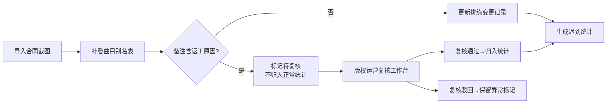
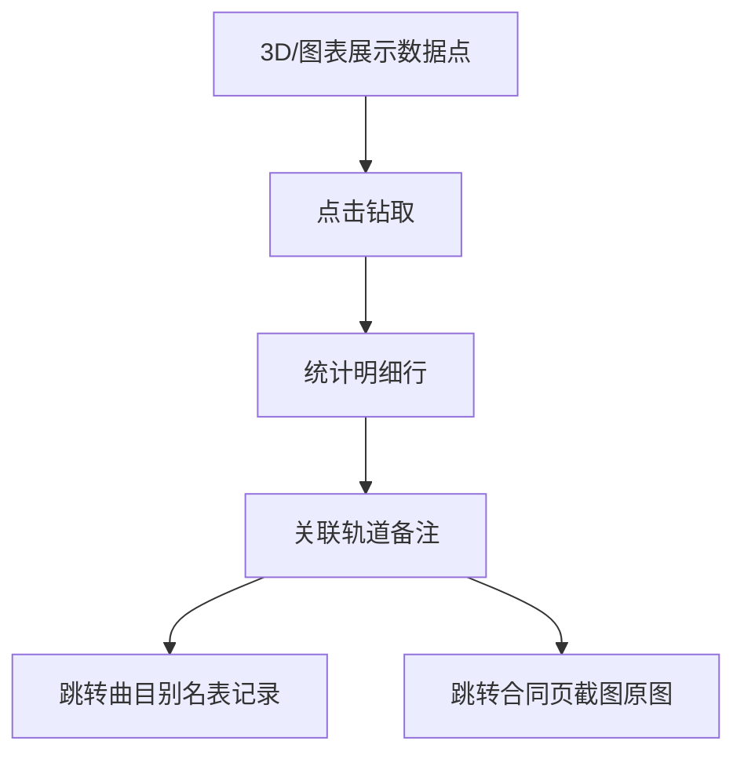

## 1. 产品概述

乐团排练迟到统计系统是面向琴行、乐团管理场景的业务追溯系统，核心目标是在统计迟到数据的同时，完整保留原始材料的可追溯性，避免"干净数据"背后的证据链断裂。系统服务于琴行店长（数据录入与备注）、版权运营（复核异常）、管理员（全局查看）三类角色。

## 2. 核心特性

### 2.1 用户角色

| 角色 | 注册方式 | 核心权限 |
|------|----------|----------|
| 琴行店长老周 | 系统预置账号 | 导入合同页截图、维护曲目别名表、更新排练变更记录、修改轨道备注 |
| 版权运营复核 | 系统预置账号 | 查看带返工原因的轨道、复核异常、标记处理状态 |
| 管理员 | 系统预置账号 | 全局查看、历史追溯、边界规则配置 |

### 2.2 功能模块

1. **合同页截图管理**：导入、去重、预览、追溯
2. **曲目别名表**：别名维护、备注保留、历史版本
3. **排练迟到统计**：统计列表、3D/图表展示、钻取溯源
4. **历史变更记录**：修改前后对比、操作人、时间戳
5. **异常复核工作台**：返工原因标记、版权运营处理流

### 2.3 页面详情

| 页面名称 | 模块名称 | 功能描述 |
|---------|----------|----------|
| 首页仪表盘 | 统计概览 | 迟到趋势图、异常待办数、快速入口 |
| 合同页截图 | 上传管理 | 拖拽上传、重复检测、缩略图预览、原始图查看 |
| 曲目别名表 | 别名维护 | 曲目名称、别名、备注字段（保留原始格式）、版本历史 |
| 排练迟到统计 | 统计列表 | 按排练场次、人员、曲目维度统计，点击可钻取 |
| 排练迟到统计 | 3D/图表展示 | 3D柱状图、趋势折线图，点击数据点回溯源材料 |
| 历史变更 | 变更对比 | 字段级修改前后对比、操作人、时间、回滚入口 |
| 异常复核 | 返工原因处理 | 带返工原因的轨道列表、复核意见、状态流转 |
| 边界规则 | 规则说明 | 代码级规则的可视化展示、README 联动 |

## 3. 核心流程

### 3.1 三步核心工作流

1. **合同页截图第一次导入**：店长上传合同截图，系统自动去重（基于文件哈希），不重复统计
2. **琴行店长老周补看曲目别名表**：店长对照截图补充/修正曲目别名和备注，备注保留原始换行和格式
3. **排练变更记录更新**：基于别名表更新迟到统计，轨道备注含"返工原因"关键词时自动标记为待复核，不归入正常统计

### 3.2 异常复核流程

### 3.3 数据追溯流程

## 4. 用户界面设计

### 4.1 设计风格

- **主色调**：深墨绿 #1a3a3a（专业、稳重），搭配暖铜色 #c49a6c 作为强调色
- **辅助色**：异常状态用砖红 #b4543c，复核通过用墨绿 #2d6a4f
- **按钮风格**：轻微立体投影、圆角 4px，悬停时上移 1px
- **字体**：标题用 Noto Serif SC（衬线，体现正式感），正文用 Noto Sans SC（易读）
- **布局风格**：左右分栏，左侧导航+内容区，卡片式模块，保留充足留白
- **图标风格**：线性图标，统一 24px 网格，颜色随语义

### 4.2 页面设计概览

| 页面名称 | 模块名称 | UI 元素 |
|---------|----------|---------|
| 首页仪表盘 | 统计概览 | 大数字卡片、趋势迷你图、待办列表入口、渐变色背景 |
| 合同页截图 | 上传管理 | 拖拽区、文件列表卡片、缩略图网格、查看模态框 |
| 曲目别名表 | 别名维护 | 表格布局、备注多行文本框、历史版本折叠面板 |
| 排练迟到统计 | 统计列表 | 可筛选表格、行点击展开、溯源按钮组 |
| 排练迟到统计 | 3D/图表展示 | Three.js 3D柱状图、切换标签、悬浮提示、点击钻取 |
| 历史变更 | 变更对比 | 左右分栏 diff 视图、时间轴、操作人头像 |
| 异常复核 | 返工原因处理 | 列表卡片、状态标签、复核意见输入区 |
| 边界规则 | 规则说明 | 代码块高亮、README 嵌入、规则开关 |

### 4.3 响应式

- Desktop-first 设计，最小支持 1280px 宽度
- 平板端折叠左侧导航为抽屉式
- 移动端单列流式布局，表格转为卡片式展示

### 4.4 3D 场景指引

- **环境**：中性灰背景，柔和环境光，避免花哨
- **光照**：主光源 45° 上方，辅助光补亮底部，柱子使用金属质感材质
- **相机**：默认 30° 俯视，支持鼠标拖拽旋转、滚轮缩放
- **交互**：柱子点击高亮并上浮，显示 tooltip，点击空白处取消
- **后处理**：轻微 Bloom 效果，突出选中状态
- **性能**：单场景最多 50 个柱子，超出时自动聚合

## 5. 边界规则（代码与 README 同步）

### 5.1 备注保留规则
- 曲目别名表备注字段：保留原始换行、空格、特殊字符，不做任何清洗
- 统计展示时备注原样显示，不截断为一行
- 历史变更记录备注字段做字符级 diff

### 5.2 返工原因判定规则
- 轨道备注中包含以下关键词之一即判定为含返工原因："返工"、"重录"、"补录"、"修正"、"重新"
- 判定不区分大小写，支持正则匹配配置
- 判定结果可在异常复核中人工覆盖

### 5.3 重复导入规则
- 合同页截图基于 SHA-256 文件哈希去重
- 同一文件重复导入时：更新导入时间，不创建新记录，不翻倍统计数量
- 重复导入时给出提示："该文件已于 YYYY-MM-DD HH:MM 导入"

### 5.4 历史追溯规则
- 所有字段修改均记录：修改前值、修改后值、操作人、时间戳
- 单条备注修改时，历史记录中可并排对比改前改后
- 支持按操作人、时间范围筛选变更历史
